# AWS VPC Networking Fundamentals

A hands-on AWS networking project demonstrating the design, implementation, and testing of a custom Amazon VPC with public and private subnets, an Internet Gateway, custom route tables, a NAT Gateway, EC2 instances deployed across the network, Security Groups, and an Application Load Balancer with Target Groups.

This project was created to develop a practical understanding of AWS networking fundamentals, subnet routing, public and private EC2 connectivity, private subnet outbound Internet access through a NAT Gateway, Security Groups, automated EC2 initialization using User Data, and distributing HTTP traffic through an Application Load Balancer.

---

## 🏗️ Architecture

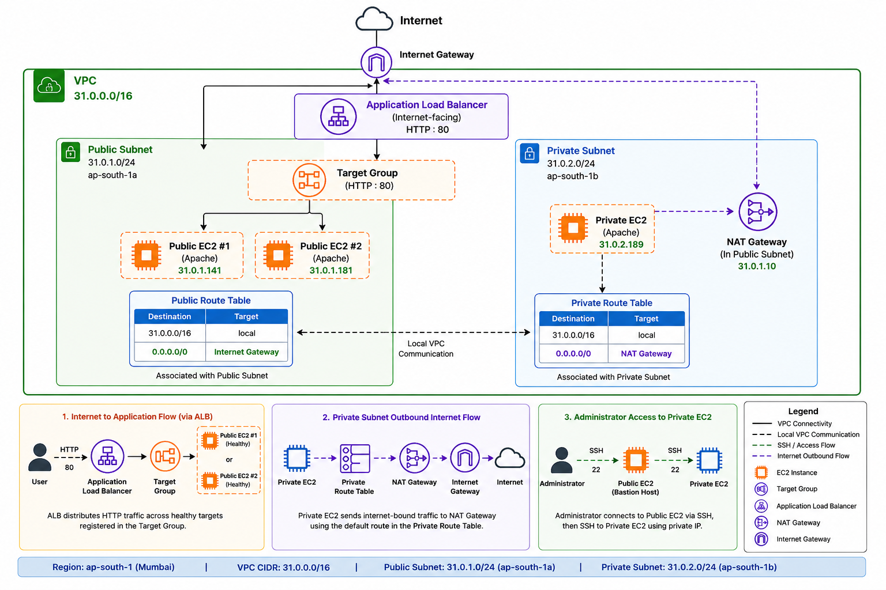

### Architecture Overview

The network is deployed in the **Asia Pacific (Mumbai) `ap-south-1`** AWS Region and currently consists of:

- One custom VPC with CIDR block `31.0.0.0/16`
- One public subnet in `ap-south-1a`
- One private subnet in `ap-south-1b`
- One Internet Gateway attached to the VPC
- One custom public route table
- One custom private route table
- One NAT Gateway for private subnet outbound Internet connectivity
- Two public EC2 instances
- One private EC2 instance
- Security Groups controlling EC2 and ALB traffic
- EC2 User Data used to automate Apache web server configuration
- One internet-facing Application Load Balancer
- One Target Group containing the EC2 instances
- HTTP listener on port `80`

The public subnet uses a default route to the Internet Gateway.

The private subnet does **not** have a direct route to the Internet Gateway. Instead, Internet-bound traffic from the private subnet is sent to the NAT Gateway.

The public EC2 instances can be accessed externally when the required network access configuration is present.

The private EC2 instance does not have a public IPv4 address and was accessed through the public EC2 instance using its private IPv4 address.

The Application Load Balancer provides an internet-facing entry point for HTTP traffic and forwards requests to targets registered in the Target Group.

---

## 🎯 Project Objectives

The objective of this project is to gain hands-on experience with core AWS VPC networking concepts, including:

- Creating a custom Amazon VPC
- Understanding IPv4 CIDR blocks
- Creating public and private subnets
- Deploying subnets across Availability Zones
- Creating and attaching an Internet Gateway
- Creating custom route tables
- Configuring public Internet routing
- Associating route tables with subnets
- Creating and configuring a NAT Gateway
- Providing outbound Internet connectivity to a private subnet
- Launching EC2 instances into specific VPC subnets
- Understanding public and private IPv4 addressing
- Connecting to EC2 instances using SSH
- Accessing a private EC2 instance through a public EC2 instance
- Validating outbound Internet connectivity from a private EC2 instance
- Configuring AWS Security Groups
- Understanding inbound and outbound Security Group rules
- Allowing HTTP traffic on TCP port `80`
- Allowing SSH traffic on TCP port `22`
- Automating EC2 initialization using User Data
- Automatically installing and configuring Apache
- Validating web server deployment using `curl` and a browser
- Creating Target Groups
- Registering EC2 instances as Target Group targets
- Configuring Application Load Balancers
- Configuring HTTP listeners
- Configuring ALB forwarding rules
- Understanding Target Group health checks
- Understanding healthy and unhealthy targets
- Distributing HTTP traffic across multiple EC2 instances
- Testing backend responses through an ALB DNS name

---

## 🌐 Network Configuration

| Resource | Configuration |
|---|---|
| AWS Region | `ap-south-1` (Mumbai) |
| VPC | `31.0.0.0/16` |
| Public Subnet | `31.0.1.0/24` |
| Public Subnet AZ | `ap-south-1a` |
| Private Subnet | `31.0.2.0/24` |
| Private Subnet AZ | `ap-south-1b` |
| Public Default Route | `0.0.0.0/0 → Internet Gateway` |
| Private Default Route | `0.0.0.0/0 → NAT Gateway` |
| Public EC2 Instances | Public + Private IPv4 |
| Private EC2 | Private IPv4 only |
| Private EC2 Internet Access | NAT Gateway |
| Public EC2 HTTP Access | TCP `80` |
| Public EC2 SSH Access | TCP `22` |
| ALB Scheme | Internet-facing |
| ALB IP Type | IPv4 |
| ALB Listener | HTTP `80` |
| Target Group Protocol | HTTP |
| Target Group Port | `80` |
| Target Type | EC2 Instances |

---

## 🧩 AWS Networking Components

### Amazon VPC

The VPC provides a logically isolated virtual network in AWS where networking resources can be created and configured.

**VPC CIDR:** `31.0.0.0/16`

[View VPC implementation →](docs/01-vpc.md)

---

### Public and Private Subnets

The VPC is divided into two subnets.

#### Public Subnet

    CIDR: 31.0.1.0/24
    Availability Zone: ap-south-1a

The public subnet is associated with a route table containing a default route to the Internet Gateway.

#### Private Subnet

    CIDR: 31.0.2.0/24
    Availability Zone: ap-south-1b

The private subnet does not have a direct route to the Internet Gateway.

Instead, its default route points to the NAT Gateway for outbound Internet connectivity.

[View subnet implementation →](docs/02-subnets.md)

---

### Internet Gateway

An Internet Gateway is created and attached to the VPC to provide a path between the VPC and the Internet.

Attaching an Internet Gateway to a VPC alone does not automatically make a subnet public.

The public subnet must use a route table containing:

    0.0.0.0/0 → Internet Gateway

[View Internet Gateway implementation →](docs/03-internet-gateway.md)

---

### Route Tables

Two custom route tables are used to provide different routing behavior for the public and private subnets.

#### Public Route Table

| Destination | Target |
|---|---|
| `31.0.0.0/16` | `local` |
| `0.0.0.0/0` | Internet Gateway |

Associated with:

    31.0.1.0/24 — Public Subnet

#### Private Route Table

The private route table was initially created with only the VPC local route.

After introducing the NAT Gateway, it was extended to:

| Destination | Target |
|---|---|
| `31.0.0.0/16` | `local` |
| `0.0.0.0/0` | NAT Gateway |

Associated with:

    31.0.2.0/24 — Private Subnet

The private subnet therefore has outbound Internet connectivity without receiving a direct route to the Internet Gateway.

[View route table implementation →](docs/04-route-tables.md)

---

### NAT Gateway

A NAT Gateway provides outbound Internet connectivity for resources deployed inside the private subnet.

The private route table contains:

    0.0.0.0/0 → NAT Gateway

Internet-bound traffic from the private subnet therefore follows:

    Private Resource
           ↓
    Private Route Table
           ↓
    NAT Gateway
           ↓
    Internet Gateway
           ↓
    Internet

This allows a private EC2 instance to initiate connections to the Internet without requiring its own public IPv4 address.

[View NAT Gateway implementation →](docs/05-nat-gateway.md)

---

### EC2 Instances in the VPC

EC2 instances were deployed to validate the public and private subnet networking architecture.

#### Public EC2 Instances

Two EC2 instances were deployed inside:

    Public Subnet
    31.0.1.0/24

Both public instances have:

    Private IPv4: Assigned inside the VPC
    Public IPv4:  Assigned by AWS

The public EC2 instances run Apache and are used as backend targets for the Application Load Balancer.

#### Private EC2

The private EC2 instance was deployed inside:

    Private Subnet
    31.0.2.0/24

It has:

    Private IPv4: Assigned inside the VPC
    Public IPv4:  None

Because the instance has no public IPv4 address, it was accessed through the public EC2 instance using VPC local routing.

[View EC2 implementation →](docs/06-ec2-in-vpc.md)

---

### Security Groups

A Security Group acts as a virtual firewall for AWS resources and controls inbound and outbound network traffic.

Security Groups were used for the EC2 instances and Application Load Balancer.

The public Apache EC2 instances require HTTP access on port `80`.

SSH access on port `22` was also configured for the hands-on lab.

Example inbound rules used in the lab include:

| Type | Protocol | Port | Source |
|---|---|---:|---|
| SSH | TCP | `22` | `0.0.0.0/0` |
| HTTP | TCP | `80` | `0.0.0.0/0` |

The outbound rule allows IPv4 traffic as configured in the lab.

The HTTP rule allows external clients to reach the Apache web server on port `80`.

The Security Group is a traffic-control layer attached to the resource and works together with route tables.

[View Security Group implementation →](docs/08-security-groups.md)

---

### EC2 User Data

EC2 User Data was used to automate the initial configuration of public EC2 instances.

A Bash script was supplied during instance launch to automatically:

- Update the package repository
- Install Apache
- Generate a custom HTML web page
- Display the instance hostname and private IPv4 address
- Restart the Apache service

The deployment was validated by checking the Apache service:

    sudo systemctl status apache2

The web server was then tested locally using:

    curl localhost

Finally, the instance's public IPv4 address was opened in a web browser to verify that Apache was serving the generated page externally.

[View EC2 User Data implementation →](docs/07-ec2-user-data.md)

---

### Application Load Balancer

An **Application Load Balancer (ALB)** was introduced to provide an internet-facing entry point for the application.

The ALB was configured with:

    Scheme   : Internet-facing
    IP Type  : IPv4
    Protocol : HTTP
    Port     : 80

The ALB receives HTTP requests from users and forwards them to targets registered in the Target Group.

The traffic flow is:

    Internet User
          ↓
    Application Load Balancer
          ↓
    Target Group
          ↓
    Healthy EC2 Target

The ALB uses its listener configuration and target health information to route requests to healthy registered targets.

---

### Target Group

A Target Group provides a logical grouping of backend resources for the Application Load Balancer.

The Target Group was configured with:

    Target Type : Instances
    Protocol    : HTTP
    Port        : 80
    Health Path : /

The Target Group uses the existing custom VPC.

The lab initially registered the existing public and private EC2 instances.

A second public EC2 instance was later added so that the load-balancing behavior could be demonstrated with two healthy public targets.

The Target Group therefore demonstrates:

    Target Group
         |
         +── Public EC2 #1
         |
         +── Public EC2 #2
         |
         └── Private EC2 → Unhealthy

The private EC2 instance was kept in the Target Group to demonstrate target health behavior in the lab.

[View Application Load Balancer implementation →](docs/09-application-load-balancer.md)

---

## 🔄 Traffic Flow

The completed architecture demonstrates several different networking paths.

### Public EC2 → Internet

Internet-bound traffic from the public EC2 instance follows:

    Public EC2
         ↓
    Public Subnet
         ↓
    Public Route Table
         ↓
    0.0.0.0/0 → Internet Gateway
         ↓
    Internet

---

### Public EC2 → Private EC2

The private EC2 instance is accessed through the public EC2 instance.

    Administrator
         ↓
        SSH
         ↓
    Public EC2
    31.0.1.x
         ↓
    VPC Local Routing
         ↓
    Private EC2
    31.0.2.x

Both addresses belong to:

    31.0.0.0/16

Therefore, the VPC local route provides the routing path between the two subnet networks.

---

### Private EC2 → Internet

The private EC2 instance does not have a public IPv4 address and does not have a direct Internet Gateway route.

Its outbound Internet traffic follows:

    Private EC2
    31.0.2.x
         ↓
    Private Subnet
    31.0.2.0/24
         ↓
    Private Route Table
         ↓
    0.0.0.0/0 → NAT Gateway
         ↓
    NAT Gateway
         ↓
    Internet Gateway
         ↓
    Internet

This allows the private EC2 instance to initiate outbound Internet connections while remaining without a public IPv4 address.

---

### Internet → Public EC2 → Apache

Direct HTTP traffic to an Apache web server follows:

    Internet
         ↓
    Internet Gateway
         ↓
    Public Route Table
         ↓
    Public Subnet
         ↓
    Security Group
         ↓
    TCP : 80
         ↓
    Public EC2
         ↓
    Apache Web Server

The Security Group determines whether the incoming HTTP traffic is allowed to reach the EC2 instance.

---

### Internet → ALB → Target Group → EC2

The Application Load Balancer introduces another HTTP traffic path:

    Internet User
         ↓
    Application Load Balancer
         ↓
    HTTP Listener : 80
         ↓
    Target Group
         ↓
    Healthy EC2 Target
         ↓
    Apache

With two healthy public EC2 instances, the same ALB DNS name can serve responses from different backend instances.

---

## 🔐 Private EC2 Access

The private EC2 instance was not accessed directly from the Internet.

For this hands-on lab, the public EC2 instance was used as an intermediate host.

The access path was:

    Local / AWS Environment
            ↓
           SSH
            ↓
        Public EC2
            ↓
           SSH
            ↓
        Private EC2

The SSH private key was temporarily transferred to the public EC2 instance for the course lab and was **not committed to this repository**.

> **Security Note:** Copying private SSH keys onto an intermediate instance is not the preferred approach for production environments. More secure access methods can include SSH agent forwarding or AWS Systems Manager Session Manager.

---

## 🧪 Connectivity Validation

### Public EC2 Access

Successful SSH connectivity to the public EC2 instance was verified.

---

### Private EC2 Access

The private EC2 instance was successfully accessed from the public EC2 instance using its private IPv4 address.

---

### Private EC2 Internet Connectivity

Outbound Internet connectivity from the private EC2 instance was tested using:

    ping 8.8.8.8

The test successfully received responses.

This validates the path:

    Private EC2
         ↓
    Private Route Table
         ↓
    NAT Gateway
         ↓
    Internet Gateway
         ↓
    Internet

---

### EC2 User Data and Apache Validation

The EC2 instance launched with User Data successfully completed its automated initialization.

Apache was verified as running:

The generated page was tested locally using `curl localhost`:

The web server was also successfully accessed using the EC2 instance's public IPv4 address from a browser:

This confirms that the User Data script successfully installed Apache and generated the custom web page during instance initialization.

---

### Security Group Configuration

The public Apache EC2 instance was configured with a Security Group controlling its network access.

The Security Group configuration was reviewed:

HTTP traffic on TCP port `80` was allowed through the inbound rules:

The outbound rules were also reviewed:

The resulting HTTP access path is:

    Internet
         ↓
    Internet Gateway
         ↓
    Public Route Table
         ↓
    Public Subnet
         ↓
    Security Group
         ↓
    TCP : 80
         ↓
    EC2
         ↓
    Apache

---

## ⚖️ Application Load Balancer Validation

### Target Group Configuration

The Target Group was configured for EC2 instances using HTTP on port `80` with an HTTP health check on `/`.

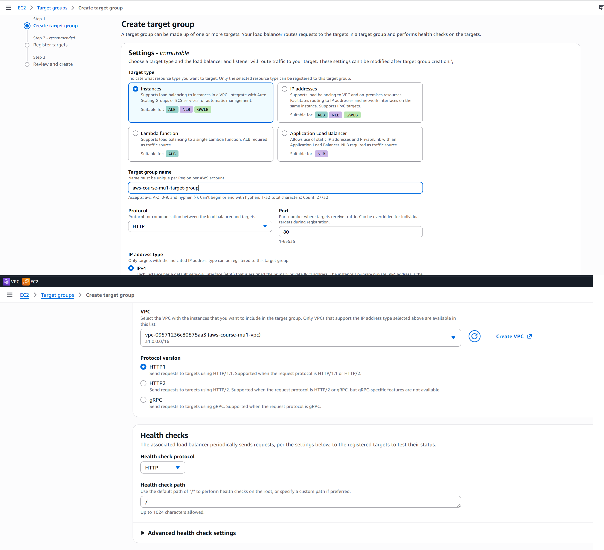

---

### Initial Target Registration

The existing public and private EC2 instances were registered in the Target Group.

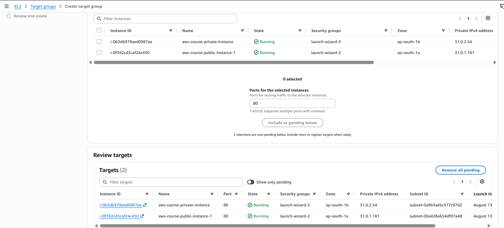

The Target Group health status was then reviewed.

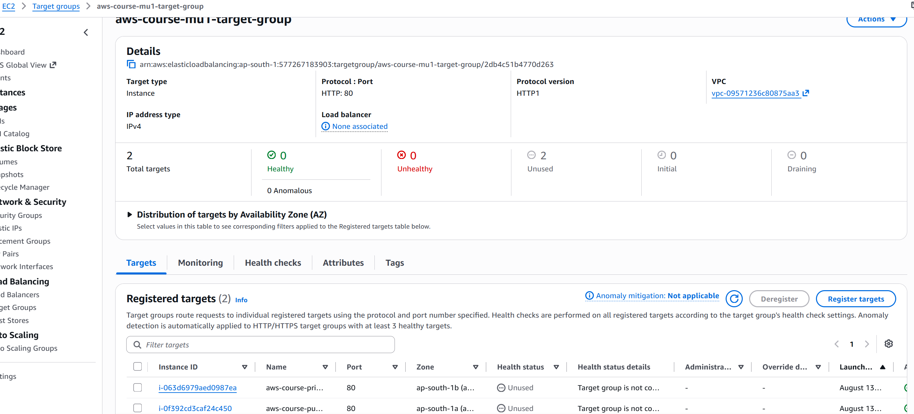

---

### Application Load Balancer Configuration

An internet-facing IPv4 Application Load Balancer was created in the existing VPC.

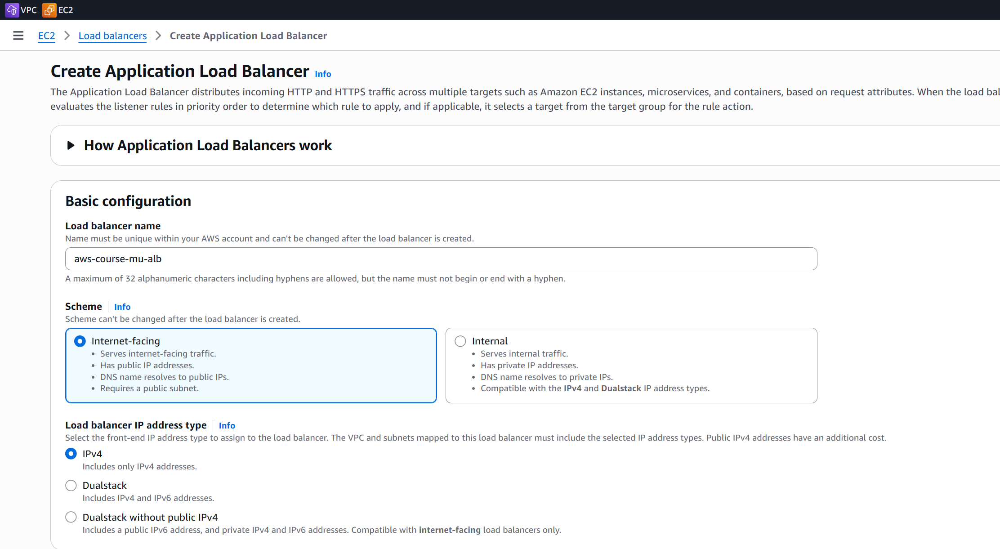

The ALB network configuration was then completed using the VPC subnets.

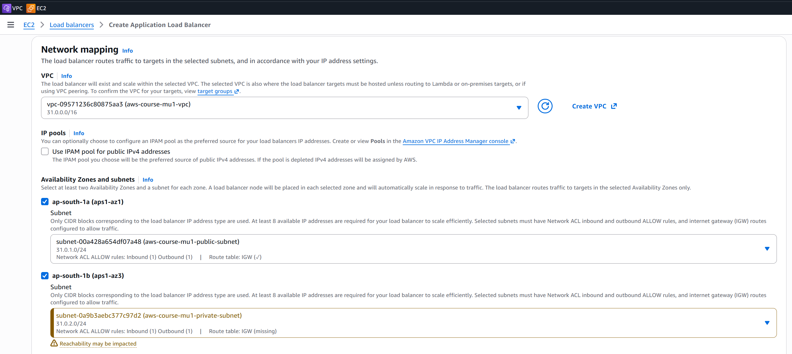

---

### ALB Security Group

The ALB Security Group was configured to allow HTTP traffic on TCP port `80`.

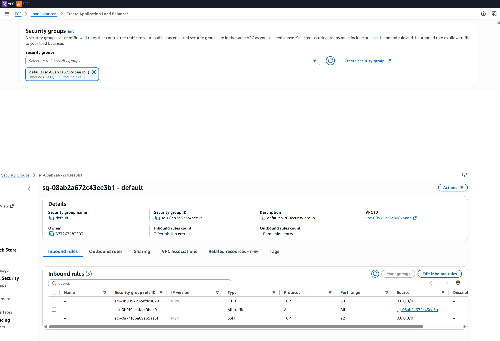

---

### ALB Listener

The Application Load Balancer was configured with an HTTP listener on port `80`.

The listener forwards traffic to the Target Group.

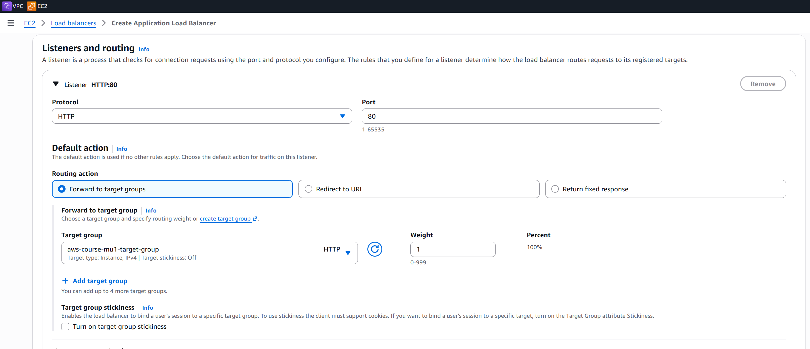

---

### ALB DNS

After creation, the Application Load Balancer became active and provided a DNS name.

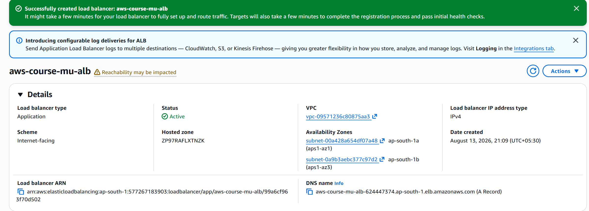

The DNS name provides a single entry point for accessing the application.

---

### First ALB Application Test

The ALB DNS name was opened in a browser.

The request successfully reached an EC2 backend and returned the Apache page.

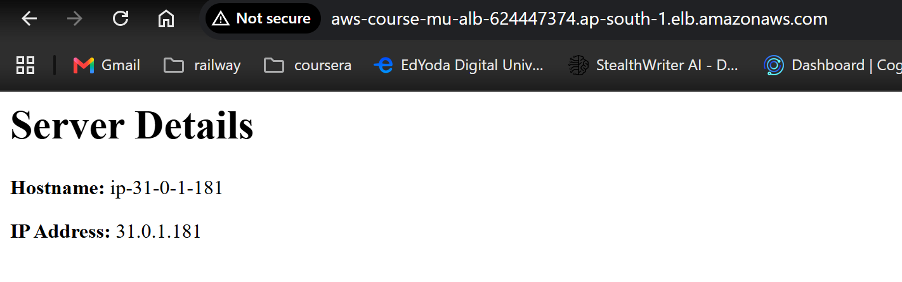

---

### Second Public EC2 Instance

A second public EC2 instance was created to demonstrate load balancing across multiple healthy backend servers.

The second instance was configured with the same basic Apache User Data setup.

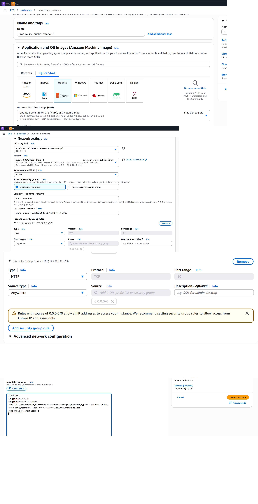

The instance successfully entered the Running state:

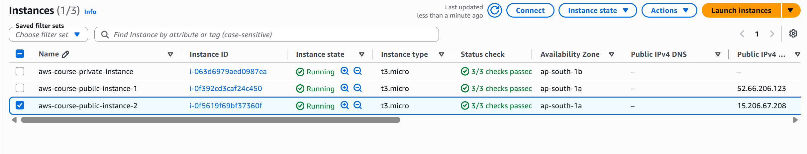

The second public EC2 instance was also tested directly to confirm that its Apache server was working:

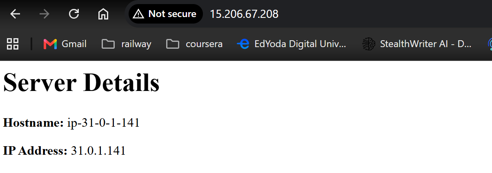

---

### Final Target Group

The second public EC2 instance was registered with the existing Target Group.

The Target Group now contained:

    Target Group
         |
         +── Public EC2 #1
         |
         +── Public EC2 #2
         |
         └── Private EC2

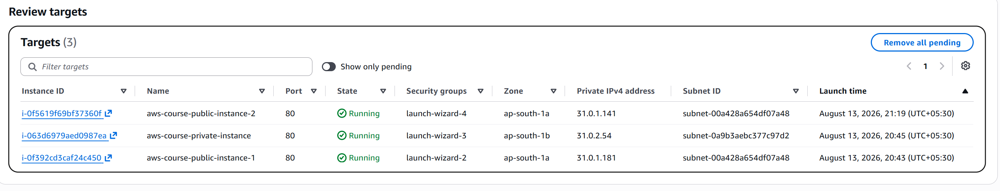

---

### Target Health

The final Target Group health status showed the health state of the registered targets.

The two public EC2 instances were healthy targets and could serve traffic through the Application Load Balancer.

The private EC2 instance remained registered but was shown as unhealthy in the lab.

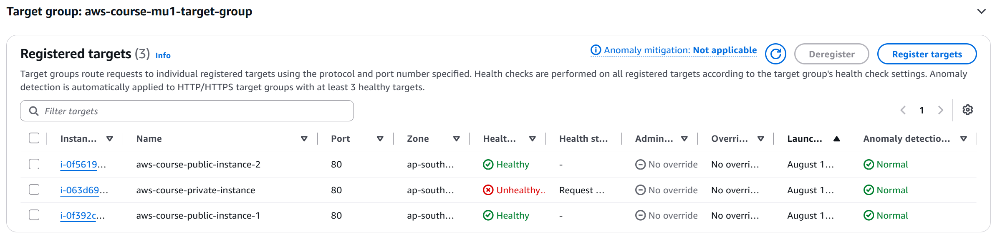

---

### ALB Backend Response 1

A request sent to the same ALB DNS name returned the server information from one of the healthy public EC2 instances.

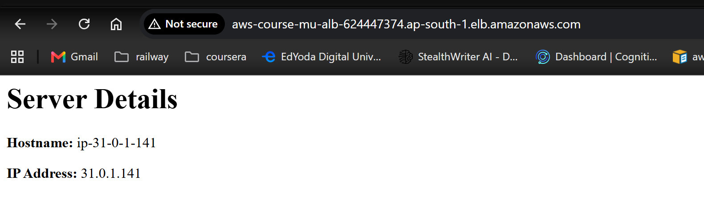

---

### ALB Backend Response 2

A subsequent request through the same ALB DNS name returned the server information from the other healthy public EC2 instance.

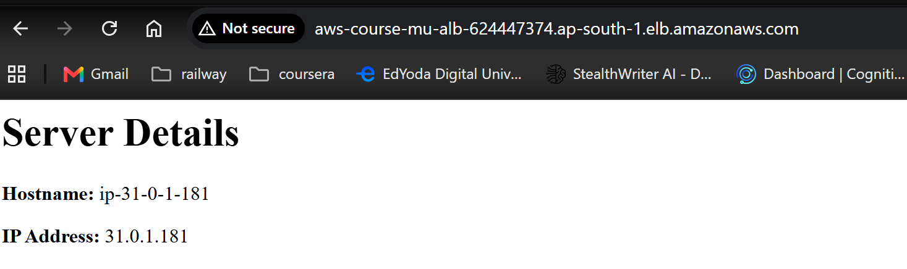

These tests demonstrate that the same ALB DNS name can serve responses from different healthy backend EC2 instances.

---

## 📸 Final AWS Resource Map

The AWS VPC Resource Map below shows the networking relationships after adding the NAT Gateway and deploying the EC2 instances.

The architecture now includes:

    VPC: 31.0.0.0/16
    │
    ├── Public Subnet
    │   ├── Public EC2 #1
    │   ├── Public EC2 #2
    │   └── Public Route Table
    │       ├── 31.0.0.0/16 → local
    │       └── 0.0.0.0/0 → Internet Gateway
    │
    └── Private Subnet
        ├── Private EC2
        └── Private Route Table
            ├── 31.0.0.0/16 → local
            └── 0.0.0.0/0 → NAT Gateway

The Application Load Balancer and Target Group provide the application entry point and backend target layer above this VPC architecture.

---

## 📚 Detailed Implementation

Detailed step-by-step documentation is available for each part of the project:

1. [VPC Creation and Configuration](docs/01-vpc.md)
2. [Public and Private Subnet Configuration](docs/02-subnets.md)
3. [Internet Gateway Configuration](docs/03-internet-gateway.md)
4. [Route Table Configuration](docs/04-route-tables.md)
5. [NAT Gateway Configuration](docs/05-nat-gateway.md)
6. [EC2 Instances in Public and Private Subnets](docs/06-ec2-in-vpc.md)
7. [EC2 User Data and Apache Automation](docs/07-ec2-user-data.md)
8. [Security Groups](docs/08-security-groups.md)
9. [Application Load Balancer and Target Groups](docs/09-application-load-balancer.md)

Each section includes explanations of the networking concept, configuration details, implementation steps, traffic-flow explanations, validation, and AWS Console screenshots.

---

## 📁 Repository Structure

    aws-vpc-networking-basics/
    │
    ├── README.md
    ├── LICENSE
    │
    ├── architecture/
    │   ├── AWS-VPC-Subnet-Routing-Architecture.png
    │   └── AWS-VPC-EC2-NAT-Gateway-Architecture.png
    │
    ├── docs/
    │   ├── 01-vpc.md
    │   ├── 02-subnets.md
    │   ├── 03-internet-gateway.md
    │   ├── 04-route-tables.md
    │   ├── 05-nat-gateway.md
    │   ├── 06-ec2-in-vpc.md
    │   ├── 07-ec2-user-data.md
    │   ├── 08-security-groups.md
    │   └── 09-application-load-balancer.md
    │
    └── screenshots/
        ├── 01-vpc-configuration.png
        ├── 02-vpc-created.png
        ├── 03-public-subnet-configuration.png
        ├── 04-private-subnet-configuration.png
        ├── 05-subnets-created.png
        ├── 06-internet-gateway-creation.png
        ├── 07-internet-gateway-attached.png
        ├── 08-public-route-table-creation.png
        ├── 09-public-route-table-internet-route.png
        ├── 10-public-subnet-route-table-association.png
        ├── 11-private-route-table-creation.png
        ├── 12-final-vpc-resource-map.png
        ├── 13-nat-gateway-configuration.png
        ├── 14-nat-gateway-available.png
        ├── 15-private-route-table-nat-route-configuration.png
        ├── 16-private-route-table-nat-route.png
        ├── 17-public-ec2-network-configuration.png
        ├── 18-public-ec2-running.png
        ├── 19-public-ec2-network-details.png
        ├── 20-public-ec2-ssh-connection.png
        ├── 21-private-ec2-network-configuration.png
        ├── 22-private-ec2-running.png
        ├── 23-private-ec2-ssh-via-public-ec2.png
        ├── 24-private-ec2-internet-test.png
        ├── 25-final-vpc-resource-map.png
        ├── 26-ec2-user-data-configuration.png
        ├── 27-user-data-ec2-running.png
        ├── 28-apache-service-running.png
        ├── 29-user-data-localhost-test.png
        ├── 30-user-data-browser-test.png
        ├── 31-security-group-configuration.png
        ├── 32-security-group-inbound-http.png
        ├── 33-security-group-outbound-rules.png
        ├── 34-target-group-configuration.png
        ├── 35-target-group-registered-targets.png
        ├── 36-target-group-health-status.png
        ├── 37-application-load-balancer-configuration.png
        ├── 38-alb-network-configuration.png
        ├── 39-alb-security-group-http-rule.png
        ├── 40-alb-listener-target-group.png
        ├── 41-alb-dns-details.png
        ├── 42-alb-application-test.png
        ├── 43-second-public-ec2-configuration.png
        ├── 44-second-public-ec2-running.png
        ├── 45-second-public-ec2-application-test.png
        ├── 46-target-group-two-public-ec2.png
        ├── 47-target-group-final-health-status.png
        ├── 48-alb-backend-response-1.png
        └── 49-alb-backend-response-2.png

---

## 🧠 Key Concepts Learned

Through this project, I gained hands-on experience with:

- Amazon VPC architecture
- IPv4 CIDR addressing
- Public and private subnet design
- Availability Zones
- Internet Gateways
- AWS route tables
- Local VPC routing
- Default routes (`0.0.0.0/0`)
- Longest prefix matching
- Subnet-to-route-table associations
- Public vs. private subnet routing
- NAT Gateway configuration
- Private subnet outbound Internet connectivity
- Public and private EC2 deployment
- Public vs. private IPv4 addressing
- SSH connectivity
- Accessing private resources through a public instance
- Testing network connectivity
- AWS VPC Resource Map
- AWS Security Groups
- Security Group inbound rules
- Security Group outbound rules
- Stateful Security Groups
- HTTP access on TCP port `80`
- SSH access on TCP port `22`
- Security Groups vs. route tables
- EC2 User Data and instance bootstrapping
- Automated Apache installation
- Automated server initialization using Bash
- HTTP service validation using `curl`
- Application Load Balancers
- Target Groups
- EC2 target registration
- ALB listeners
- ALB security groups
- Target health checks
- Healthy and unhealthy targets
- Internet-facing load balancers
- Load balancing across multiple EC2 instances
- ALB DNS names
- Backend response validation

One of the key concepts demonstrated by this project is that simply naming a subnet **public** or **private** does not determine its networking behavior.

Routing and resource configuration determine how resources communicate.

Security Groups provide an additional traffic-control layer at the resource level.

In this architecture:

    Public Subnet
    0.0.0.0/0 → Internet Gateway
           ↓
    Security Group
           ↓
    TCP 80 → Apache

while:

    Private Subnet
    0.0.0.0/0 → NAT Gateway

The private EC2 instance can therefore initiate outbound Internet connections without having a public IPv4 address or a direct Internet Gateway route.

EC2 User Data additionally demonstrates how instance initialization tasks can be automated during launch instead of being performed manually after connecting to the server.

The Application Load Balancer demonstrates how a single internet-facing endpoint can distribute HTTP requests across multiple healthy backend EC2 instances.

---

## 🧹 Resource Cleanup

AWS resources created for hands-on practice should be removed after completing the lab when they are no longer required.

Resources created throughout this project currently include:

- Custom VPC
- Public subnet
- Private subnet
- Internet Gateway
- Public route table
- Private route table
- NAT Gateway
- NAT Gateway public IP / Elastic IP resources where applicable
- Public EC2 instances
- Private EC2 instance
- Security Groups
- Target Group
- Application Load Balancer

NAT Gateway, public IPv4 resources, and other running AWS resources can incur charges, so temporary lab resources should not be left running unnecessarily.

---

## ⚠️ Note

This project is intended for educational and hands-on AWS networking practice.

The architecture focuses on understanding AWS VPC networking concepts and is **not intended to represent a complete production environment**.

The VPC CIDR `31.0.0.0/16` follows the addressing used during the training lab. For real-world private VPC designs, RFC 1918 private address ranges such as `10.0.0.0/8`, `172.16.0.0/12`, or `192.168.0.0/16` would normally be used.

The Security Group configuration used in this lab allows SSH and HTTP from `0.0.0.0/0` for learning and testing purposes. Restricting administrative access to trusted source addresses or using managed access mechanisms is preferable in production environments.

The Application Load Balancer and Target Group configuration in this project is also intended for learning and demonstration purposes.

The project will continue to evolve as additional AWS networking concepts are implemented.