# AWS VPC Networking Fundamentals

A hands-on AWS networking project demonstrating the design, implementation, and validation of core Amazon VPC networking concepts, including public and private subnets, Internet Gateway, route tables, NAT Gateway, EC2, Security Groups, EC2 User Data, Application Load Balancer, Network Load Balancer, Target Groups, VPC Peering, AWS Transit Gateway, Transit Gateway Cross-Region Peering, VPC Endpoints, and VPC Flow Logs.

---

## 🏗️ Architecture

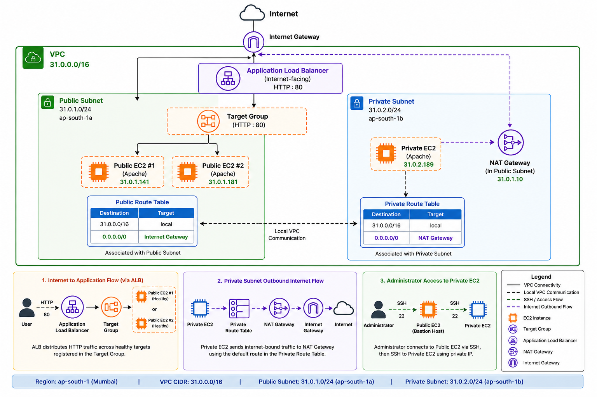

### Architecture Overview

The primary network is deployed in the **Asia Pacific (Mumbai) `ap-south-1`** AWS Region.

The architecture includes:

- One custom VPC — `31.0.0.0/16`
- One public subnet in `ap-south-1a`
- One private subnet in `ap-south-1b`
- One Internet Gateway
- One public route table
- One private route table
- One NAT Gateway
- Two public EC2 instances
- One private EC2 instance
- Security Groups
- EC2 User Data
- Apache web servers
- One internet-facing Application Load Balancer
- One internet-facing Network Load Balancer
- Target Groups

The public subnet uses a default route to the Internet Gateway.

The private subnet uses a default route to the NAT Gateway for outbound Internet connectivity.

The private EC2 instance does not have a public IPv4 address and was accessed through the public EC2 instance using its private IPv4 address.

The Application Load Balancer provides an internet-facing entry point and forwards HTTP traffic to healthy backend EC2 instances registered with the Target Group.

### VPC Endpoint

VPC Endpoints provide private connectivity between resources inside a VPC and supported AWS services without requiring traffic to use the public Internet.

The VPC Endpoint lab used both Gateway and Interface Endpoint types.

#### Gateway Endpoint

The S3 Gateway Endpoint was associated with the public and private route tables.

```text
Private EC2
     ↓
Private Route Table
     ↓
S3 Prefix List
     ↓
S3 Gateway VPC Endpoint
     ↓
Amazon S3
```

The private EC2 successfully ran:

```bash
aws s3 ls
```

without requiring a NAT Gateway or Internet Gateway path for S3 connectivity.

#### Interface Endpoints

Interface Endpoints were created for:

```text
SSM
SSMMessages
STS
```

These endpoints use private network interfaces inside the VPC.

The SSM and SSMMessages endpoints allowed the private EC2 to be accessed using Systems Manager Session Manager.

The STS endpoint provided the private EC2 with a network path to STS for the AWS CLI identity test:

```bash
aws sts get-caller-identity
```

The EC2 used the IAM Role:

```text
EC2-S3-VPC-Endpoint-Role
```

instead of storing permanent AWS access keys on the instance.

The IAM role contained:

```text
EC2-S3-ListBuckets-Policy
AmazonSSMManagedInstanceCore
```

The final endpoint architecture was:

```text
VPC 31.0.0.0/16
│
├── Public Subnet
│   └── Public EC2
│
└── Private Subnet
    └── Private EC2
        │
        ├── S3 Gateway Endpoint
        │      ↓
        │      S3
        │
        ├── SSM Interface Endpoint
        │      ↓
        │      Systems Manager
        │
        ├── SSMMessages Interface Endpoint
        │      ↓
        │      Systems Manager
        │
        └── STS Interface Endpoint
               ↓
               STS
```

The negative test confirmed that the private EC2 could access S3 while general Internet connectivity remained unavailable.

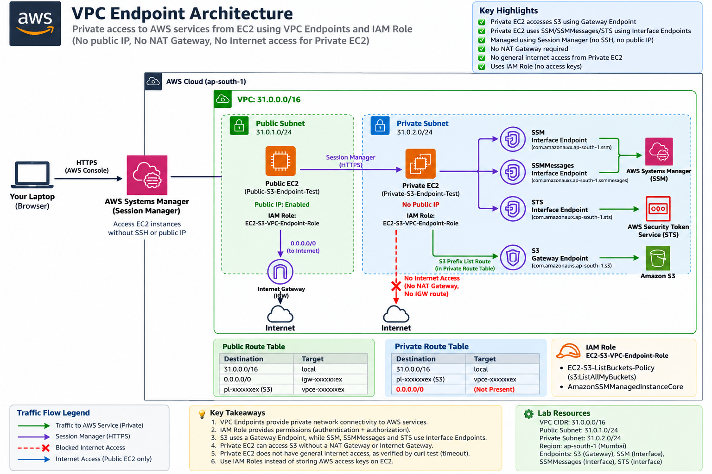

[View VPC Endpoint implementation →](docs/13-vpc-endpoint.md)

---

### VPC Peering Extension

A separate VPC Peering lab was implemented between:

- Mumbai — `ap-south-1`
- N. Virginia — `us-east-1`

The Mumbai VPC uses:

```text
31.0.0.0/16
```

The N. Virginia VPC uses:

```text
41.0.0.0/16
```

The two VPCs were connected using a VPC Peering connection.

Private IPv4 connectivity was tested between EC2 instances in both VPCs.

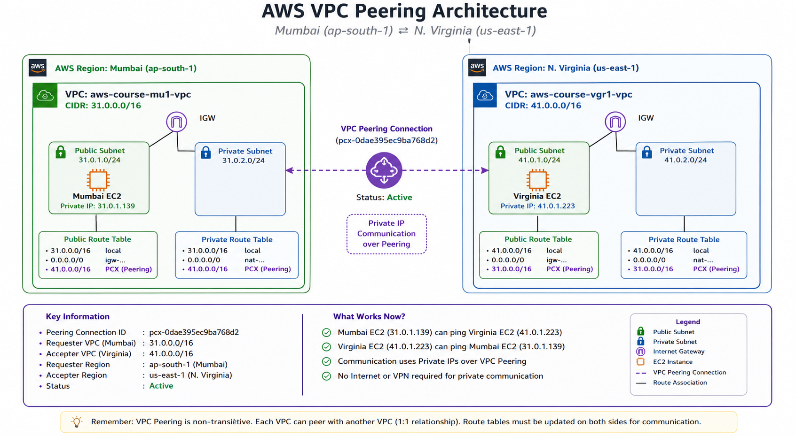

### Transit Gateway Extension

A separate Transit Gateway lab was implemented to connect three VPCs through a centralized AWS Transit Gateway.

The three VPCs are:

```text
AWS Course VPC
31.0.0.0/16

Demo Course VPC
71.0.0.0/16

Redshift VPC
10.0.0.0/16
```

Each VPC was connected to the Transit Gateway using a dedicated VPC attachment.

The required remote VPC routes were then configured in the VPC route tables.

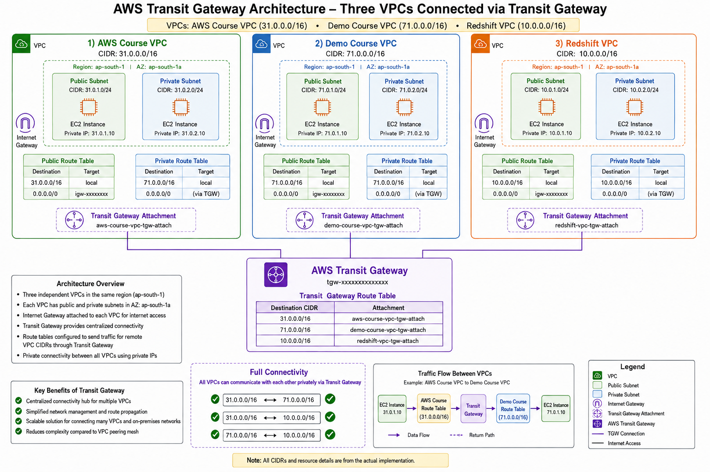

### Transit Gateway Cross-Region Peering Extension

A separate cross-region Transit Gateway Peering lab was implemented between two VPCs located in different AWS Regions.

The practical used:

- Mumbai — `ap-south-1`
- N. Virginia — `us-east-1`

The Mumbai VPC uses:

```text
31.0.0.0/16
```

The N. Virginia VPC uses:

```text
41.0.0.0/16
```

Each region contains its own Transit Gateway.

The two regional Transit Gateways are connected using a **Transit Gateway Peering Attachment**.

Mumbai acts as the **requester** and N. Virginia acts as the **accepter**.

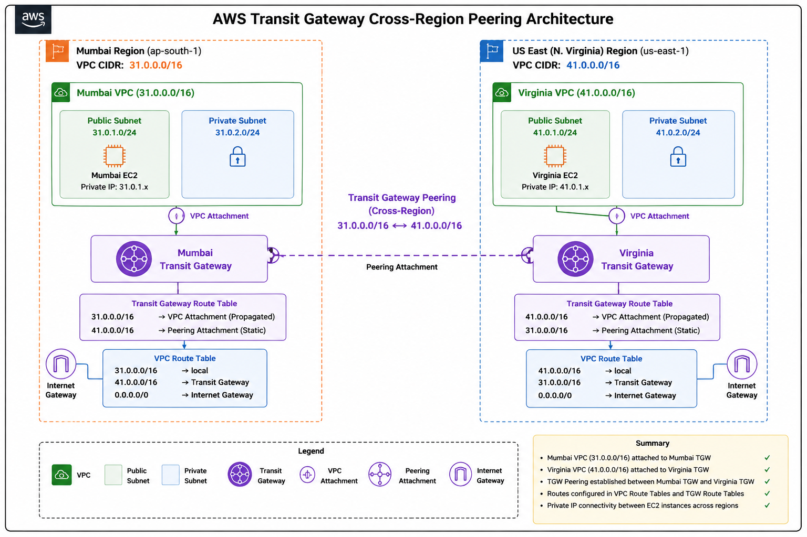

### VPC Endpoint Extension

A separate **VPC Endpoint** lab was implemented using the existing Mumbai VPC to provide private connectivity from EC2 instances to supported AWS services.

The lab uses:

- VPC — `31.0.0.0/16`
- Public Subnet
- Private Subnet
- Public EC2
- Private EC2
- S3 Gateway VPC Endpoint
- SSM Interface VPC Endpoint
- SSMMessages Interface VPC Endpoint
- STS Interface VPC Endpoint
- EC2 IAM Role

The private EC2 instance was intentionally configured without a public IPv4 address and without a NAT Gateway route.

The S3 Gateway Endpoint provides private connectivity to Amazon S3 through the route table, while the Interface Endpoints provide private connectivity to Systems Manager, SSMMessages, and STS.

The final architecture was:

```text
                              AWS Cloud
                                   |
                     ┌──────────────┴──────────────┐
                     |       VPC 31.0.0.0/16       |
                     |                             |
           ┌─────────┴──────────┐       ┌──────────┴─────────┐
           |    Public Subnet   |       |   Private Subnet   |
           |                    |       |                    |
           |     Public EC2     |       |    Private EC2     |
           |                    |       |                    |
           |     IAM Role       |       |     IAM Role       |
           └─────────┬──────────┘       └──────────┬─────────┘
                     |                             |
                Internet                      VPC Endpoints
                Gateway                           |
                     |                    ┌────────┼────────┐
                 Internet                 |        |        |
                                         S3       SSM     STS
                                      Gateway   Interface Interface
                                      Endpoint   Endpoint Endpoint
                                         |        |        |
                                         ▼        ▼        ▼
                                        S3   Systems Manager  STS
```

The private EC2 successfully accessed S3 using:

```bash
aws s3 ls
```

while general Internet connectivity was intentionally blocked.

The private EC2 was also accessed using Systems Manager Session Manager through the SSM and SSMMessages Interface Endpoints.


### VPC Flow Logs Extension

A separate **VPC Flow Logs** lab was implemented to capture network traffic metadata from the VPC and deliver the records to **Amazon CloudWatch Logs**.

The lab used:

- VPC — `12.0.0.0/16`
- Public Subnet — `12.0.1.0/24`
- Private Subnet — `12.0.2.0/24`
- EC2 instance in the public subnet
- EC2 network interface — `eni-0e16fa6936bb97b97`
- CloudWatch Log Group — `/vpc/flow-logs`
- IAM Role — `VPCFlowLogs-CloudWatch-Role`
- IAM Policy — `VPCFlowLogs-CloudWatch-Policy`
- VPC Flow Log — `VPCFlowLogs-to-CloudWatch`

The Flow Log was configured with:

```text
Traffic type   : All
Aggregation    : 1 minute
Destination    : CloudWatch Logs
Log Group      : /vpc/flow-logs
```

Traffic was generated from the EC2 instance and the resulting flow records were inspected in CloudWatch Logs.

A captured record included a `REJECT` action, demonstrating how VPC Flow Logs can provide traffic metadata for network troubleshooting and visibility.

[View VPC Flow Logs implementation →](docs/14-vpc-flow-logs.md)

### Network Load Balancer Extension

A separate **Network Load Balancer (NLB)** lab was implemented using the existing Mumbai VPC. The lab demonstrates network-level load balancing using TCP traffic and two EC2 backend servers running Apache.

The lab uses:

- VPC — `31.0.0.0/16`
- Public Subnet — `31.0.1.0/24`
- Availability Zone — `ap-south-1a`
- EC2 — `NLB-Server-1`
- EC2 — `NLB-Server-2`
- Target Group — `NLB-Target-Group`
- Network Load Balancer — `NLB-Lab`
- Scheme — Internet-facing
- Listener — TCP `:80`
- Target Group Protocol — TCP `:80`
- Health Check — HTTP `/`

The two EC2 instances run Apache on port `80` and return different responses so the backend receiving NLB traffic can be identified during testing.

The final NLB architecture was:

```text
                         Internet
                            |
                            | TCP :80
                            v
                  +---------------------+
                  |      NLB-Lab        |
                  | Internet-facing     |
                  | Network Load        |
                  | Balancer            |
                  +----------+----------+
                             |
                             | TCP :80
                             v
                  +---------------------+
                  |  NLB-Target-Group   |
                  |       TCP :80       |
                  +----------+----------+
                             |
                       +-----+-----+
                       |           |
                       v           v
                NLB-Server-1  NLB-Server-2
                   Apache        Apache
                    :80           :80

                  Public Subnet
                   31.0.1.0/24
```

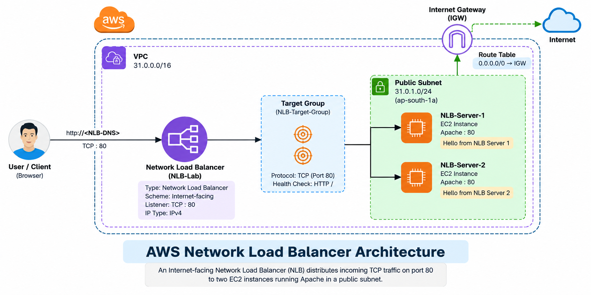

[View Network Load Balancer implementation →](docs/15-network-load-balancer.md)

---

## 🎯 Project Objectives

The objective of this project is to gain hands-on experience with:

- Amazon VPC architecture
- IPv4 CIDR addressing
- Public and private subnet design
- Availability Zones
- Internet Gateways
- AWS route tables
- Local VPC routing
- Default routes
- Longest prefix matching
- Subnet-to-route-table associations
- NAT Gateway configuration
- Private subnet outbound Internet connectivity
- Public and private EC2 deployment
- Public and private IPv4 addressing
- SSH connectivity
- Accessing private resources through a public instance
- Network connectivity testing
- AWS VPC Resource Map
- AWS Security Groups
- Security Group inbound and outbound rules
- HTTP access on TCP port `80`
- SSH access on TCP port `22`
- EC2 User Data
- Automated Apache installation
- Automated server initialization using Bash
- HTTP validation using `curl`
- Application Load Balancers
- Target Groups
- EC2 target registration
- ALB listeners
- ALB security groups
- Target health checks
- Healthy and unhealthy targets
- Load balancing across multiple EC2 instances
- ALB DNS names
- Backend response validation
- Network Load Balancers
- NLB listeners
- NLB target groups
- TCP load balancing
- NLB health checks
- Internet-facing NLBs
- NLB DNS names
- Backend response validation through NLB
- VPC Peering
- Cross-region VPC connectivity
- VPC Peering requester and accepter concepts
- VPC Peering connection states
- Cross-region private IPv4 communication
- Route-table configuration for VPC Peering
- Bidirectional VPC Peering connectivity
- VPC Peering limitations
- Non-transitive VPC routing
- AWS Transit Gateway
- Transit Gateway VPC attachments
- Centralized connectivity between multiple VPCs
- Transit Gateway route-table configuration
- Private IPv4 communication through Transit Gateway
- Transit Gateway connectivity validation
- Negative connectivity testing
- Transit Gateway routing dependencies
- Transit Gateway Peering
- Cross-region Transit Gateway connectivity
- Transit Gateway requester and accepter concepts
- Transit Gateway Peering connection states
- Cross-region Transit Gateway route configuration
- Bidirectional private connectivity through Transit Gateway Peering
- VPC Peering vs. Transit Gateway architecture
- VPC Endpoints
- Gateway VPC Endpoints
- Interface VPC Endpoints
- S3 Gateway Endpoint
- S3 private connectivity from a private EC2
- Route-table integration with Gateway Endpoints
- Systems Manager Session Manager
- SSM and SSMMessages Interface Endpoints
- STS Interface Endpoint
- EC2 IAM Roles
- Temporary IAM credentials
- IAM permissions vs. network connectivity
- VPC Endpoint security groups
- Private AWS service access without general Internet connectivity
- Negative testing for private service connectivity
- VPC Flow Logs
- VPC Flow Logs record fields
- Elastic Network Interface correlation
- CloudWatch Logs integration
- Flow Log `ACCEPT` and `REJECT` actions
- Network traffic visibility and troubleshooting

---

## 📚 Topics Covered

This project covers the following AWS networking topics:

### 1. VPC Fundamentals

- VPC creation
- IPv4 CIDR blocks
- VPC configuration
- Availability Zones
- Default VPC concepts
- Custom VPC concepts
- VPC Resource Map

### 2. Subnets

- Public subnets
- Private subnets
- Subnet CIDR ranges
- Availability Zone placement
- Public vs. private subnet concepts
- Subnet route-table association

### 3. Internet Gateway

- Internet Gateway creation
- VPC attachment
- Public subnet routing
- Internet connectivity

### 4. Route Tables

- Main route table
- Custom route tables
- Local routes
- Default routes
- Route-table associations
- Longest prefix matching
- Internet Gateway routes
- NAT Gateway routes
- VPC Peering routes
- Transit Gateway routes
- VPC Endpoint routes

### 5. NAT Gateway

- NAT Gateway creation
- Elastic IP association
- Public subnet placement
- Private subnet default route
- Outbound Internet connectivity
- NAT Gateway architecture

### 6. EC2 in VPC

- EC2 deployment
- Public IPv4 addresses
- Private IPv4 addresses
- Network interfaces
- Security Groups
- SSH connectivity
- Public and private instance communication

### 7. EC2 User Data

- User Data scripts
- Instance bootstrapping
- Automated Apache installation
- Automated package installation
- Automated service startup
- HTTP validation

### 8. Security Groups

- Stateful firewall behavior
- Inbound rules
- Outbound rules
- SSH port `22`
- HTTP port `80`
- Security Group association
- Security Group vs. route table behavior

### 9. Application Load Balancer

- Internet-facing ALB
- ALB Security Groups
- Listeners
- Target Groups
- EC2 target registration
- Health checks
- Healthy and unhealthy targets
- Load balancing
- ALB DNS names

### 10. VPC Peering

- Cross-region VPC Peering
- Requester and accepter
- Peering connection states
- VPC route-table configuration
- Private IPv4 connectivity
- Bidirectional communication
- Non-transitive routing

### 11. Transit Gateway

- Transit Gateway creation
- VPC attachments
- Transit Gateway route tables
- Centralized VPC connectivity
- Remote VPC routes
- Private IPv4 communication
- Connectivity testing
- Negative testing

### 12. Transit Gateway Cross-Region Peering

- Regional Transit Gateways
- Transit Gateway Peering Attachment
- Requester and accepter
- Cross-region connectivity
- VPC attachments
- Remote VPC routes
- Bidirectional private communication
- Connectivity validation

### 13. VPC Endpoints

- VPC Endpoint concepts
- Gateway Endpoints
- Interface Endpoints
- S3 Gateway Endpoint
- SSM Interface Endpoint
- SSMMessages Interface Endpoint
- STS Interface Endpoint
- IAM Roles
- Private AWS service access
- Systems Manager Session Manager
- Negative Internet connectivity testing

### 14. VPC Flow Logs

- VPC Flow Logs
- Traffic metadata
- Flow Log filters
- CloudWatch Logs destination
- IAM permissions
- Flow Log record fields

### 15. Network Load Balancer

- Network Load Balancer concepts
- Layer 4 load balancing
- TCP listeners
- NLB target groups
- EC2 target registration
- NLB health checks
- Healthy and unhealthy targets
- Internet-facing NLB
- NLB DNS name
- Backend response validation
- ENI correlation
- `ACCEPT` and `REJECT`
- Network troubleshooting

---

## 🗂️ Repository Structure

```text
aws-vpc-networking-basics/
│
├── architecture/
│   ├── AWS-VPC-EC2-ALB-Architecture.png
│   ├── AWS-VPC-EC2-NAT-Gateway-Architecture.png
│   ├── AWS-VPC-Peering-Architecture.png
│   ├── AWS-VPC-Subnet-Routing-Architecture.png
│   ├── AWS-VPC-Transit-Gateway-Architecture.png
│   ├── AWS-VPC-Transit-Gateway-Cross-Region-Peering-Architecture.png
│   ├── AWS-VPC-Endpoint-Architecture.png
│   └── AWS-VPC-Network-Load-Balancer-Architecture.png
│
├── docs/
│   ├── 01-vpc.md
│   ├── 02-subnets.md
│   ├── 03-internet-gateway.md
│   ├── 04-route-tables.md
│   ├── 05-nat-gateway.md
│   ├── 06-ec2-in-vpc.md
│   ├── 07-ec2-user-data.md
│   ├── 08-security-groups.md
│   ├── 09-application-load-balancer.md
│   ├── 10-vpc-peering.md
│   ├── 11-transit-gateway.md
│   ├── 12-transit-gateway-cross-region-peering.md
│   ├── 13-vpc-endpoint.md
│   ├── 14-vpc-flow-logs.md
│   └── 15-network-load-balancer.md
│
├── screenshots/
│   ├── 01-vpc-created.png
│   ├── 02-vpc-details.png
│   ├── 03-subnet-created.png
│   ├── 04-subnet-details.png
│   ├── 05-internet-gateway-created.png
│   ├── 06-internet-gateway-attached.png
│   ├── 07-route-table-created.png
│   ├── 08-public-route-table-route.png
│   ├── 09-private-route-table-route.png
│   ├── 10-route-table-association.png
│   ├── 11-nat-gateway-configuration.png
│   ├── 12-nat-gateway-created.png
│   ├── 13-private-route-table-nat-route.png
│   ├── 14-ec2-configuration.png
│   ├── 15-ec2-running.png
│   ├── ...
│   ├── 162-s3-gateway-endpoint-configuration.png
│   ├── 163-s3-gateway-endpoint-created.png
│   ├── 164-public-route-table-s3-endpoint.png
│   ├── 165-private-route-table-s3-endpoint.png
│   ├── 166-ec2-s3-list-buckets-iam-policy.png
│   ├── 167-ec2-s3-vpc-endpoint-role.png
│   ├── 168-ec2-s3-vpc-endpoint-role-created.png
│   ├── 169-ec2-role-s3-ssm-permissions.png
│   ├── 170-public-ec2-configuration.png
│   ├── 171-public-ec2-running.png
│   ├── 172-private-ec2-configuration.png
│   ├── 173-private-ec2-running.png
│   ├── 174-ssm-interface-endpoint-configuration.png
│   ├── 175-ssm-interface-endpoint-created.png
│   ├── 176-ssmmessages-interface-endpoint-configuration.png
│   ├── 177-ssmmessages-interface-endpoint-created.png
│   ├── 178-private-ec2-ssm-managed-node.png
│   ├── 179-private-ec2-session-manager.png
│   ├── 180-private-ec2-iam-role-verification.png
│   ├── 181-private-ec2-s3-list-success.png
│   ├── 182-sts-interface-endpoint-configuration.png
│   ├── 183-sts-interface-endpoint-created.png
│   ├── 184-private-ec2-iam-role-verification.png
│   ├── 185-private-ec2-s3-list-success.png
│   ├── 186-private-ec2-iam-role-credential-source.png
│   ├── 187-private-ec2-internet-access-blocked.png
│   ├── 188-vpc-endpoints-final.png
│   ├── 189-public-ec2-s3-list-success.png
│   ├── 190-vpc-flow-logs-iam-policy-json.png
│   ├── 191-vpc-flow-logs-iam-policy-created.png
│   ├── 192-vpc-flow-logs-iam-role-trust-policy.png
│   ├── 193-vpc-flow-logs-iam-role-created.png
│   ├── 194-vpc-flow-logs-iam-role-permissions.png
│   ├── 195-vpc-flow-logs-cloudwatch-log-group-configuration.png
│   ├── 196-vpc-flow-logs-cloudwatch-log-group-created.png
│   ├── 197-vpc-flow-logs-configuration.png
│   ├── 198-vpc-flow-log-created.png
│   ├── 199-vpc-flow-logs-ec2-configuration.png
│   ├── 200-vpc-flow-logs-ec2-running.png
│   ├── 201-vpc-flow-logs-ec2-eni.png
│   ├── 202-vpc-flow-logs-traffic-generation.png
│   ├── 203-vpc-flow-logs-log-stream.png
│   ├── 204-vpc-flow-logs-records.png
│   ├── 205-nlb-vpc.png
│   ├── 206-nlb-server-1-configuration.png
│   ├── 207-nlb-server-1-user-data.png
│   ├── 208-nlb-server-1-running.png
│   ├── 209-nlb-server-1-apache-test.png
│   ├── 210-nlb-server-2-configuration.png
│   ├── 211-nlb-server-2-user-data.png
│   ├── 212-nlb-server-2-running.png
│   ├── 213-nlb-server-2-apache-test.png
│   ├── 214-nlb-target-group-configuration.png
│   ├── 215-nlb-target-group-targets.png
│   ├── 216-nlb-target-group-created.png
│   ├── 217-nlb-targets-healthy.png
│   ├── 218-nlb-network-mapping.png
│   ├── 219-nlb-listener-and-routing.png
│   ├── 220-nlb-provisioning.png
│   ├── 221-nlb-active.png
│   ├── 222-nlb-first-request.png
│   └── 223-nlb-second-backend-response.png
│
└── README.md
```

---

## 🧪 Hands-On Labs

The project was built as a sequence of practical AWS networking labs.

### Lab 01 — VPC

Created a custom VPC and learned:

- CIDR blocks
- VPC configuration
- Availability Zones
- VPC Resource Map
- IPv4 addressing

Documentation:

[01 — VPC](docs/01-vpc.md)

### Lab 02 — Subnets

Created public and private subnets across Availability Zones.

Documentation:

[02 — Subnets](docs/02-subnets.md)

### Lab 03 — Internet Gateway

Created and attached an Internet Gateway to provide Internet connectivity for the public subnet.

Documentation:

[03 — Internet Gateway](docs/03-internet-gateway.md)

### Lab 04 — Route Tables

Configured public and private route tables and associated them with the appropriate subnets.

Documentation:

[04 — Route Tables](docs/04-route-tables.md)

### Lab 05 — NAT Gateway

Created a NAT Gateway and configured the private route table to provide outbound Internet connectivity.

Documentation:

[05 — NAT Gateway](docs/05-nat-gateway.md)

### Lab 06 — EC2 in VPC

Deployed public and private EC2 instances and tested private/public connectivity.

Documentation:

[06 — EC2 in VPC](docs/06-ec2-in-vpc.md)

### Lab 07 — EC2 User Data

Used EC2 User Data to automatically install and configure Apache.

Documentation:

[07 — EC2 User Data](docs/07-ec2-user-data.md)

### Lab 08 — Security Groups

Configured Security Groups and tested SSH and HTTP connectivity.

Documentation:

[08 — Security Groups](docs/08-security-groups.md)

### Lab 09 — Application Load Balancer

Created an internet-facing Application Load Balancer, Target Group, listener, and EC2 targets.

Documentation:

[09 — Application Load Balancer](docs/09-application-load-balancer.md)

### Lab 10 — VPC Peering

Connected VPCs across AWS Regions using VPC Peering and validated private IPv4 connectivity.

Documentation:

[10 — VPC Peering](docs/10-vpc-peering.md)

### Lab 11 — Transit Gateway

Connected multiple VPCs through a centralized Transit Gateway.

Documentation:

[11 — Transit Gateway](docs/11-transit-gateway.md)

### Lab 12 — Transit Gateway Cross-Region Peering

Connected regional Transit Gateways using Transit Gateway Peering and validated cross-region private connectivity.

Documentation:

[12 — Transit Gateway Cross-Region Peering](docs/12-transit-gateway-cross-region-peering.md)

### Lab 13 — VPC Endpoint

Implemented Gateway and Interface VPC Endpoints to provide private AWS service connectivity.

Documentation:

[13 — VPC Endpoint](docs/13-vpc-endpoint.md)

### Lab 14 — VPC Flow Logs

Implemented VPC Flow Logs with CloudWatch Logs and analyzed captured network traffic metadata.

Documentation:

[14 — VPC Flow Logs](docs/14-vpc-flow-logs.md)

### Lab 15 — Network Load Balancer

Created an internet-facing Network Load Balancer with a TCP port 80 listener and two healthy EC2 backend targets.

Documentation:

[15 — Network Load Balancer](docs/15-network-load-balancer.md)

---

## 🌐 Network Configuration

### Primary VPC

| Resource | Configuration |
|---|---|
| VPC | `31.0.0.0/16` |
| Region | `ap-south-1` |
| Availability Zones | `ap-south-1a`, `ap-south-1b` |
| Public Subnet | Public |
| Private Subnet | Private |
| Internet Gateway | Attached |
| NAT Gateway | Configured |
| Public Route Table | Internet Gateway route |
| Private Route Table | NAT Gateway route |

### VPC Peering Lab

| Resource | Region | CIDR |
|---|---|---|
| Mumbai VPC | `ap-south-1` | `31.0.0.0/16` |
| N. Virginia VPC | `us-east-1` | `41.0.0.0/16` |

### Transit Gateway Lab

| VPC | CIDR |
|---|---|
| AWS Course VPC | `31.0.0.0/16` |
| Demo Course VPC | `71.0.0.0/16` |
| Redshift VPC | `10.0.0.0/16` |

### Transit Gateway Cross-Region Lab

| Region | VPC CIDR |
|---|---|
| Mumbai — `ap-south-1` | `31.0.0.0/16` |
| N. Virginia — `us-east-1` | `41.0.0.0/16` |

### VPC Endpoint Lab

| Resource | Configuration |
|---|---|
| VPC | `31.0.0.0/16` |
| Public Subnet | Existing public subnet |
| Private Subnet | Existing private subnet |
| Public EC2 | `Public-S3-Endpoint-Test` |
| Private EC2 | `Private-S3-Endpoint-Test` |
| Gateway Endpoint | S3 |
| Interface Endpoint | SSM |
| Interface Endpoint | SSMMessages |
| Interface Endpoint | STS |
| IAM Role | `EC2-S3-VPC-Endpoint-Role` |

### VPC Flow Logs Lab

| Resource | Configuration |
|---|---|
| VPC | `12.0.0.0/16` |
| Public Subnet | `12.0.1.0/24` |
| Private Subnet | `12.0.2.0/24` |
| EC2 | Public subnet |
| ENI | `eni-0e16fa6936bb97b97` |
| CloudWatch Log Group | `/vpc/flow-logs` |
| IAM Role | `VPCFlowLogs-CloudWatch-Role` |
| IAM Policy | `VPCFlowLogs-CloudWatch-Policy` |
| Flow Log | `VPCFlowLogs-to-CloudWatch` |
| Traffic Type | `All` |
| Aggregation | `1 minute` |
| Destination | CloudWatch Logs |

### Network Load Balancer Lab

| Resource | Configuration |
|---|---|
| VPC | `31.0.0.0/16` |
| Public Subnet | `31.0.1.0/24` |
| Availability Zone | `ap-south-1a` |
| EC2 Server 1 | `NLB-Server-1` |
| EC2 Server 2 | `NLB-Server-2` |
| Target Group | `NLB-Target-Group` |
| Target Protocol | `TCP :80` |
| Health Check | `HTTP /` |
| Network Load Balancer | `NLB-Lab` |
| Scheme | Internet-facing |
| Listener | `TCP :80` |

---

## 🔐 Security Group Configuration

The project uses Security Groups as the instance-level network access control mechanism.

Typical rules used during the lab included:

### SSH

```text
Protocol : TCP
Port     : 22
Source   : 0.0.0.0/0
```

### HTTP

```text
Protocol : TCP
Port     : 80
Source   : 0.0.0.0/0
```

These settings were used for learning and testing.

For production environments, administrative access should generally be restricted to trusted source addresses or managed access mechanisms.

---

## 💻 EC2 User Data

EC2 User Data was used to automate Apache installation and configuration during instance launch.

Example:

```bash
#!/bin/bash

dnf update -y

dnf install -y httpd

systemctl enable httpd
systemctl start httpd

echo "Hello from Apache Server" > /var/www/html/index.html
```

The resulting web server was validated using:

```bash
curl http://<PUBLIC-IP>
```

---

## ⚖️ Application Load Balancer

The Application Load Balancer lab demonstrates:

```text
Internet
   |
   ↓
Application Load Balancer
   |
   ↓
Target Group
   |
   ├── EC2 Instance
   |
   └── EC2 Instance
```

The ALB was configured with:

- Internet-facing scheme
- HTTP listener
- Target Group
- EC2 target registration
- Health checks
- Security Group
- DNS name

The public EC2 instances were used as backend targets.

The private EC2 instance was registered in the Target Group, but it was unhealthy because the ALB did not have a working network path to the target under the routing and security configuration used in this lab.

The private subnet in this lab does not have a direct Internet Gateway route, and the configured networking does not provide a working path for the ALB health check to the private target.

Therefore, the ALB cannot successfully complete its HTTP health check against the private target in this architecture.

---

## 🔗 VPC Peering

The VPC Peering lab connected:

```text
Mumbai VPC
31.0.0.0/16
     |
     |
VPC Peering
     |
     |
Virginia VPC
41.0.0.0/16
```

The peering connection was configured using:

```text
Requester
    ↓
Peering Connection
    ↓
Accepter
```

Routes were added to both VPC route tables.

Connectivity was validated using private IPv4 addresses.

The lab demonstrated that VPC Peering is:

- One-to-one
- Non-transitive
- Route-table dependent
- Security Group dependent

---

## 🌐 Transit Gateway

The Transit Gateway lab used a centralized network architecture:

```text
                 Transit Gateway
                /       |       \
               /        |        \
              /         |         \
      AWS Course     Demo Course    Redshift
         VPC             VPC          VPC
      31.0.0.0/16     71.0.0.0/16   10.0.0.0/16
```

Each VPC was connected using a VPC attachment.

Connectivity depended on:

```text
VPC
 ↓
VPC Route Table
 ↓
Transit Gateway
 ↓
Transit Gateway Route Table
 ↓
VPC Attachment
 ↓
Destination VPC
```

The required remote VPC CIDR routes were configured in the VPC route tables.

The lab also included negative connectivity testing to understand the effect of missing routes.

---

## 🌍 Transit Gateway Cross-Region Peering

The cross-region Transit Gateway lab used:

```text
Mumbai
ap-south-1
31.0.0.0/16
      |
      |
Transit Gateway A
      |
      |
Transit Gateway Peering Attachment
      |
      |
Transit Gateway B
      |
      |
Virginia
us-east-1
41.0.0.0/16
```

The Mumbai Transit Gateway acted as the requester.

The N. Virginia Transit Gateway acted as the accepter.

The peering attachment was established successfully.

Private IPv4 communication was then tested between EC2 instances in the two regions.

The required VPC and Transit Gateway routes were configured to enable the traffic path.

---

## 🔌 VPC Endpoints

The VPC Endpoint lab demonstrates how AWS service connectivity can be provided without requiring general Internet access.

### S3 Gateway Endpoint

The S3 Gateway Endpoint was associated with both public and private route tables.

The private EC2 instance successfully ran:

```bash
aws s3 ls
```

This demonstrated private connectivity to S3.

### SSM Interface Endpoint

The SSM Interface Endpoint provided private connectivity to Systems Manager.

### SSMMessages Interface Endpoint

The SSMMessages Interface Endpoint provided the required private connectivity for Systems Manager Session Manager.

### STS Interface Endpoint

The STS Interface Endpoint provided a network path for:

```bash
aws sts get-caller-identity
```

The successful output showed that the EC2 instance was using the IAM role:

```text
EC2-S3-VPC-Endpoint-Role
```

Example observed output:

```text
sh-5.2$ aws sts get-caller-identity

{
    "UserId": "AROAYMZ6OGEPQL3SOWYC3:i-0a476e5e6dda9b367",
    "Account": "577267183903",
    "Arn": "arn:aws:sts::577267183903:assumed-role/EC2-S3-VPC-Endpoint-Role/i-0a476e5e6dda9b367"
}
```

The IAM role used:

```text
EC2-S3-ListBuckets-Policy
AmazonSSMManagedInstanceCore
```

The private EC2 did not contain manually configured permanent AWS access keys.

### Negative Internet Test

The private EC2 was tested using:

```bash
curl -I --connect-timeout 5 --max-time 10 https://google.com
```

The request timed out.

This demonstrated that:

```text
S3 access
   ↓
VPC Endpoint
   ↓
Successful

General Internet
   ↓
No Internet route
   ↓
Blocked
```

The test confirmed that AWS service connectivity through VPC Endpoints can work independently from general Internet connectivity.

---

## 📊 VPC Flow Logs Validation

The VPC Flow Logs lab used:

```text
VPC
12.0.0.0/16
```

with:

```text
Public Subnet
12.0.1.0/24

Private Subnet
12.0.2.0/24
```

The public EC2 network interface was:

```text
eni-0e16fa6936bb97b97
```

The CloudWatch Log Group was:

```text
/vpc/flow-logs
```

The IAM role was:

```text
VPCFlowLogs-CloudWatch-Role
```

The IAM policy was:

```text
VPCFlowLogs-CloudWatch-Policy
```

The VPC Flow Log was:

```text
VPCFlowLogs-to-CloudWatch
```

The Flow Log configuration used:

```text
Traffic Type : All
Aggregation  : 1 minute
Destination  : CloudWatch Logs
```

### IAM Policy

The custom IAM policy used by the Flow Logs role was:

```json
{
  "Version": "2012-10-17",
  "Statement": [
    {
      "Effect": "Allow",
      "Action": [
        "logs:CreateLogGroup",
        "logs:CreateLogStream",
        "logs:PutLogEvents",
        "logs:DescribeLogGroups",
        "logs:DescribeLogStreams"
      ],
      "Resource": "*"
    }
  ]
}
```

### Traffic Generation

Traffic was generated from the EC2 instance using:

```bash
ping -c 4 google.com
```

The resulting VPC Flow Log records were then inspected in CloudWatch Logs.

### Observed Flow Log Record

One observed record was:

```text
2 577267183903 eni-0e16fa6936bb97b97 212.73.148.29 12.0.1.18 45819 43073 6 1 52 1790621790 1790621816 REJECT OK
```

Important fields from the record included:

| Field | Observed Value |
|---|---|
| Version | `2` |
| Account ID | `577267183903` |
| ENI | `eni-0e16fa6936bb97b97` |
| Source IP | `212.73.148.29` |
| Destination IP | `12.0.1.18` |
| Source Port | `45819` |
| Destination Port | `43073` |
| Protocol | `6` |
| Packets | `1` |
| Bytes | `52` |
| Action | `REJECT` |
| Log Status | `OK` |

Protocol `6` represents TCP.

The `REJECT` action demonstrates that Flow Logs can record traffic that was rejected somewhere along the network path.

The Flow Log record itself does not establish which specific network or security control caused the rejection. Additional investigation using route tables, Security Groups, Network ACLs, and other relevant configuration would be required to determine the exact cause.

### ENI Correlation

The ENI:

```text
eni-0e16fa6936bb97b97
```

was correlated with the EC2 instance used during the lab.

This demonstrates an important troubleshooting technique:

```text
Flow Log Record
      ↓
ENI
      ↓
EC2 Network Interface
      ↓
Instance
      ↓
Network Configuration
```

---

## 📸 VPC Flow Logs Screenshots

The VPC Flow Logs implementation includes the following screenshots:

### IAM Policy


### IAM Role


### CloudWatch Log Group


### Flow Log Configuration


### EC2 and ENI


### Traffic Generation


### CloudWatch Logs


---

## 📊 Network Load Balancer Validation

The Network Load Balancer lab included the following validation screenshots.

### VPC and Backend Server 1

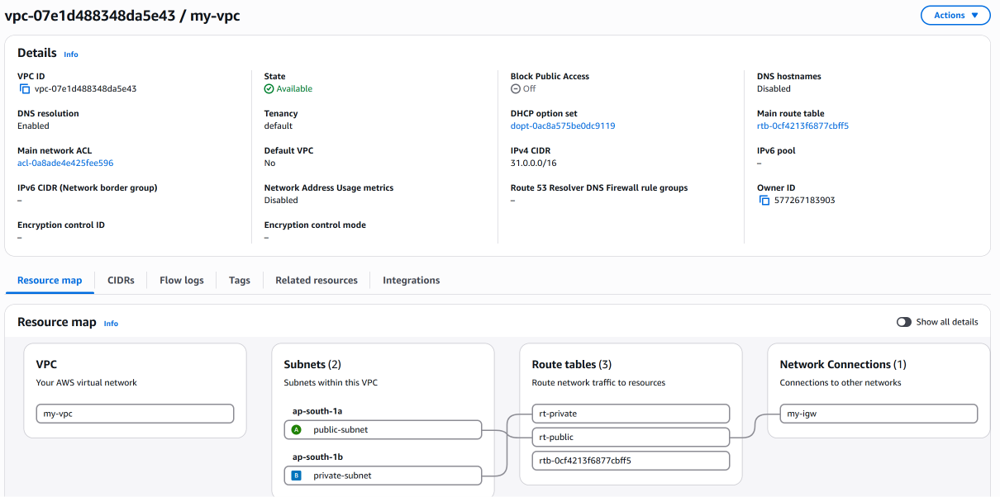

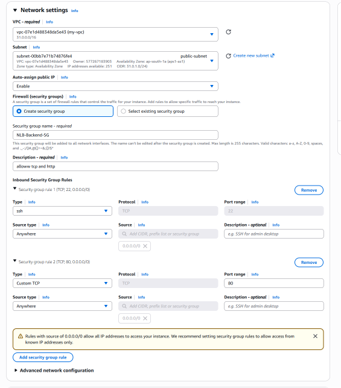

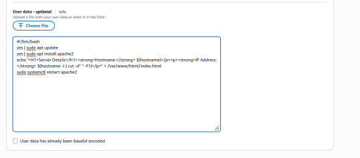

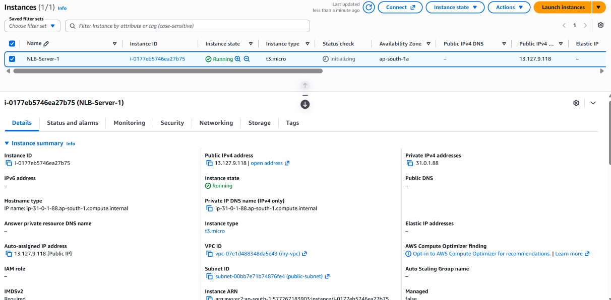

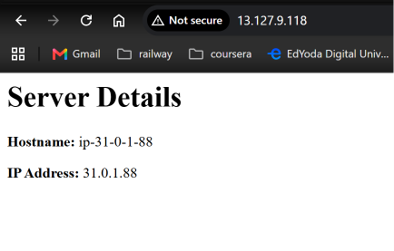

### Backend Server 2

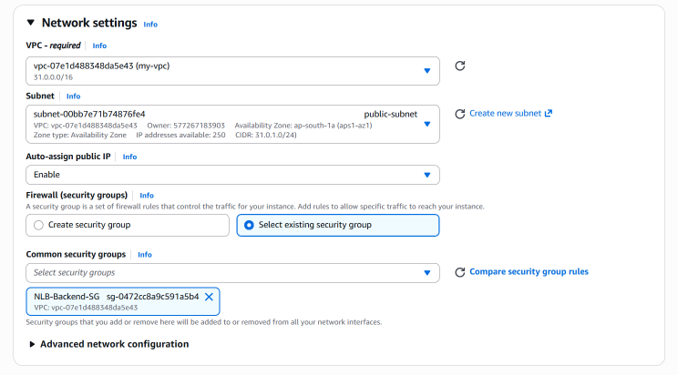

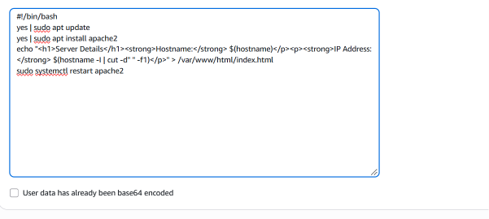

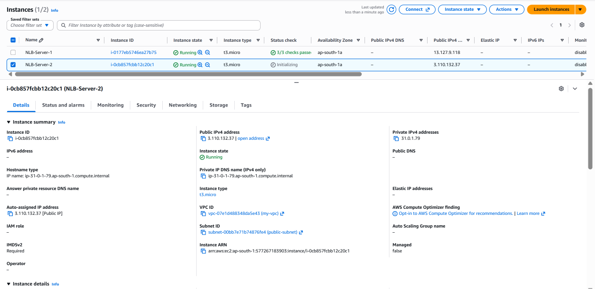

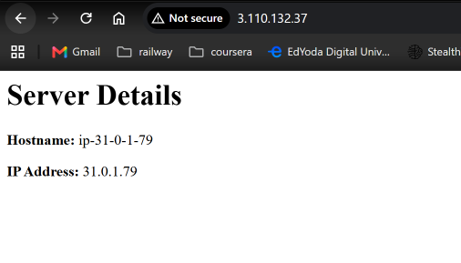

### Target Group

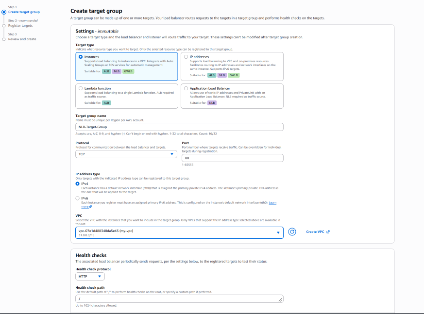

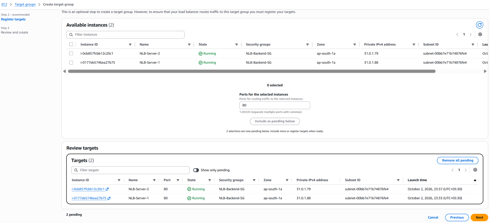

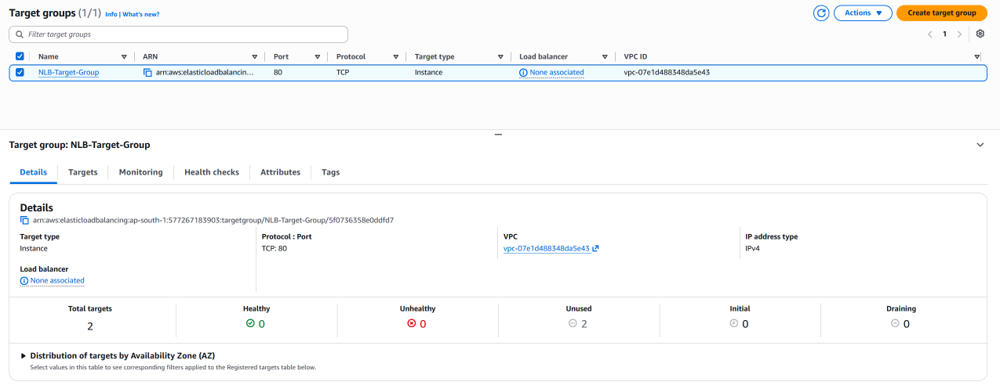

### NLB and Target Health

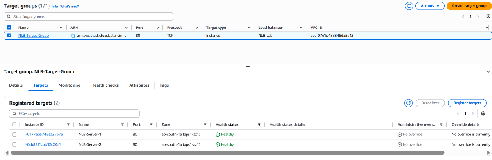

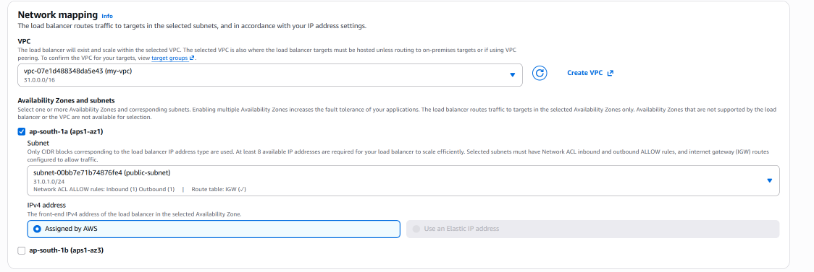

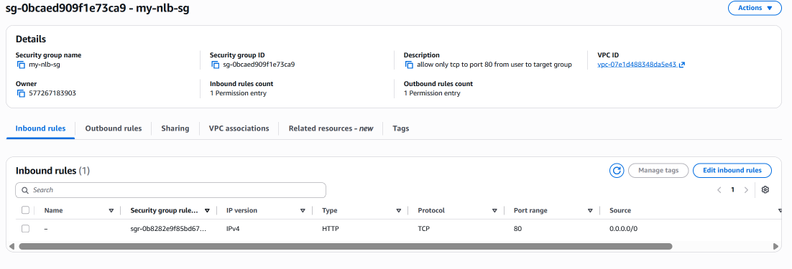

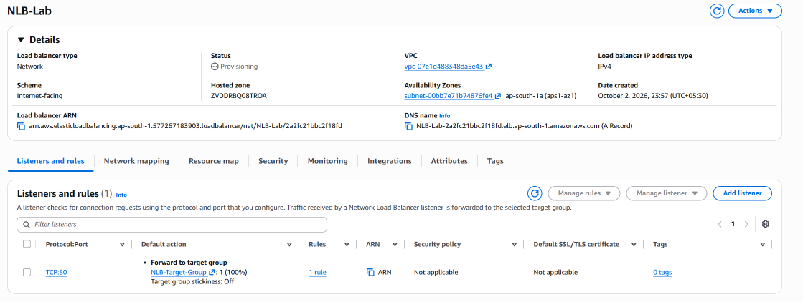

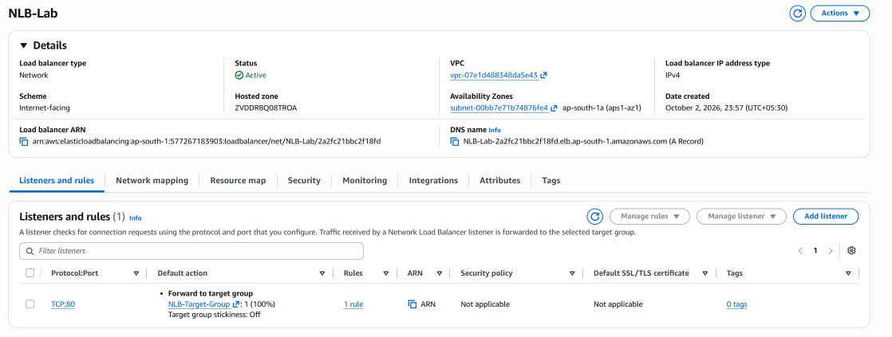

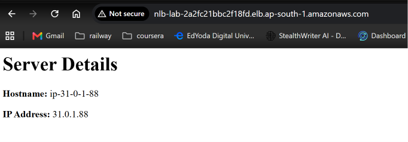

### NLB Backend Validation

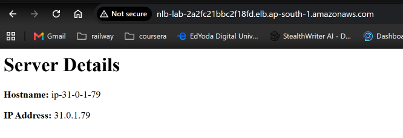

---

## 📖 Detailed Implementation

The complete hands-on implementation is divided into 15 documentation sections.

### 1. VPC

[Read the VPC implementation →](docs/01-vpc.md)

### 2. Subnets

[Read the Subnets implementation →](docs/02-subnets.md)

### 3. Internet Gateway

[Read the Internet Gateway implementation →](docs/03-internet-gateway.md)

### 4. Route Tables

[Read the Route Tables implementation →](docs/04-route-tables.md)

### 5. NAT Gateway

[Read the NAT Gateway implementation →](docs/05-nat-gateway.md)

### 6. EC2 in VPC

[Read the EC2 implementation →](docs/06-ec2-in-vpc.md)

### 7. EC2 User Data

[Read the EC2 User Data implementation →](docs/07-ec2-user-data.md)

### 8. Security Groups

[Read the Security Groups implementation →](docs/08-security-groups.md)

### 9. Application Load Balancer

[Read the Application Load Balancer implementation →](docs/09-application-load-balancer.md)

### 10. VPC Peering

[Read the VPC Peering implementation →](docs/10-vpc-peering.md)

### 11. Transit Gateway

[Read the Transit Gateway implementation →](docs/11-transit-gateway.md)

### 12. Transit Gateway Cross-Region Peering

[Read the Transit Gateway Cross-Region Peering implementation →](docs/12-transit-gateway-cross-region-peering.md)

### 13. VPC Endpoint

[Read the VPC Endpoint implementation →](docs/13-vpc-endpoint.md)

### 14. VPC Flow Logs

[Read the VPC Flow Logs implementation →](docs/14-vpc-flow-logs.md)

### 15. Network Load Balancer

[Read the Network Load Balancer implementation →](docs/15-network-load-balancer.md)

---

## 🧪 Practical Validation

The project focuses heavily on validating network behavior instead of only creating AWS resources.

Examples of validation performed include:

### Public EC2 Internet Connectivity

```bash
ping google.com
```

### Private EC2 Connectivity

Private IPv4 addresses were used to test communication between EC2 instances.

### HTTP Validation

```bash
curl http://<PUBLIC-IP>
```

### SSH Validation

```bash
ssh <user>@<public-ip>
```

### S3 VPC Endpoint Validation

```bash
aws s3 ls
```

### STS VPC Endpoint Validation

```bash
aws sts get-caller-identity
```

### IAM Role Credential Validation

```bash
aws configure list
```

The credential source showed that the EC2 instance was using IAM role credentials.

### General Internet Negative Test

```bash
curl -I --connect-timeout 5 --max-time 10 https://google.com
```

The private EC2 request timed out while S3 access through the VPC Endpoint succeeded.

### VPC Flow Logs Validation

```bash
ping -c 4 google.com
```

The resulting traffic metadata was observed in CloudWatch Logs.

### Network Load Balancer Validation

The NLB lab was validated by:

- Verifying both EC2 backend servers directly
- Registering both EC2 instances in the NLB target group
- Confirming both targets became `Healthy`
- Verifying the NLB listener on TCP port `80`
- Accessing the NLB DNS endpoint
- Confirming backend responses through the NLB

---

## 🔍 Important Practical Lessons

### 1. A public subnet is defined by routing

A subnet is not public simply because it is named `public`.

A subnet is effectively public when its route table provides a path such as:

```text
0.0.0.0/0
      ↓
Internet Gateway
```

### 2. A private subnet can still access the Internet

A private subnet can have outbound Internet connectivity through:

```text
Private EC2
    ↓
Private Route Table
    ↓
NAT Gateway
    ↓
Internet Gateway
    ↓
Internet
```

The private EC2 does not need a public IPv4 address.

### 3. Route tables and Security Groups perform different jobs

Route tables determine where traffic is sent.

Security Groups determine whether traffic is allowed at the resource level.

Both need to be considered when troubleshooting connectivity.

### 4. VPC Peering is not transitive

If:

```text
VPC A ↔ VPC B
```

and:

```text
VPC B ↔ VPC C
```

this does not automatically mean:

```text
VPC A ↔ VPC C
```

### 5. Transit Gateway provides centralized connectivity

Transit Gateway provides a centralized architecture:

```text
VPC A
   \
VPC B → Transit Gateway
   /
VPC C
```

But route configuration is still required.

### 6. Cross-region Transit Gateway Peering requires routing

Creating the Transit Gateway Peering Attachment alone does not provide complete end-to-end connectivity.

The traffic path depends on:

```text
VPC Route
     ↓
Transit Gateway
     ↓
Peering Attachment
     ↓
Remote Transit Gateway
     ↓
Remote VPC Route
     ↓
Destination
```

### 7. VPC Endpoints can provide private AWS service access

The private EC2 was able to access S3 without general Internet connectivity because the S3 Gateway Endpoint provided the required service path.

### 8. IAM permissions and network connectivity are separate

An IAM role can provide permission to call an AWS service, but the instance still needs an appropriate network path to that service.

This distinction became especially clear during the STS test.

### 9. VPC Flow Logs provide visibility, not packet contents

VPC Flow Logs record metadata about network traffic.

They can help identify:

- Source IP
- Destination IP
- Source port
- Destination port
- Protocol
- Packet count
- Byte count
- Accept/reject action
- ENI

They do not provide the full contents of network packets.

### 10. ENI correlation is useful during troubleshooting

Flow Log records can be correlated with an Elastic Network Interface.

This allows a network engineer to move from:

```text
Flow Log
   ↓
ENI
   ↓
EC2
   ↓
Route / Security Configuration
```

during troubleshooting.

---

## 🧠 Key Concepts Learned

Through this project, I gained hands-on experience with:

- Amazon VPC architecture
- IPv4 CIDR addressing
- Public and private subnet design
- Availability Zones
- Internet Gateways
- AWS route tables
- Local VPC routing
- Default routes (`0.0.0.0/0`)
- Longest prefix matching
- Subnet-to-route-table associations
- Public vs. private subnet routing
- NAT Gateway configuration
- Private subnet outbound Internet connectivity
- Public and private EC2 deployment
- Public vs. private IPv4 addressing
- SSH connectivity
- Accessing private resources through a public instance
- Testing network connectivity
- AWS VPC Resource Map
- AWS Security Groups
- Security Group inbound rules
- Security Group outbound rules
- Stateful Security Groups
- HTTP access on TCP port `80`
- SSH access on TCP port `22`
- Security Groups vs. route tables
- EC2 User Data and instance bootstrapping
- Automated Apache installation
- Automated server initialization using Bash
- HTTP service validation using `curl`
- Application Load Balancers
- Target Groups
- EC2 target registration
- ALB listeners
- ALB security groups
- Target health checks
- Healthy and unhealthy targets
- Internet-facing load balancers
- Load balancing across multiple EC2 instances
- ALB DNS names
- Backend response validation
- Network Load Balancers
- Layer 4 load balancing
- TCP listeners
- NLB target groups
- NLB target health checks
- Internet-facing NLBs
- NLB DNS names
- Backend response validation through NLB
- VPC Peering
- Cross-region VPC connectivity
- VPC Peering requester and accepter concepts
- VPC Peering connection states
- Cross-region private IPv4 communication
- Route-table configuration for VPC Peering
- Bidirectional VPC Peering connectivity
- VPC Peering limitations
- Non-transitive VPC routing
- AWS Transit Gateway
- Transit Gateway VPC attachments
- Centralized connectivity between multiple VPCs
- Transit Gateway route-table configuration
- Private IPv4 communication through Transit Gateway
- Transit Gateway connectivity validation
- Negative connectivity testing
- Transit Gateway routing dependencies
- Transit Gateway Peering
- Cross-region Transit Gateway connectivity
- Transit Gateway requester and accepter concepts
- Transit Gateway Peering connection states
- Cross-region Transit Gateway route configuration
- Bidirectional private connectivity through Transit Gateway Peering
- VPC Peering vs. Transit Gateway architecture
- VPC Endpoints
- Gateway VPC Endpoints
- Interface VPC Endpoints
- S3 Gateway Endpoint
- S3 private connectivity from a private EC2
- Route-table integration with Gateway Endpoints
- Systems Manager Session Manager
- SSM and SSMMessages Interface Endpoints
- STS Interface Endpoint
- EC2 IAM Roles
- Temporary IAM credentials
- IAM permissions vs. network connectivity
- VPC Endpoint security groups
- Private AWS service access without general Internet connectivity
- Negative testing for private service connectivity
- VPC Flow Logs
- VPC Flow Logs record fields
- Elastic Network Interface correlation
- CloudWatch Logs integration
- Flow Log `ACCEPT` and `REJECT` actions
- Network traffic visibility and troubleshooting

One of the key concepts demonstrated by this project is that simply naming a subnet **public** or **private** does not determine its networking behavior.

Routing and resource configuration determine how resources communicate.

Security Groups provide an additional traffic-control layer at the resource level.

In this architecture:

```text
Public Subnet
0.0.0.0/0 → Internet Gateway
      ↓
Security Group
      ↓
TCP 80 → Apache
```

while:

```text
Private Subnet
0.0.0.0/0 → NAT Gateway
```

The private EC2 instance can therefore initiate outbound Internet connections without having a public IPv4 address or a direct Internet Gateway route.

EC2 User Data demonstrates how instance initialization tasks can be automated during launch instead of being performed manually after connecting to the server.

The Application Load Balancer demonstrates how a single internet-facing endpoint can distribute HTTP requests across multiple healthy backend EC2 instances.

VPC Peering demonstrates how two VPCs in different AWS Regions can communicate privately when the peering connection is active and the appropriate routes are configured on both sides.

Transit Gateway extends this concept by providing a centralized connectivity hub through which multiple VPCs can communicate using dedicated VPC attachments and appropriate route-table entries.

The Transit Gateway lab also demonstrates that creating attachments alone does not automatically establish end-to-end connectivity. The required remote VPC CIDR routes must be present in the VPC route tables.

Transit Gateway Cross-Region Peering extends this architecture by connecting two regional Transit Gateways through a Transit Gateway Peering Attachment.

The cross-region lab demonstrates that private communication between VPCs in different AWS Regions requires:

```text
VPC Attachment
       +
Transit Gateway Peering
       +
Remote VPC Routes
       +
Security Group Rules
       =
Private Cross-Region Connectivity
```

The final validation confirmed bidirectional private IPv4 connectivity between the Mumbai and Virginia EC2 instances.

VPC Flow Logs added a visibility layer to the project by capturing traffic metadata from the EC2 network interface and delivering the records to CloudWatch Logs. This demonstrated how Flow Logs can be used alongside route tables, Security Groups, and other networking controls during troubleshooting.

---

## 🧹 Resource Cleanup

AWS resources created for hands-on practice should be removed after completing the lab when they are no longer required.

Resources created throughout this project include:

- Custom VPCs
- Public subnets
- Private subnets
- Internet Gateways
- Public route tables
- Private route tables
- NAT Gateway
- NAT Gateway public IP / Elastic IP resources where applicable
- Public EC2 instances
- Private EC2 instance
- Security Groups
- Target Group
- Application Load Balancer
- Network Load Balancer
- NLB Target Group
- NLB backend EC2 instances
- VPC Peering connection
- Additional VPC and networking resources used in the N. Virginia VPC Peering lab
- EC2 instances used for cross-region VPC connectivity testing
- Transit Gateway
- Transit Gateway VPC attachments
- Additional VPCs used for Transit Gateway testing
- EC2 instances used for Transit Gateway connectivity testing
- Regional Transit Gateways used for cross-region Transit Gateway Peering
- Transit Gateway Peering Attachment
- VPC attachments used for cross-region Transit Gateway connectivity
- EC2 instances used for cross-region Transit Gateway connectivity testing
- S3 Gateway VPC Endpoint
- SSM Interface VPC Endpoint
- SSMMessages Interface VPC Endpoint
- STS Interface VPC Endpoint
- VPC Endpoint security group
- IAM role and policy created for the VPC Endpoint lab
- VPC Flow Log
- CloudWatch Log Group used for VPC Flow Logs
- IAM role and policy created for the VPC Flow Logs lab

NAT Gateway, public IPv4 resources, EC2 instances, Transit Gateway resources, and other running AWS resources can incur charges, so temporary lab resources should not be left running unnecessarily.

---

## ⚠️ Note

This project is intended for educational and hands-on AWS networking practice.

The architecture focuses on understanding AWS VPC networking concepts and is **not intended to represent a complete production environment**.

The VPC CIDR `31.0.0.0/16` follows the addressing used during the training lab. For real-world private VPC designs, RFC 1918 private address ranges such as `10.0.0.0/8`, `172.16.0.0/12`, or `192.168.0.0/16` would normally be used.

The Security Group configuration used in this lab allows SSH and HTTP from `0.0.0.0/0` for learning and testing purposes. Restricting administrative access to trusted source addresses or using managed access mechanisms is preferable in production environments.

The Application Load Balancer and Target Group configuration in this project is intended for learning and demonstration purposes.

The Network Load Balancer configuration is also intended for learning and demonstration purposes. The lab uses an Internet-facing NLB with a TCP port 80 listener and two EC2 targets running Apache.

The VPC Peering configuration is also intended for learning and demonstration purposes. VPC Peering is a one-to-one connection and does not provide transitive routing between multiple VPCs.

The Transit Gateway configuration is also intended for learning and demonstration purposes. Transit Gateway provides centralized connectivity between multiple attached VPCs, but the appropriate route-table configuration is still required for traffic to reach the intended destination.

The Transit Gateway Cross-Region Peering configuration is also intended for learning and demonstration purposes. Cross-region connectivity requires Transit Gateway Peering, appropriate VPC attachments, remote VPC routes, and compatible security rules.

The VPC Endpoint configuration is also intended for learning and demonstration purposes. The lab uses an S3 Gateway Endpoint and Interface Endpoints for SSM, SSMMessages, and STS to demonstrate private AWS service connectivity from a private EC2 instance.

The VPC Flow Logs configuration is also intended for learning and demonstration purposes. The lab sends VPC Flow Log records to CloudWatch Logs using an IAM role and policy configured for the Flow Logs service.

The private EC2 in the VPC Endpoint lab was intentionally configured without a NAT Gateway route. S3 access succeeded through the S3 Gateway Endpoint, while the general Internet connectivity test timed out.

The EC2 instances used IAM Roles instead of manually configured permanent AWS access keys. The STS Interface Endpoint was added after observing that the private EC2 did not have a network path to STS during the identity test.

The project will continue to evolve as additional AWS networking concepts are implemented.