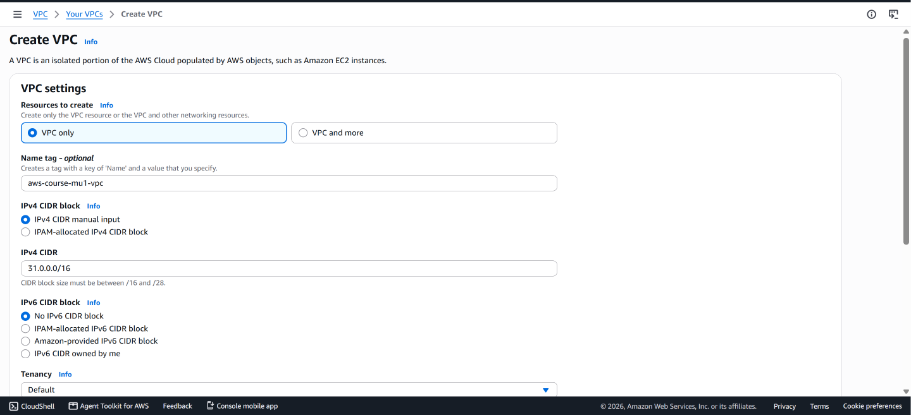
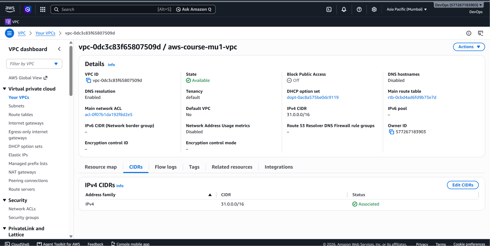

# Amazon VPC – Creation and Configuration

## 📌 What is Amazon VPC?

Amazon Virtual Private Cloud (Amazon VPC) is a service that allows you to create a logically isolated virtual network within AWS.

A VPC acts as the networking foundation for AWS resources such as EC2 instances, load balancers, databases, and other services.

Within a VPC, we can control networking components such as:

- IPv4 address ranges
- Subnets
- Route tables
- Internet connectivity
- Network gateways
- Network security

In this project, a custom VPC was created as the foundation for the public and private subnet architecture.

---

## 🎯 Why Do We Need a VPC?

A VPC allows us to design and control our own virtual network inside AWS.

Using a VPC, we can:

- Define our own IP address range
- Divide the network into multiple subnets
- Control how traffic is routed
- Provide or restrict Internet connectivity
- Deploy resources across Availability Zones
- Apply network security controls

The remaining networking components in this project are created inside this VPC.

---

## 🌐 What is a CIDR Block?

CIDR stands for **Classless Inter-Domain Routing**.

CIDR notation is used to define the range of IP addresses available within a network.

The VPC in this lab uses:

```text
31.0.0.0/16
```

The `/16` represents the network prefix.

This CIDR block provides the address space from which smaller subnet CIDR blocks can be allocated.

For example:

```text
VPC
31.0.0.0/16
│
├── Public Subnet
│   31.0.1.0/24
│
└── Private Subnet
    31.0.2.0/24
```

Both subnet CIDR blocks fall within the VPC's CIDR range.

> **Note:** `31.0.0.0/16` is used here to reproduce the networking lab configuration. For private network designs, RFC 1918 private IPv4 ranges such as `10.0.0.0/8`, `172.16.0.0/12`, or `192.168.0.0/16` are generally used.

---

# 🛠️ VPC Implementation

## Step 1 – Open the Amazon VPC Console

From the AWS Management Console:

```text
AWS Management Console
        ↓
VPC
        ↓
Your VPCs
        ↓
Create VPC
```

For this project, the VPC was created manually through the AWS Management Console.

---

## Step 2 – Configure the VPC

The following configuration was used:

| Setting | Value |
|---|---|
| Resource | VPC only |
| Name | `aws-course-mu1-vpc` |
| IPv4 CIDR | `31.0.0.0/16` |
| IPv6 CIDR | None |
| Tenancy | Default |

The `31.0.0.0/16` CIDR block defines the IPv4 address space available to the VPC.

### VPC Configuration



After verifying the configuration, the VPC was created.

---

## Step 3 – Verify the Created VPC

After creation, the VPC appeared in the **Your VPCs** section of the AWS Management Console.

The VPC details confirm that the custom network was successfully created with the configured IPv4 CIDR block.

### Created VPC



At this stage, the basic VPC network exists, but it does not yet contain the custom public and private subnets required by the architecture.

---

## 🔍 What Happens When the VPC is Created?

Creating the VPC establishes the main network boundary for this project.

The architecture at this stage can be represented as:

```text
AWS Region: ap-south-1

┌───────────────────────────────┐
│                               │
│       Custom Amazon VPC       │
│                               │
│         31.0.0.0/16           │
│                               │
└───────────────────────────────┘
```

The next step is to divide this address space into smaller networks using **subnets**.

---

## 🧠 Key Concepts

### VPC

A logically isolated virtual network within AWS where resources can be deployed.

### CIDR Block

Defines the IP address range available to a network.

### Region

The VPC was created in:

```text
Asia Pacific (Mumbai)
ap-south-1
```

A VPC is a regional resource and can contain subnets located in different Availability Zones within that Region.

### Tenancy

The VPC uses:

```text
Default tenancy
```

This allows resources launched within the VPC to use AWS's standard shared hardware model unless a different tenancy option is explicitly selected for supported resources.

---

## ✅ Result

A custom Amazon VPC was successfully created with the following configuration:

```text
VPC Name : aws-course-mu1-vpc
CIDR     : 31.0.0.0/16
Region   : ap-south-1
Tenancy  : Default
```

This VPC serves as the networking foundation for the public subnet, private subnet, Internet Gateway, and route tables configured in the following stages of the project.

---

## ➡️ Next Step

Continue to:

**[02 – Public and Private Subnets →](02-subnets.md)**

---

[← Back to Project README](../README.md)