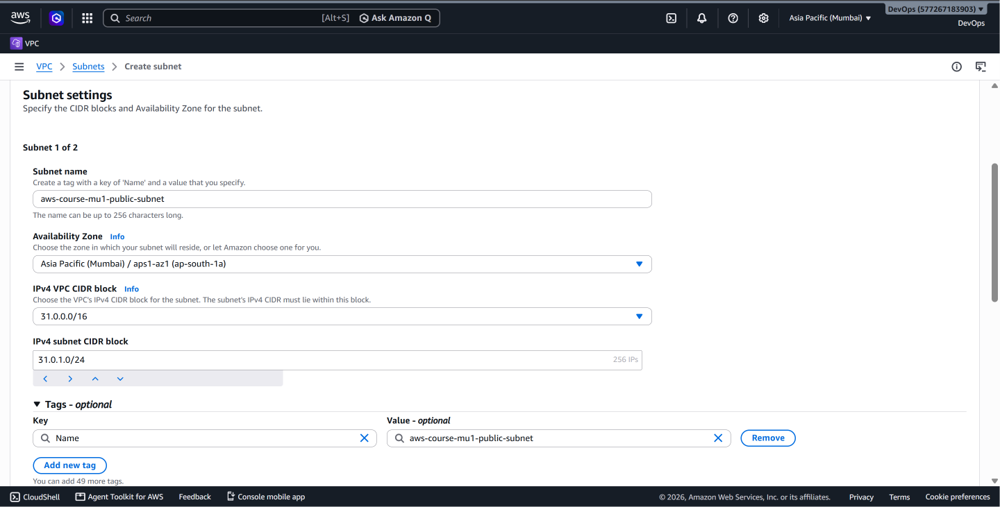
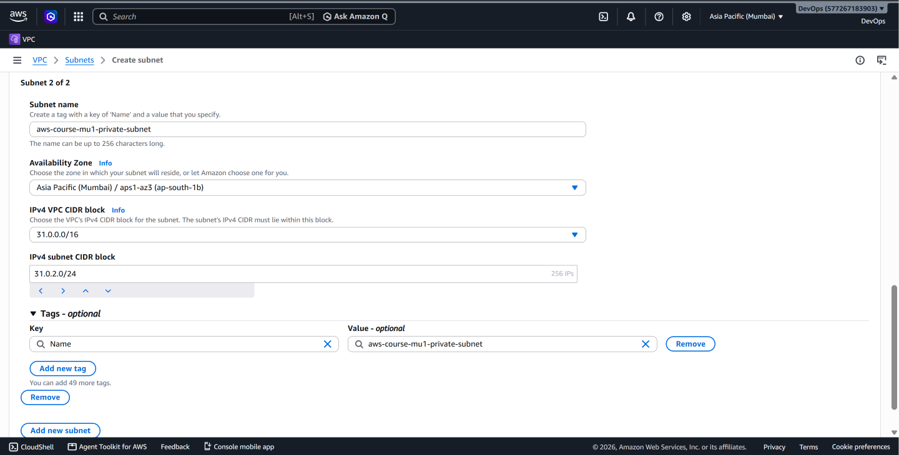
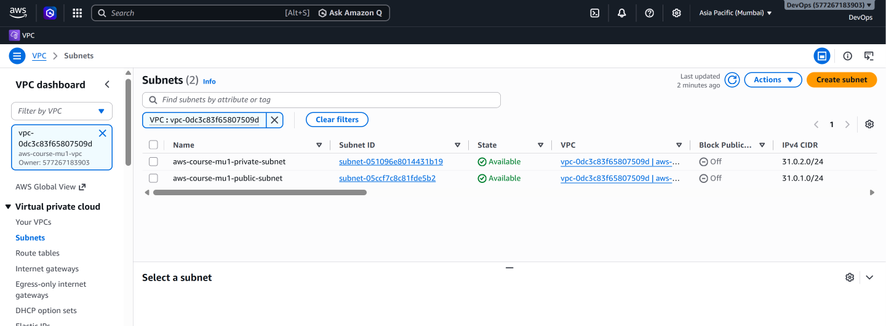

# AWS Subnets – Public and Private Subnet Configuration

## 📌 What is a Subnet?

A subnet is a smaller network created inside a VPC.

The VPC provides the overall IP address range, while subnets divide that range into smaller network segments where AWS resources can be deployed.

For this project, the VPC:

```text
31.0.0.0/16
```

was divided into two subnets:

```text
VPC: 31.0.0.0/16
│
├── Public Subnet
│   └── 31.0.1.0/24
│
└── Private Subnet
    └── 31.0.2.0/24
```

This allows different groups of resources to use different routing configurations.

---

## 🎯 Why Do We Use Subnets?

Subnets allow us to logically separate resources within a VPC.

For example, an architecture may place Internet-facing resources in public subnets while keeping internal resources in private subnets.

Typical examples include:

**Public subnet:**
- Internet-facing load balancers
- Bastion hosts
- NAT Gateways

**Private subnet:**
- Application servers
- Databases
- Internal services

The actual resources deployed in a subnet depend on the architecture being designed.

---

# 🌐 Subnet Design

The following subnet configuration was created in this project:

| Subnet | CIDR Block | Availability Zone | Routing |
|---|---|---|---|
| Public Subnet | `31.0.1.0/24` | `ap-south-1a` | Internet Gateway route |
| Private Subnet | `31.0.2.0/24` | `ap-south-1b` | Local route only |

Both subnet CIDR blocks are contained within the VPC CIDR:

```text
31.0.0.0/16
```

---

# 🔢 Understanding `/16` and `/24`

The VPC uses:

```text
31.0.0.0/16
```

while the subnets use:

```text
31.0.1.0/24
31.0.2.0/24
```

The prefix length determines how much of the IPv4 address represents the network portion.

A `/16` network contains a much larger address space than a `/24` network.

By creating `/24` subnets inside the `/16` VPC, the VPC address space can be divided into multiple smaller network segments.

A `/24` IPv4 subnet contains 256 total IPv4 addresses.

In AWS, five IPv4 addresses in each subnet are reserved and cannot be assigned to resources.

Therefore, a `/24` subnet provides:

```text
256 total addresses
- 5 AWS-reserved addresses
--------------------------
251 usable addresses
```

---

# 🌍 Availability Zones

An Availability Zone (AZ) is an isolated location within an AWS Region.

The project uses the AWS Mumbai Region:

```text
ap-south-1
```

The two subnets were created in different Availability Zones:

```text
Public Subnet
31.0.1.0/24
ap-south-1a

Private Subnet
31.0.2.0/24
ap-south-1b
```

A subnet exists entirely within a single Availability Zone and cannot span multiple Availability Zones.

Using multiple Availability Zones is an important building block for highly available AWS architectures.

---

# 🌎 What Makes a Subnet Public or Private?

A subnet does not become public simply because it is named **public**.

Its routing configuration is one of the key factors.

In this project, the public subnet is associated with a route table containing:

```text
0.0.0.0/0 → Internet Gateway
```

This provides a route for Internet-bound traffic toward the VPC's Internet Gateway.

The private subnet does not have this Internet Gateway route.

Therefore:

```text
Public Subnet
      │
      ▼
Public Route Table
      │
      ▼
0.0.0.0/0 → Internet Gateway
```

while:

```text
Private Subnet
      │
      ▼
Private Route Table
      │
      ▼
31.0.0.0/16 → local
```

> A route to an Internet Gateway is not by itself sufficient for an individual EC2 instance to communicate directly with the Internet. The instance also needs appropriate IP addressing and security configuration.

The detailed routing configuration is documented later in the project.

---

# 🛠️ Subnet Implementation

## Step 1 – Create the Public Subnet

From the AWS Management Console:

```text
VPC
 ↓
Subnets
 ↓
Create subnet
```

The previously created VPC was selected.

The public subnet was configured with:

| Setting | Value |
|---|---|
| VPC | `aws-course-mu1-vpc` |
| Subnet Type | Public |
| IPv4 CIDR | `31.0.1.0/24` |
| Availability Zone | `ap-south-1a` |

### Public Subnet Configuration



The subnet uses a portion of the address space available within the `31.0.0.0/16` VPC.

---

## Step 2 – Create the Private Subnet

A second subnet was created for resources that should not have a direct route to the Internet Gateway.

The private subnet was configured with:

| Setting | Value |
|---|---|
| VPC | `aws-course-mu1-vpc` |
| Subnet Type | Private |
| IPv4 CIDR | `31.0.2.0/24` |
| Availability Zone | `ap-south-1b` |

### Private Subnet Configuration



This subnet uses a different CIDR block and Availability Zone from the public subnet.

---

## Step 3 – Verify Both Subnets

After creation, both subnets were visible in the AWS VPC console.

### Created Subnets



The final subnet layout is:

```text
VPC
31.0.0.0/16
│
├── Public Subnet
│   ├── CIDR: 31.0.1.0/24
│   └── AZ: ap-south-1a
│
└── Private Subnet
    ├── CIDR: 31.0.2.0/24
    └── AZ: ap-south-1b
```

---

# 🧠 Key Concepts

### VPC CIDR

Defines the overall IPv4 address space available to the VPC.

```text
31.0.0.0/16
```

### Subnet CIDR

Defines a smaller IP address range within the VPC.

```text
Public  → 31.0.1.0/24
Private → 31.0.2.0/24
```

### Availability Zone

Each subnet belongs to exactly one Availability Zone.

### Public Subnet

In this architecture, a subnet associated with a route table that provides a route to an Internet Gateway.

### Private Subnet

In this architecture, a subnet without a direct route to the Internet Gateway.

---

# ✅ Result

The VPC has successfully been divided into two network segments:

```text
31.0.0.0/16
       │
       ├── 31.0.1.0/24
       │      Public Subnet
       │      ap-south-1a
       │
       └── 31.0.2.0/24
              Private Subnet
              ap-south-1b
```

The next step is to create an **Internet Gateway** and attach it to the VPC so that Internet connectivity can be configured for the public subnet.

---

## ➡️ Next Step

Continue to:

**[03 – Internet Gateway Configuration →](03-internet-gateway.md)**

---

[← Previous: VPC Creation](01-vpc.md) | [Back to Project README](../README.md)