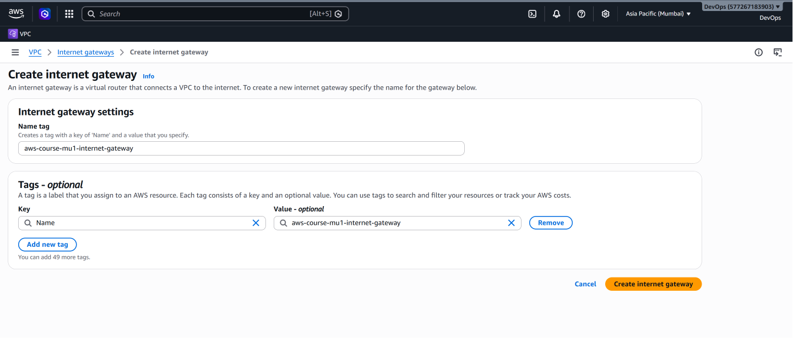
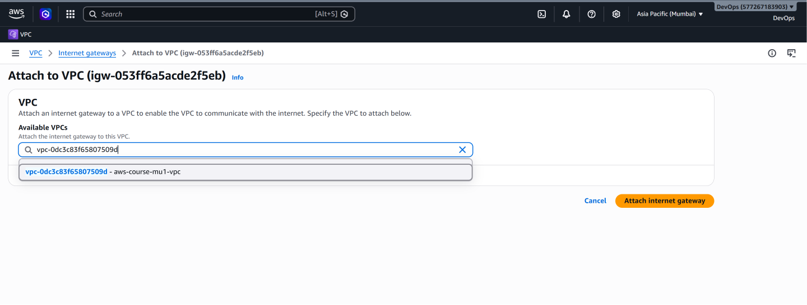

# AWS Internet Gateway – Creation and Configuration

## 📌 What is an Internet Gateway?

An **Internet Gateway (IGW)** is a horizontally scaled, redundant, and highly available VPC component that enables communication between a VPC and the Internet.

An Internet Gateway is attached to a VPC and can be used as a target in route tables for Internet-bound traffic.

In this project, an Internet Gateway was created and attached to:

```text
VPC: aws-course-mu1-vpc
CIDR: 31.0.0.0/16
```

---

## 🎯 Why Do We Need an Internet Gateway?

By default, creating a VPC and subnets does not automatically provide direct Internet connectivity.

Our architecture initially looked like:

```text
VPC: 31.0.0.0/16
│
├── Public Subnet
│   └── 31.0.1.0/24
│
└── Private Subnet
    └── 31.0.2.0/24
```

At this stage, there was no configured path from the VPC to the Internet.

An Internet Gateway provides a gateway that can be referenced by a route table for Internet-bound traffic.

After attaching the IGW:

```text
                Internet
                    │
                    │
           Internet Gateway
                    │
                    │
          VPC: 31.0.0.0/16
             /           \
            /             \
   Public Subnet       Private Subnet
   31.0.1.0/24        31.0.2.0/24
```

However, **attaching an Internet Gateway to the VPC does not automatically make every subnet public**.

Routing must still be configured.

---

# 🛠️ Internet Gateway Implementation

## Step 1 – Open Internet Gateways

From the AWS Management Console:

```text
AWS Management Console
        ↓
VPC
        ↓
Internet Gateways
        ↓
Create Internet Gateway
```

---

## Step 2 – Create the Internet Gateway

A custom Internet Gateway was created for the networking project.

The Internet Gateway was given a descriptive name so that its purpose could easily be identified in the AWS console.

### Internet Gateway Creation



After the Internet Gateway was created, it existed as an AWS networking resource but still needed to be attached to the VPC.

---

## Step 3 – Attach the Internet Gateway to the VPC

The newly created Internet Gateway was attached to:

```text
aws-course-mu1-vpc
```

The relationship became:

```text
Internet Gateway
       │
       ▼
aws-course-mu1-vpc
31.0.0.0/16
```

### Internet Gateway Attached to VPC



The Internet Gateway is now associated with the VPC.

---

# ⚠️ Does Attaching an IGW Make the Subnet Public?

**No.**

This is an important AWS networking concept.

Attaching an Internet Gateway to a VPC only makes the gateway available to the VPC.

For the public subnet to have a path toward the Internet, its route table must contain a route such as:

```text
Destination: 0.0.0.0/0
Target:      Internet Gateway
```

Therefore, the complete routing path is:

```text
Public Subnet
31.0.1.0/24
      │
      ▼
Public Route Table
      │
      ▼
0.0.0.0/0 → Internet Gateway
      │
      ▼
Internet
```

The private subnet does not receive this direct Internet Gateway route.

---

# 🌐 What Does `0.0.0.0/0` Mean?

The CIDR:

```text
0.0.0.0/0
```

represents all IPv4 destinations.

When a route table contains:

```text
0.0.0.0/0 → Internet Gateway
```

traffic that does not match a more specific route can be forwarded toward the Internet Gateway.

This is commonly called a **default route**.

In this project, this default route is added only to the route table associated with the public subnet.

---

# 🔄 Internet Traffic Path

Once the public route table is configured, the logical path for Internet-bound traffic becomes:

```text
Resource in Public Subnet
          │
          ▼
     Public Subnet
      31.0.1.0/24
          │
          ▼
   Public Route Table
          │
          ▼
     0.0.0.0/0
          │
          ▼
   Internet Gateway
          │
          ▼
       Internet
```

An EC2 instance would additionally require appropriate public IP addressing and security configuration to communicate directly with the Internet.

---

# 🔒 What About the Private Subnet?

The private subnet:

```text
31.0.2.0/24
```

does not have a direct route to the Internet Gateway in this architecture.

Its route table contains the VPC local route:

```text
31.0.0.0/16 → local
```

Therefore, resources in the private subnet do not have a direct Internet path through the IGW.

Later architectures can provide outbound Internet access to private resources through services such as a **NAT Gateway**, without directly exposing those resources to inbound Internet connections.

NAT Gateway is outside the scope of this project.

---

# 🧠 Key Concepts

### Internet Gateway

Provides a gateway that enables Internet communication for appropriately configured resources within a VPC.

### IGW Attachment

An Internet Gateway must be attached to a VPC before it can be used as a route target for that VPC.

### Default Route

```text
0.0.0.0/0
```

represents the default IPv4 route.

### Route Target

For the public subnet in this architecture:

```text
0.0.0.0/0 → Internet Gateway
```

### Public Subnet

A subnet intended for direct Internet connectivity requires appropriate routing to an Internet Gateway, along with suitable resource IP addressing and security configuration.

### Private Subnet

The private subnet in this project does not have a direct route to the Internet Gateway.

---

# ✅ Result

The Internet Gateway was successfully:

```text
Created
   ↓
Attached to aws-course-mu1-vpc
   ↓
Made available as a route target
```

The architecture is now ready for the final networking configuration: **route tables and subnet associations**.

---

## ➡️ Next Step

Continue to:

**[04 – Route Table Configuration →](04-route-tables.md)**

---

[← Previous: Public and Private Subnets](02-subnets.md) | [Back to Project README](../README.md)