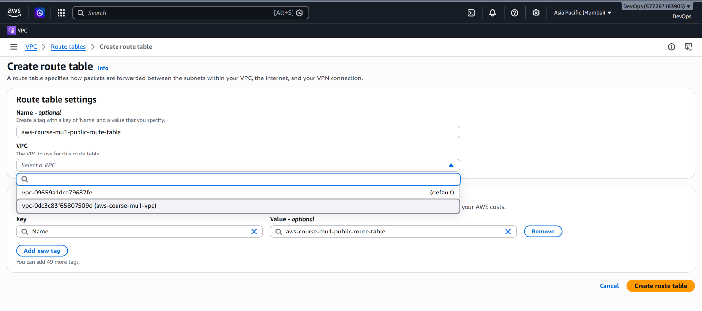
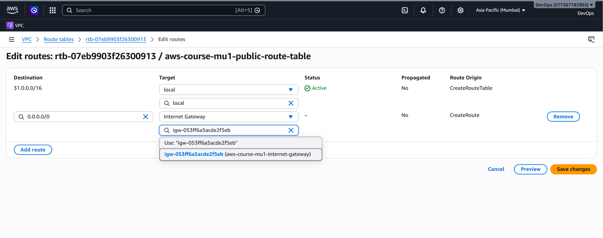
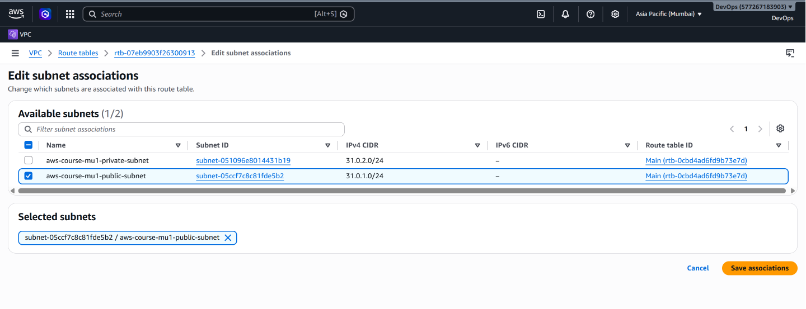
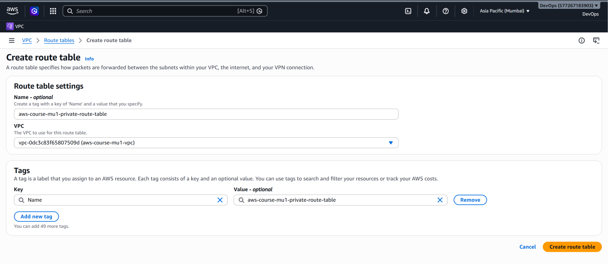
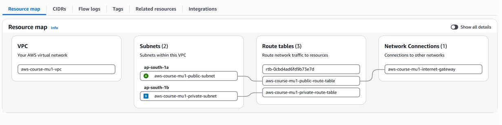

# AWS Route Tables – Public and Private Subnet Routing

## 📌 What is a Route Table?

A **route table** is a set of rules, called routes, that determines where network traffic from a subnet is directed.

Each route contains two important components:

```text
Destination → Target
```

For example:

```text
31.0.0.0/16 → local
0.0.0.0/0   → Internet Gateway
```

The **destination** specifies the IP address range the traffic is trying to reach, while the **target** specifies where matching traffic should be sent.

In this project, separate route tables are used for the public and private subnets.

---

## 🎯 Why Do We Need Route Tables?

Creating a VPC, subnets, and an Internet Gateway does not by itself determine how traffic should move.

Route tables provide those routing decisions.

Our architecture contains:

```text
VPC: 31.0.0.0/16
│
├── Public Subnet
│   └── 31.0.1.0/24
│
└── Private Subnet
    └── 31.0.2.0/24
```

We want different routing behavior for these two subnets.

The public subnet should have a route toward the Internet Gateway.

The private subnet should not have a direct Internet Gateway route.

Therefore, separate route tables are used.

---

# 🗺️ Routing Design

## Public Route Table

The public route table contains:

| Destination | Target | Purpose |
|---|---|---|
| `31.0.0.0/16` | `local` | Communication within the VPC |
| `0.0.0.0/0` | Internet Gateway | Internet-bound IPv4 traffic |

It is associated with:

```text
Public Subnet
31.0.1.0/24
```

---

## Private Route Table

The private route table contains:

| Destination | Target | Purpose |
|---|---|---|
| `31.0.0.0/16` | `local` | Communication within the VPC |

It is associated with:

```text
Private Subnet
31.0.2.0/24
```

There is no:

```text
0.0.0.0/0 → Internet Gateway
```

route in the private route table.

Therefore, the private subnet does not have a direct route to the Internet Gateway.

---

# 🏠 Understanding the Local Route

When a VPC is created, AWS automatically adds a **local route** to its route tables for communication within the VPC.

For this project:

```text
Destination: 31.0.0.0/16
Target:      local
```

This allows resources using IP addresses within the VPC CIDR to route traffic to each other, subject to other networking and security controls.

For example:

```text
Public Subnet
31.0.1.0/24
       │
       │
       ▼
31.0.0.0/16 → local
       │
       ▼
Private Subnet
31.0.2.0/24
```

Because both subnet CIDRs belong to the same VPC CIDR, the local route provides the routing path between them.

Security Groups, Network ACLs, and resource-level configuration can still control whether particular traffic is permitted.

---

# 🌎 Understanding the Default Route

The public route table also contains:

```text
Destination: 0.0.0.0/0
Target:      Internet Gateway
```

`0.0.0.0/0` represents all IPv4 destinations.

This route acts as the default path for traffic that needs to leave the VPC toward the Internet.

Therefore:

```text
Public Subnet
      │
      ▼
Public Route Table
      │
      ▼
0.0.0.0/0
      │
      ▼
Internet Gateway
      │
      ▼
Internet
```

---

# 🧠 How Does AWS Choose a Route?

A route table can contain multiple routes.

AWS uses the **most specific matching route** for the destination IP address.

This is commonly known as **longest prefix match**.

Consider the public route table:

```text
Destination       Target

31.0.0.0/16       local
0.0.0.0/0         Internet Gateway
```

Suppose traffic is being sent to:

```text
31.0.2.10
```

This destination matches both:

```text
31.0.0.0/16
```

and:

```text
0.0.0.0/0
```

However, `/16` is more specific than `/0`.

Therefore AWS selects:

```text
31.0.0.0/16 → local
```

and the traffic remains within the VPC.

If the destination is instead:

```text
8.8.8.8
```

it does not match the VPC's `31.0.0.0/16` route.

The default route matches:

```text
0.0.0.0/0 → Internet Gateway
```

so the traffic is directed toward the Internet Gateway.

---

# 🛠️ Route Table Implementation

## Step 1 – Create the Public Route Table

From the AWS Management Console:

```text
AWS Management Console
        ↓
VPC
        ↓
Route Tables
        ↓
Create route table
```

A custom route table was created for the public subnet.

It was associated with:

```text
VPC: aws-course-mu1-vpc
```

### Public Route Table Creation



---

## Step 2 – Add the Internet Route

The public route table needs a route for Internet-bound traffic.

The following route was added:

```text
Destination: 0.0.0.0/0
Target:      Internet Gateway
```

The route table therefore contains:

```text
31.0.0.0/16 → local
0.0.0.0/0   → Internet Gateway
```

### Public Route Table Routes



This creates the routing path from the public subnet toward the Internet Gateway.

---

## Step 3 – Associate the Public Subnet

Creating a route table does not automatically make a subnet use it.

The public route table was explicitly associated with:

```text
Public Subnet
31.0.1.0/24
```

### Public Subnet Association



The public subnet now uses the routing rules defined in the public route table.

---

# 🔒 Private Route Table

## Step 4 – Create the Private Route Table

A separate route table was created for the private subnet.

### Private Route Table Creation



The private route table retains the VPC local route:

```text
31.0.0.0/16 → local
```

but does not contain:

```text
0.0.0.0/0 → Internet Gateway
```

The private subnet therefore has no direct Internet Gateway route in this architecture.

---

# 🔄 Comparing Public and Private Routing

The final routing design can be summarized as:

```text
                         Internet
                             │
                             │
                      Internet Gateway
                             │
                             │
                ┌────────────┴────────────┐
                │                         │
          Public Route               No direct IGW
             Table                       route
                │                         │
                ▼                         ▼
        Public Subnet               Private Subnet
        31.0.1.0/24                 31.0.2.0/24
```

More specifically:

```text
PUBLIC

31.0.1.0/24
     │
     ▼
Public Route Table
     │
     ├── 31.0.0.0/16 → local
     │
     └── 0.0.0.0/0 → IGW
                       │
                       ▼
                    Internet
```

versus:

```text
PRIVATE

31.0.2.0/24
     │
     ▼
Private Route Table
     │
     └── 31.0.0.0/16 → local

No direct IGW route
```

---

# 📸 Final VPC Resource Map

After configuring the route tables and subnet associations, the AWS VPC Resource Map shows the relationship between the networking components.



The completed architecture contains:

```text
VPC
31.0.0.0/16
│
├── Public Subnet
│   └── Public Route Table
│       ├── Local Route
│       └── Internet Gateway Route
│
└── Private Subnet
    └── Private Route Table
        └── Local Route
```

---

# ⚠️ Important: Route to IGW vs Actual Internet Access

A public subnet route such as:

```text
0.0.0.0/0 → Internet Gateway
```

provides a routing path toward the Internet Gateway.

However, an EC2 instance placed inside that subnet would still require appropriate configuration for direct Internet communication, including:

- A public IPv4 address or Elastic IP
- Appropriate Security Group rules
- Appropriate Network ACL rules
- A functioning Internet Gateway attached to the VPC

Therefore:

```text
IGW route ≠ automatic Internet access for every resource
```

The route is one important part of the complete networking configuration.

---

# 🧠 Key Concepts Learned

Through the route table configuration, this project demonstrates:

- How AWS route tables control network traffic
- How the VPC local route works
- How `0.0.0.0/0` acts as a default IPv4 route
- How an Internet Gateway is used as a route target
- How route tables are associated with subnets
- How public and private subnet routing differs
- How longest prefix matching determines which route AWS selects
- Why an Internet Gateway attachment alone does not make a subnet public

---

# ✅ Final Result

The completed routing architecture is:

```text
AWS VPC: 31.0.0.0/16
│
├── Public Subnet: 31.0.1.0/24
│      │
│      └── Public Route Table
│             ├── 31.0.0.0/16 → local
│             └── 0.0.0.0/0 → Internet Gateway
│
└── Private Subnet: 31.0.2.0/24
       │
       └── Private Route Table
              └── 31.0.0.0/16 → local
```

This completes the fundamental AWS VPC networking architecture implemented in this project.

---

## 🏁 Project Complete

The following components have now been configured and documented:

- ✅ Custom Amazon VPC
- ✅ Public Subnet
- ✅ Private Subnet
- ✅ Internet Gateway
- ✅ Public Route Table
- ✅ Private Route Table
- ✅ Default Internet Route
- ✅ Subnet Associations
- ✅ Final VPC Resource Map

---

[← Previous: Internet Gateway](03-internet-gateway.md) | [Back to Project README](../README.md)