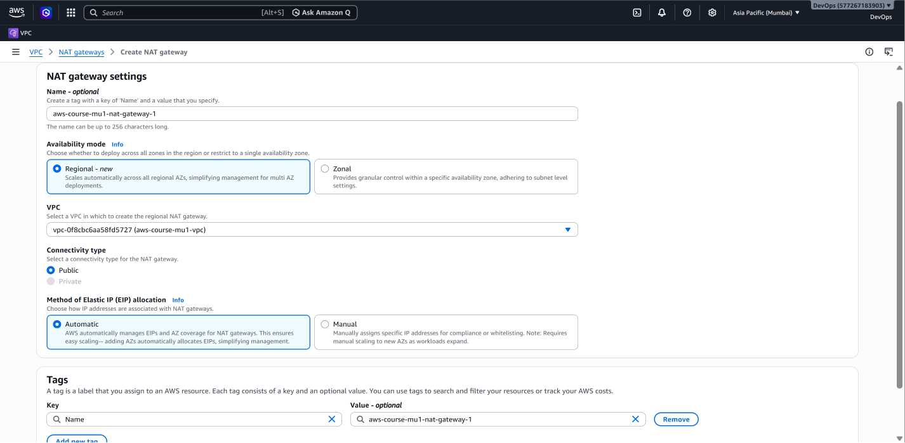
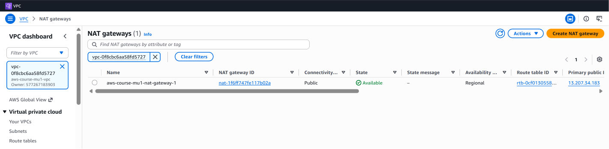
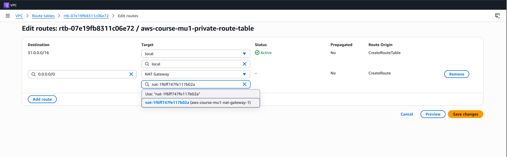
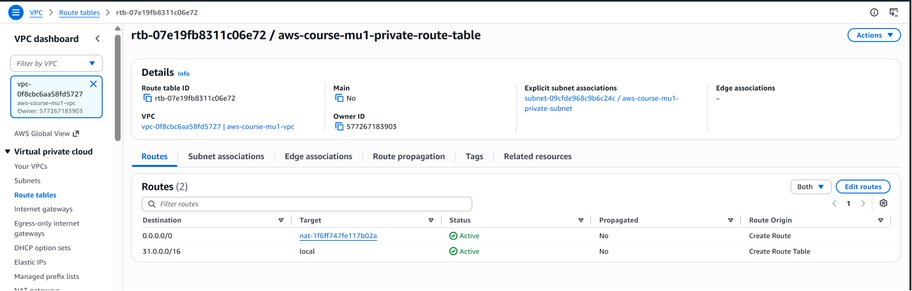

# NAT Gateway

## Overview

A NAT (Network Address Translation) Gateway allows resources inside a private subnet to initiate outbound connections to the Internet while preventing the Internet from directly initiating connections to those resources.

In this project, the EC2 instance running inside the private subnet does not have a public IPv4 address. A NAT Gateway is used to provide outbound Internet connectivity to this private instance.

---

## Why Do We Need a NAT Gateway?

The private subnet in this project is:

```text
31.0.2.0/24
```

Resources inside this subnet are intentionally not directly exposed to the Internet.

However, a private EC2 instance may still need Internet access for tasks such as:

- Downloading software packages
- Installing system updates
- Accessing external APIs
- Downloading application dependencies

Instead of assigning a public IP address to the private EC2 instance, outbound Internet traffic is routed through a NAT Gateway.

The traffic flow is:

```text
Private EC2
     |
     v
Private Route Table
     |
     | 0.0.0.0/0
     v
NAT Gateway
     |
     v
Internet Gateway
     |
     v
Internet
```

The connection is initiated by the private instance. External systems on the Internet cannot use the NAT Gateway to initiate a connection directly to the private EC2 instance.

---

## NAT Gateway Configuration

A NAT Gateway named:

```text
aws-course-mu1-nat-gateway-1
```

was created inside the existing VPC.

The NAT Gateway uses **Public** connectivity and a public IP address for communication with the Internet.

### NAT Gateway Configuration



The NAT Gateway was created using the AWS Console's regional NAT Gateway option.

---

## NAT Gateway Available

After creation, the NAT Gateway must reach the **Available** state before it can be used as a route target.



At this point, the NAT Gateway is ready to forward outbound traffic.

---

## Updating the Private Route Table

Creating a NAT Gateway alone does not automatically provide Internet connectivity to the private subnet.

The private route table must explicitly send Internet-bound traffic to the NAT Gateway.

The following route was added:

| Destination | Target |
|---|---|
| `31.0.0.0/16` | `local` |
| `0.0.0.0/0` | NAT Gateway |

The `31.0.0.0/16 → local` route allows communication between resources inside the VPC.

The `0.0.0.0/0 → NAT Gateway` route sends all other IPv4 traffic toward the NAT Gateway.

### Configuring the NAT Route



---

## Final Private Route Table

After saving the route, the private route table contains both the VPC local route and the NAT Gateway default route.



The resulting routing behavior is:

```text
Traffic for 31.0.0.0/16
        |
        +----> Local VPC Routing

All other IPv4 traffic
0.0.0.0/0
        |
        +----> NAT Gateway
```

This allows resources in the private subnet to communicate with resources inside the VPC while also providing outbound Internet connectivity through the NAT Gateway.

---

## Validating Internet Connectivity

An EC2 instance was launched inside the private subnet without a public IPv4 address.

The private EC2 instance was accessed through the EC2 instance running in the public subnet.

From the private EC2 instance, Internet connectivity was tested using:

```bash
ping 8.8.8.8
```

The test successfully received responses with `0% packet loss`.


This verifies that the outbound traffic path is working:

```text
Private EC2
     |
     v
Private Subnet
31.0.2.0/24
     |
     v
Private Route Table
0.0.0.0/0 → NAT Gateway
     |
     v
NAT Gateway
     |
     v
Internet Gateway
     |
     v
Internet
```

The private EC2 instance can therefore access the Internet without requiring its own public IPv4 address.

---

## Key Takeaways

- A private EC2 instance does not need a public IPv4 address to initiate outbound Internet connections.
- A NAT Gateway provides outbound Internet connectivity for resources in private subnets.
- The private route table must contain a `0.0.0.0/0` route pointing to the NAT Gateway.
- The VPC `local` route continues to handle communication between resources inside the VPC.
- NAT Gateway does not make the private EC2 instance directly reachable from the public Internet.
- Routing determines where network traffic is forwarded.

---

## ➡️ Next Step

Continue to:

**[06 – EC2 Instances in VPC →](06-ec2-in-vpc.md)**

---

[← Previous: Route Tables](04-route-tables.md) | [Back to Project README](../README.md)