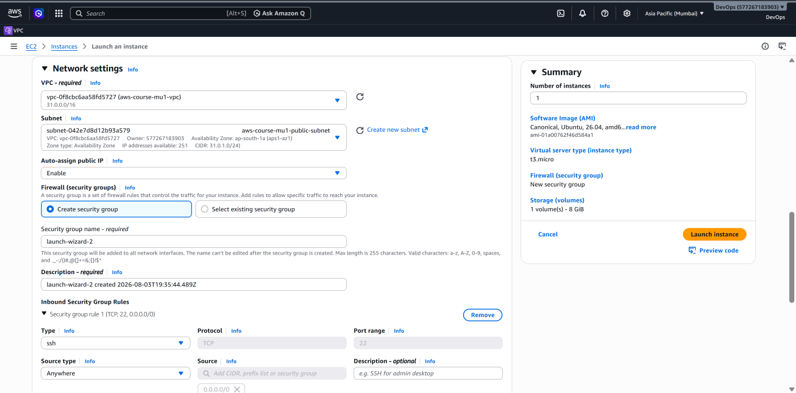
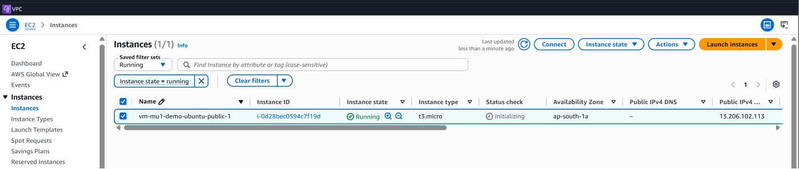
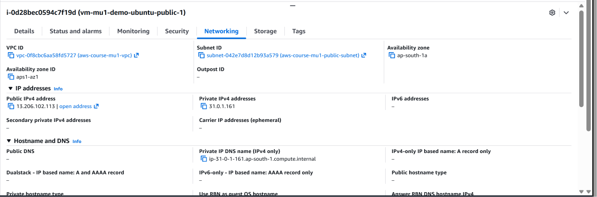
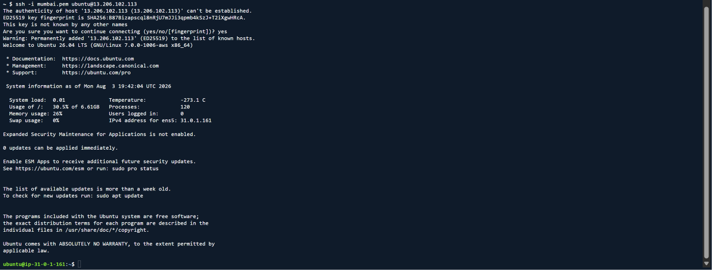
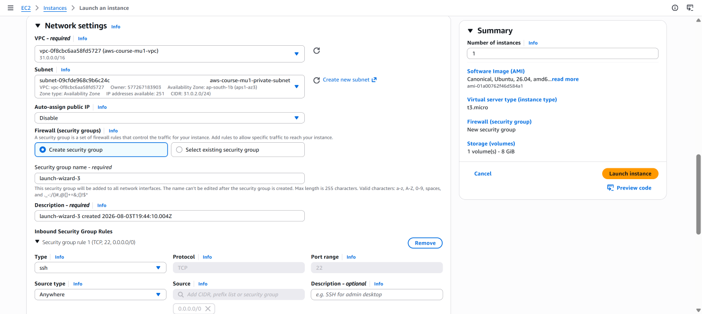
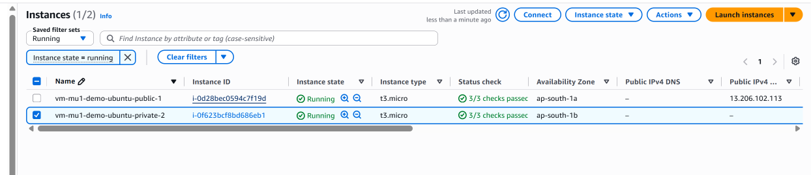
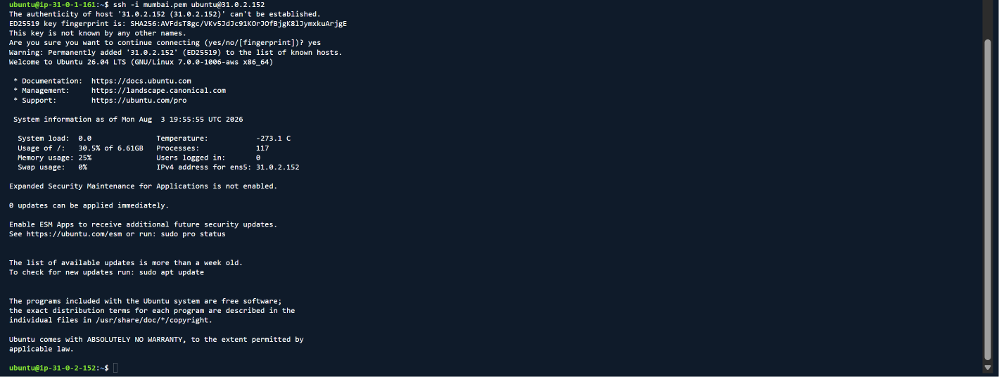
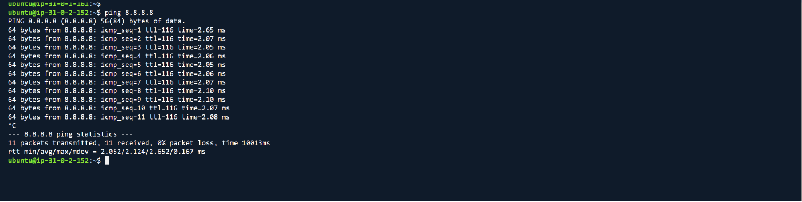
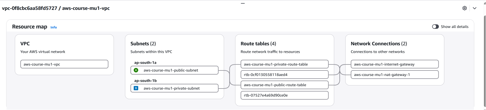

# EC2 Instances in Public and Private Subnets

## Overview

Amazon EC2 instances can be deployed into different subnets within a VPC depending on their networking requirements.

In this project, two EC2 instances were deployed:

- One EC2 instance in the public subnet
- One EC2 instance in the private subnet

The public EC2 instance has a public IPv4 address and can be accessed externally using SSH.

The private EC2 instance does not have a public IPv4 address and is accessed through the public EC2 instance using its private IPv4 address.

The resulting access path is:

```text
Administrator
     |
     | SSH
     v
Public EC2
31.0.1.161
     |
     | SSH using Private IPv4
     v
Private EC2
31.0.2.152
```

This demonstrates how resources inside public and private subnets can have different accessibility while still communicating through the VPC.

---

## Public EC2 Instance

The first EC2 instance was deployed inside the public subnet:

```text
Public Subnet
31.0.1.0/24
```

The instance was configured to receive a public IPv4 address.

Its network path to the Internet is:

```text
Public EC2
     |
     v
Public Subnet
31.0.1.0/24
     |
     v
Public Route Table
     |
     | 0.0.0.0/0
     v
Internet Gateway
     |
     v
Internet
```

---

## Public EC2 Network Configuration

During instance creation, the existing VPC and public subnet were selected.

The networking configuration included:

```text
VPC         : aws-course-mu1-vpc
Subnet      : aws-course-mu1-public-subnet
Public IPv4 : Enabled
```

### Network Configuration



Selecting the public subnet places the EC2 instance inside the `31.0.1.0/24` network.

---

## Public EC2 Running

After launching the instance, its state changed to **Running**.



The instance is now running inside the public subnet.

---

## Public and Private IPv4 Addresses

The public EC2 instance has both:

```text
Private IPv4 : 31.0.1.161
Public IPv4  : Assigned by AWS
```

### EC2 Network Details



The private IPv4 address is used for communication within the VPC.

The public IPv4 address allows the instance to participate in direct Internet communication when the required routing and access configuration are present.

---

## Connecting to the Public EC2 Instance

The public EC2 instance was accessed using SSH.

After connecting successfully, commands such as the following can be used to verify the Linux host:

```bash
whoami
hostname
hostname -I
```

### Successful SSH Connection



This confirms that the public EC2 instance is reachable through the configured network path.

---

# Private EC2 Instance

The second EC2 instance was deployed inside:

```text
Private Subnet
31.0.2.0/24
```

Unlike the public instance, this EC2 instance was configured without a public IPv4 address.

Therefore, it cannot be directly accessed using a public IPv4 address.

---

## Private EC2 Network Configuration

During instance creation, the private subnet was selected and automatic public IPv4 assignment was disabled.

```text
VPC         : aws-course-mu1-vpc
Subnet      : aws-course-mu1-private-subnet
Public IPv4 : Disabled
```

### Network Configuration



This places the instance inside the private network:

```text
31.0.2.0/24
```

without assigning it a public IPv4 address.

---

## Private EC2 Running

After launching the instance, it successfully entered the **Running** state.



The instance received a private IPv4 address:

```text
31.0.2.152
```

but no public IPv4 address.

---

# Accessing the Private EC2 Instance

Because the private EC2 instance does not have a public IPv4 address, it was not accessed directly from the Internet.

Instead, the public EC2 instance was used as an intermediate host.

The access path is:

```text
Administrator
      |
      | SSH
      v
+-------------------------+
| Public Subnet           |
| 31.0.1.0/24             |
|                         |
| Public EC2              |
| Private IP: 31.0.1.161  |
+------------+------------+
             |
             | VPC local routing
             | SSH to 31.0.2.152
             v
+-------------------------+
| Private Subnet          |
| 31.0.2.0/24             |
|                         |
| Private EC2             |
| Private IP: 31.0.2.152  |
+-------------------------+
```

The VPC local route:

```text
31.0.0.0/16 → local
```

provides the routing path between the two subnet networks.

---

## SSH from Public EC2 to Private EC2

After connecting to the public EC2 instance, an SSH connection was established to the private EC2 instance using its private IPv4 address.

### Successful Private EC2 SSH Connection



This confirms communication between:

```text
Public EC2
31.0.1.161
     |
     v
Private EC2
31.0.2.152
```

through the VPC network.

---

## SSH Key Handling in This Lab

For this hands-on lab, the SSH private key was temporarily transferred from the local Windows machine to the public EC2 instance.

The public EC2 instance then used that key to authenticate to the private EC2 instance.

The lab flow was:

```text
Windows Machine
      |
      | SCP
      v
Public EC2
      |
      | SSH using private key
      v
Private EC2
```

> **Security Note:** Copying a private SSH key onto an intermediate EC2 instance is acceptable for demonstrating the course lab, but it is not the preferred approach for production environments. More secure approaches can include SSH agent forwarding, AWS Systems Manager Session Manager, or other managed access methods.

The private key itself is **not stored in this GitHub repository**.

---

# Public EC2 vs Private EC2

| Feature | Public EC2 | Private EC2 |
|---|---|---|
| Subnet | Public | Private |
| Subnet CIDR | `31.0.1.0/24` | `31.0.2.0/24` |
| Private IPv4 | Yes | Yes |
| Public IPv4 | Yes | No |
| Direct IGW Route from Subnet | Yes | No |
| Direct SSH using Public IPv4 | Possible | No |
| Access Method in Lab | SSH | SSH through Public EC2 |
| Outbound Internet | Internet Gateway path | NAT Gateway path |

---

# Two Different Networking Paths

This project now demonstrates two important networking flows.

## Administrative Access

The private EC2 instance is reached through the public EC2 instance:

```text
Administrator
     |
     v
Public EC2
     |
     | VPC local routing
     v
Private EC2
```

## Private EC2 Outbound Internet Access

Internet-bound traffic from the private EC2 instance follows:

```text
Private EC2
     |
     v
Private Route Table
     |
     | 0.0.0.0/0
     v
NAT Gateway
     |
     v
Internet Gateway
     |
     v
Internet
```

These are separate networking concepts.

The public EC2 instance provides the access path used in this lab to reach the private EC2 instance, while the NAT Gateway provides outbound Internet connectivity for the private subnet.

---

# Internet Connectivity Validation

From the private EC2 instance, outbound Internet connectivity was tested using:

```bash
ping 8.8.8.8
```

The test successfully received responses.



This verifies that the private instance can initiate outbound Internet communication through the NAT Gateway without having its own public IPv4 address.

---

# Final VPC Resource Map

After configuring the NAT Gateway and deploying the EC2 instances, the VPC Resource Map was reviewed to verify the final networking relationships visible in the AWS Console.



The architecture now contains:

```text
VPC: 31.0.0.0/16
│
├── Public Subnet
│   ├── Public EC2
│   └── Public Route Table
│       └── 0.0.0.0/0 → Internet Gateway
│
└── Private Subnet
    ├── Private EC2
    └── Private Route Table
        └── 0.0.0.0/0 → NAT Gateway
```

The NAT Gateway provides the private subnet's outbound path toward the Internet.

---

# Key Takeaways

Through this part of the project, I gained hands-on experience with:

- Launching EC2 instances inside an existing VPC
- Selecting specific subnets for EC2 instances
- Understanding public and private IPv4 addressing
- Deploying an EC2 instance without a public IPv4 address
- Connecting to a public EC2 instance using SSH
- Accessing a private EC2 instance through a public EC2 instance
- Understanding VPC local routing between subnets
- Using a NAT Gateway for private subnet outbound connectivity
- Validating Internet connectivity from a private EC2 instance
- Understanding the difference between inbound administrative access and outbound Internet access

---

## ➡️ Next Step

Continue to:

**[07 – EC2 User Data →](07-ec2-user-data.md)**

---

[← Previous: NAT Gateway](05-nat-gateway.md) | [Back to Project README](../README.md)