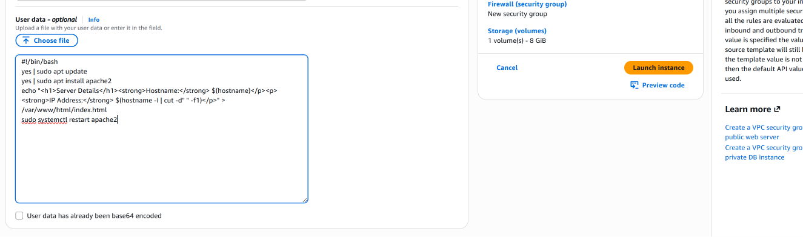
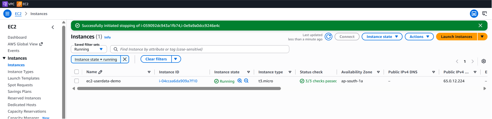

# EC2 User Data – Automated Apache Web Server Setup

## 📌 What is EC2 User Data?

EC2 User Data allows commands or scripts to be provided when launching an EC2 instance.

For Linux instances, User Data can be used to automate initial configuration tasks such as:

- Updating packages
- Installing software
- Creating configuration files
- Starting services
- Deploying basic applications

In this project, EC2 User Data was used to automatically install and configure an Apache web server when a new EC2 instance was launched.

---

## 🎯 Objective

The objective of this lab was to automatically configure a public EC2 instance as a web server during instance initialization.

The User Data script performs the following tasks:

```text
EC2 Instance Launch
        ↓
User Data Executes
        ↓
Update Package Repository
        ↓
Install Apache
        ↓
Generate Custom index.html
        ↓
Restart Apache
        ↓
Web Server Available
```

---

## 📝 User Data Script

The following script was added under the **Advanced details → User data** section while launching the EC2 instance:

```bash
#!/bin/bash

yes | sudo apt update
yes | sudo apt install apache2

echo "<h1>Server Details</h1><strong>Hostname:</strong> $(hostname)</p><p><strong>IP Address:</strong> $(hostname -I | cut -d" " -f1)</p>" > /var/www/html/index.html

sudo systemctl restart apache2
```

The script:

1. Updates the Ubuntu package repository.
2. Installs the Apache web server.
3. Creates a custom `index.html` page.
4. Retrieves the instance hostname.
5. Retrieves the instance's private IPv4 address.
6. Restarts Apache.

---

## 🛠️ Step 1 – Configure EC2 User Data

During EC2 instance creation, the script was entered in:

```text
EC2
 ↓
Launch Instance
 ↓
Advanced Details
 ↓
User Data
```



This allows the initial web-server configuration to be automated as part of the EC2 launch process.

---

## 🚀 Step 2 – Launch the EC2 Instance

After configuring the networking and User Data settings, the EC2 instance was launched in the public subnet.



The instance successfully entered the:

```text
Running
```

state and passed its status checks.

---

## 🌐 Step 3 – Verify Apache

After connecting to the instance, the Apache service was checked using:

```bash
sudo systemctl status apache2
```

The service reported:

```text
Active: active (running)
```


This confirms that Apache was successfully installed and started through the automated instance initialization process.

---

## 🧪 Step 4 – Test the Web Server Locally

The web server was first tested from inside the EC2 instance using:

```bash
curl localhost
```

The server returned the custom HTML generated by the User Data script.


The response contained the instance information:

```text
Hostname: ip-31-0-1-86
IP Address: 31.0.1.86
```

This confirms that:

```text
Apache is responding
        +
Custom index.html exists
        +
Dynamic instance information was generated
```

---

## 🌍 Step 5 – Test from a Web Browser

The EC2 instance's public IPv4 address was entered into a web browser:

```text
http://<EC2-PUBLIC-IP>
```

The Apache web server successfully returned the custom page:


The browser displayed:

```text
Server Details

Hostname: ip-31-0-1-86
IP Address: 31.0.1.86
```

This validates external HTTP connectivity to the web server.

---

## 🔄 Complete User Data Flow

The complete process demonstrated in this lab is:

```text
Launch EC2
    │
    ▼
User Data Script
    │
    ├── apt update
    │
    ├── Install Apache
    │
    ├── Generate index.html
    │
    └── Restart Apache
             │
             ▼
        Apache Running
             │
        ┌────┴────┐
        │         │
        ▼         ▼
 curl localhost  Browser
        │         │
        └────┬────┘
             ▼
      Custom Web Page
```

---

## 🧠 Why Use EC2 User Data?

Without User Data, the server could be configured manually after launch:

```text
Launch EC2
   ↓
SSH into EC2
   ↓
Install Apache
   ↓
Create Web Page
   ↓
Start Service
```

With User Data:

```text
Launch EC2
   ↓
Automatic Configuration
   ↓
Web Server Ready
```

This introduces an important cloud and DevOps concept:

> **Automating server initialization instead of manually configuring every new server.**

This approach becomes especially useful when multiple EC2 instances need to be launched with the same initial configuration.

---

## 🧠 Key Concepts Learned

Through this lab, I gained hands-on experience with:

- EC2 User Data
- Automated instance initialization
- Bash scripting during EC2 launch
- Automated package installation
- Apache web server installation
- Linux service management with `systemctl`
- Creating web content automatically
- Retrieving EC2 hostname information
- Retrieving private IPv4 information from Linux
- Testing HTTP services using `curl`
- Accessing an EC2-hosted web server through a browser
- Basic EC2 bootstrapping concepts

---

## ⚠️ Important Notes

EC2 User Data is commonly used for **bootstrapping** instances during initialization.

For Linux EC2 instances, User Data scripts are typically processed through the instance's cloud-init mechanism.

The web page in this lab displays the instance's **private IPv4 address**, while the browser connects to the instance using its **public IPv4 address**.

These addresses serve different purposes:

```text
Public IPv4
    ↓
Used by the browser to reach the EC2 instance

Private IPv4
    ↓
Used by the EC2 instance inside the VPC
```

---

## ✅ Final Result

The EC2 instance was successfully launched and automatically configured using User Data.

The completed workflow was:

```text
EC2 Launch
   ↓
User Data
   ↓
Apache Installation
   ↓
Custom Web Page Creation
   ↓
Apache Running
   ↓
Local Test Successful
   ↓
Browser Test Successful
```

No manual Apache installation was required after the instance was launched.

---

[← Previous: EC2 in VPC](06-ec2-in-vpc.md) | [Back to Project README](../README.md)