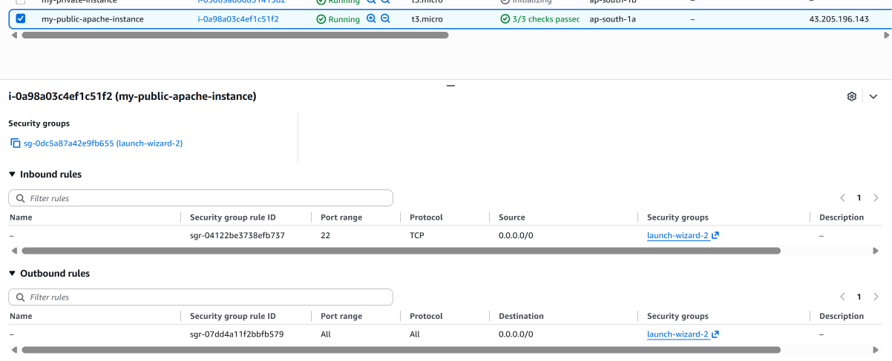
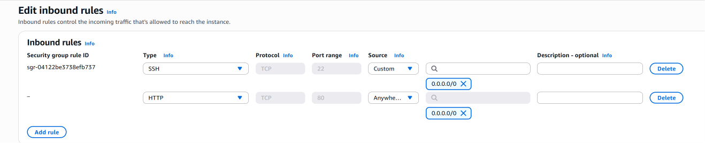
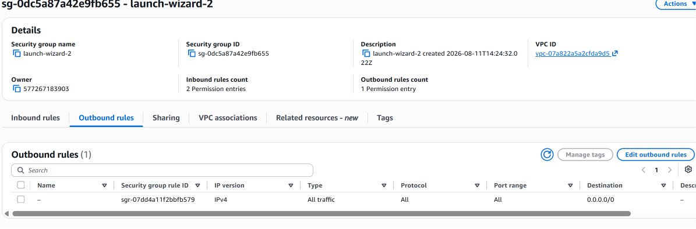

# AWS Security Groups – Controlling EC2 Network Traffic

## 📌 What is a Security Group?

An **AWS Security Group** acts as a virtual firewall for resources such as Amazon EC2 instances.

Security Groups control network traffic by defining:

- Inbound rules
- Outbound rules

Inbound rules determine which incoming traffic is allowed to reach the resource.

Outbound rules determine which traffic the resource is allowed to send.

In this project, a Security Group was configured for the public EC2 instance running the Apache web server.

The Security Group was configured to allow:

```text
SSH  → TCP port 22
HTTP → TCP port 80
```

---

## 🎯 Objective

The objective of this section was to understand how Security Groups control network traffic to and from an EC2 instance.

The public EC2 instance created in the previous section was used for this hands-on practice.

The main configuration was:

```text
Public EC2
     |
     |
Security Group
     |
     ├── Inbound: SSH 22
     ├── Inbound: HTTP 80
     └── Outbound: All traffic
```

The HTTP rule allows external clients to reach the Apache web server running on port `80`.

---

# 🧩 Security Group in the VPC Architecture

The Security Group is associated with the EC2 instance.

The traffic flow to the Apache web server can be represented as:

```text
Internet
    |
    | HTTP : 80
    v
Internet Gateway
    |
    v
Public Subnet
31.0.1.0/24
    |
    v
Security Group
    |
    | Allow TCP : 80
    v
Public EC2
    |
    v
Apache Web Server
    |
    | Port 80
    v
HTTP Response
```

The Security Group therefore acts as a traffic control layer between the network and the EC2 instance.

---

# 🔐 Inbound and Outbound Rules

Security Groups contain two main types of rules.

## Inbound Rules

Inbound rules control traffic coming **into** the EC2 instance.

For example:

```text
HTTP → TCP → 80
```

allows HTTP traffic to reach the instance when the source is permitted by the rule.

In this lab, SSH was also allowed:

```text
SSH → TCP → 22
```

This allows SSH connections to the EC2 instance.

---

## Outbound Rules

Outbound rules control traffic leaving the EC2 instance.

The Security Group used in this lab contains the default outbound rule:

```text
All traffic
Protocol: All
Port: All
Destination: 0.0.0.0/0
```

This allows the EC2 instance to initiate outbound IPv4 traffic to any destination.

---

# 🛠️ Security Group Configuration

The Security Group was configured for the public Apache EC2 instance:

```text
EC2 Instance:
my-public-apache-instance
```

The Security Group attached to the instance was:

```text
launch-wizard-2
```

The Security Group belongs to the VPC used throughout this project.

### Security Group Configuration



The configuration shows that the Security Group is associated with the public Apache EC2 instance.

The Security Group contains:

```text
Inbound rules  : 2
Outbound rules : 1
```

---

# 🌐 Configuring the Inbound HTTP Rule

The Apache web server installed during the EC2 User Data section listens for HTTP traffic on port `80`.

To allow external clients to access the Apache server, an HTTP inbound rule was added.

The rule configured in this lab is:

| Type | Protocol | Port | Source |
|---|---|---:|---|
| HTTP | TCP | 80 | `0.0.0.0/0` |

### Inbound HTTP Rule



The Security Group also contains the existing SSH rule:

| Type | Protocol | Port | Source |
|---|---|---:|---|
| SSH | TCP | 22 | `0.0.0.0/0` |
| HTTP | TCP | 80 | `0.0.0.0/0` |

The HTTP rule allows IPv4 clients from the Internet to send HTTP requests to port `80` on the EC2 instance.

---

# 🚪 Why Port 80 is Required for Apache

Apache is a web server that commonly listens for HTTP requests on port `80`.

The traffic path is therefore:

```text
Browser
   |
   | HTTP : 80
   v
Internet
   |
   v
Internet Gateway
   |
   v
Public Subnet
   |
   v
Security Group
   |
   | TCP : 80 allowed
   v
EC2 Instance
   |
   v
Apache
```

Without an appropriate inbound Security Group rule allowing HTTP traffic, the browser would not be able to reach Apache through port `80`.

Therefore:

```text
Apache listening on port 80
            +
Security Group allowing TCP 80
            =
HTTP traffic can reach the EC2 instance
```

---

# 📤 Outbound Rule

The Security Group also contains an outbound rule allowing all IPv4 traffic:

```text
Type        : All traffic
Protocol    : All
Port Range  : All
Destination : 0.0.0.0/0
```

### Outbound Rule



This allows the EC2 instance to initiate outbound IPv4 connections to any destination.

For example, the instance can initiate connections to external services when the rest of the AWS networking configuration permits the traffic.

---

# 🧠 Security Groups are Stateful

Security Groups are **stateful**.

This means that when an allowed connection is established, the response traffic is automatically allowed back through the Security Group.

For example:

```text
Browser
   |
   | HTTP Request : 80
   v
EC2
   |
   | HTTP Response
   v
Browser
```

When the inbound HTTP request is permitted by the Security Group, the corresponding response traffic is allowed automatically.

A separate inbound rule is not required just to allow the response to that established connection.

---

# 🔄 Complete HTTP Traffic Flow

The complete HTTP access path for the Apache server is:

```text
                 Internet
                    |
                    | HTTP : 80
                    v
             Internet Gateway
                    |
                    v
             Public Subnet
              31.0.1.0/24
                    |
                    v
             Security Group
                    |
                    | TCP : 80
                    v
          Public EC2 Instance
                    |
                    v
             Apache Web Server
                    |
                    v
              HTTP Response
```

The Security Group determines whether the incoming traffic is allowed to reach the EC2 instance.

---

# 🔑 SSH Access

The Security Group also contains an SSH inbound rule:

```text
Type        : SSH
Protocol    : TCP
Port        : 22
Source      : 0.0.0.0/0
```

This allows SSH connections to the EC2 instance.

The SSH access path used during the lab is:

```text
Administrator
      |
      | SSH : 22
      v
Internet Gateway
      |
      v
Public Subnet
      |
      v
Security Group
      |
      | TCP : 22 allowed
      v
Public EC2
```

SSH is used for administrative access to the Linux EC2 instance.

---

# ⚠️ Security Consideration

The Security Group used in this hands-on lab allows SSH and HTTP from:

```text
0.0.0.0/0
```

This means the corresponding ports are reachable from any IPv4 address, subject to the other network controls.

This configuration is useful for learning and testing, but unrestricted SSH access is generally **not recommended for production environments**.

For production environments, SSH access should ideally be restricted to trusted source IP addresses or replaced with more controlled access mechanisms where appropriate.

For example:

```text
SSH
22
↓
Trusted administrator IP
```

instead of:

```text
SSH
22
↓
0.0.0.0/0
```

The HTTP rule may intentionally allow public access when the EC2 instance is hosting a public web application.

---

# 🧠 Security Group vs Route Table

Security Groups and route tables perform different functions.

## Route Table

A route table determines **where traffic should go**.

Example:

```text
0.0.0.0/0
      ↓
Internet Gateway
```

It provides a routing path toward the Internet Gateway.

## Security Group

A Security Group determines **whether traffic is allowed to reach or leave the resource**.

Example:

```text
TCP : 80
      ↓
Allow
```

Therefore:

```text
Route Table
     ↓
Determines the path

Security Group
     ↓
Controls whether traffic is allowed
```

Both are important parts of EC2 network connectivity.

---

# 🔄 Relationship with the Previous Sections

The Security Group works together with the networking components configured earlier.

The public Apache EC2 traffic path is:

```text
Internet
    |
    v
Internet Gateway
    |
    v
Public Route Table
    |
    | 0.0.0.0/0 → IGW
    v
Public Subnet
    |
    v
Security Group
    |
    | TCP : 80 allowed
    v
EC2
    |
    v
Apache
```

Each component has a different responsibility:

```text
VPC
 ↓
Provides the network

Subnet
 ↓
Provides the IP address range

Route Table
 ↓
Determines the traffic path

Internet Gateway
 ↓
Provides connectivity between the VPC and Internet

Security Group
 ↓
Controls allowed traffic to/from the EC2

EC2
 ↓
Runs the application

Apache
 ↓
Serves HTTP traffic
```

---

# 🧠 Key Concepts Learned

Through this section, I gained hands-on experience with:

- Understanding AWS Security Groups
- Understanding inbound rules
- Understanding outbound rules
- Associating a Security Group with an EC2 instance
- Allowing SSH traffic on TCP port `22`
- Allowing HTTP traffic on TCP port `80`
- Understanding how Security Groups control EC2 traffic
- Understanding that Security Groups are stateful
- Understanding the relationship between route tables and Security Groups
- Understanding how HTTP traffic reaches an Apache web server
- Understanding basic Security Group security considerations

---

# ✅ Final Result

The public Apache EC2 instance is now protected by a configured Security Group.

The final rules used in this lab are:

### Inbound

```text
SSH
TCP : 22
Source: 0.0.0.0/0
```

```text
HTTP
TCP : 80
Source: 0.0.0.0/0
```

### Outbound

```text
All traffic
Protocol: All
Ports: All
Destination: 0.0.0.0/0
```

The resulting HTTP access path is:

```text
Internet
    ↓
Internet Gateway
    ↓
Public Route Table
    ↓
Public Subnet
    ↓
Security Group
    ↓
TCP : 80
    ↓
EC2
    ↓
Apache
```

This completes the **Security Groups** section of the AWS VPC networking project.

---

[← Previous: EC2 User Data](07-ec2-user-data.md) | [Back to Project README](../README.md)