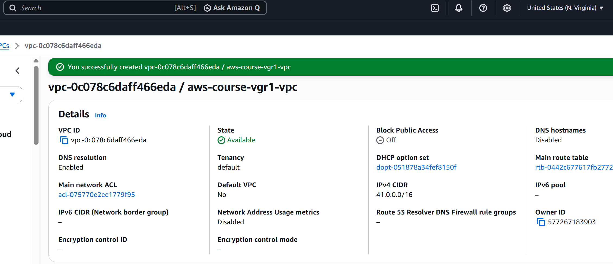
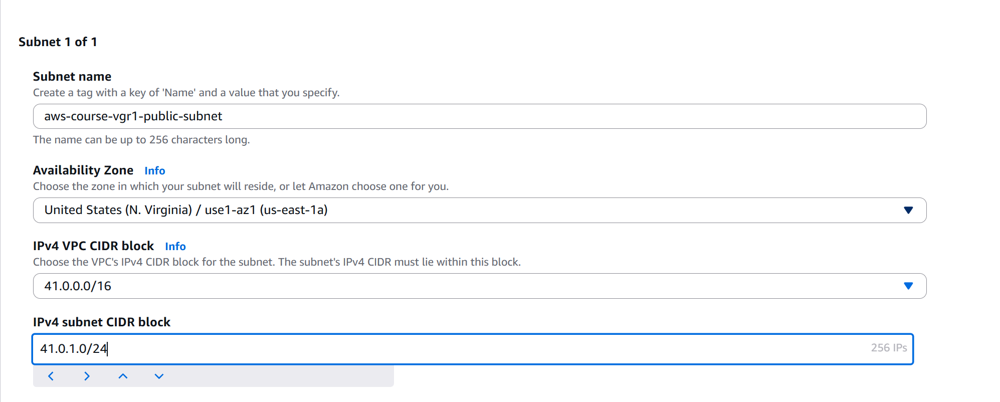
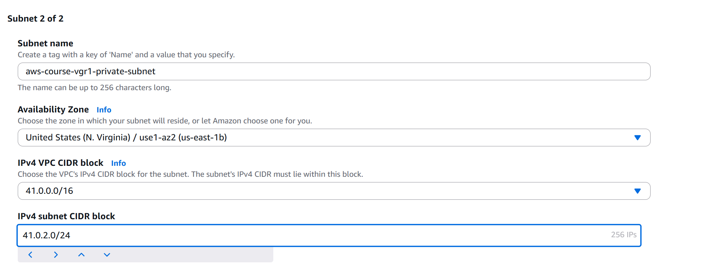
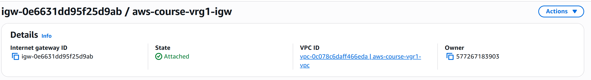
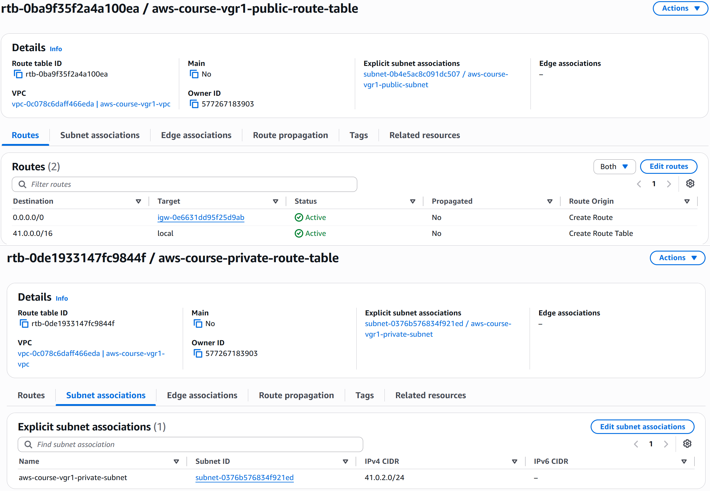

# Section 10: VPC Peering

## Overview

AWS VPC Peering allows two Virtual Private Clouds (VPCs) to communicate with each other using private IP addresses.

In this section, I configured VPC Peering between two VPCs located in different AWS Regions:

- Mumbai (`ap-south-1`)
- N. Virginia (`us-east-1`)

The Mumbai VPC uses the CIDR:

```text
31.0.0.0/16
```

The N. Virginia VPC uses the CIDR:

```text
41.0.0.0/16
```

After establishing the VPC Peering connection, I launched an EC2 instance in each VPC and tested communication between them using their private IPv4 addresses.

Initially, the ping failed because the required routes were not present in the route tables.

After adding the appropriate VPC Peering routes to both VPCs, communication between the two EC2 instances was successful.

---

# 1. What is AWS VPC Peering?

**AWS VPC Peering** is a networking connection that allows two VPCs to communicate privately with each other using private IPv4 or IPv6 addresses.

The VPCs can communicate without sending their traffic through the public Internet.

VPC Peering can be established between:

- VPCs in the same AWS Region.
- VPCs in different AWS Regions.
- VPCs belonging to the same AWS account.
- VPCs belonging to different AWS accounts.

In this practical implementation, I established VPC Peering between two VPCs located in different AWS Regions within the same AWS account.

The architecture is:

```text
             AWS Account
                  |
        +---------+---------+
        |                   |
        v                   v
   Mumbai VPC          N. Virginia VPC
   31.0.0.0/16         41.0.0.0/16
        |                   |
        |                   |
        +---- VPC Peering --+
```

The peering connection provides a private networking path between the two VPCs.

---

# 2. Why Do We Need VPC Peering?

Normally, two independent VPCs are isolated from each other.

For example:

```text
    Mumbai VPC                    N. Virginia VPC

    31.0.0.0/16                   41.0.0.0/16

       EC2                            EC2
        |                              |
        X                              X
        |                              |
        +------- No connectivity ------+
```

Even if both VPCs belong to the same AWS account, resources in one VPC cannot automatically communicate with resources in another VPC.

VPC Peering solves this problem by creating a private connection between the VPCs.

After peering:

```text
    Mumbai VPC
    31.0.0.0/16
         |
         |
         | VPC Peering
         |
         v
    N. Virginia VPC
    41.0.0.0/16
```

This allows resources in the two VPCs to communicate using their private IP addresses, provided that the required routes and security rules are configured.

---

# 3. What Problem Does VPC Peering Solve?

The main problem is **private communication between isolated VPC networks**.

For example, suppose an organization has:

```text
Mumbai VPC
31.0.0.0/16
```

and:

```text
N. Virginia VPC
41.0.0.0/16
```

An EC2 instance in Mumbai may need to communicate with an EC2 instance in N. Virginia.

Without VPC Peering:

```text
Mumbai EC2
    |
    X
    |
Virginia EC2
```

With VPC Peering:

```text
Mumbai EC2
31.0.1.139
    |
    v
Mumbai Route Table
    |
    v
VPC Peering Connection
    |
    v
Virginia Route Table
    |
    v
Virginia EC2
41.0.1.223
```

The communication can therefore happen using private IP addresses.

In this lab, the final connectivity was:

```text
Mumbai EC2
31.0.1.139
      |
      | VPC Peering
      |
      v
Virginia EC2
41.0.1.223
```

The reverse communication was also tested successfully.

---

# 4. What is the Role of Route Tables?

Creating a VPC Peering connection does **not automatically add routes** to the VPC route tables.

This is an important concept.

The VPC Peering connection provides the networking path, but the route tables must tell the VPC where traffic destined for the remote VPC should go.

For example, the Mumbai route table needs:

```text
Destination: 41.0.0.0/16
Target:      VPC Peering Connection
```

The N. Virginia route table needs:

```text
Destination: 31.0.0.0/16
Target:      VPC Peering Connection
```

The routing therefore becomes:

```text
Mumbai VPC
31.0.0.0/16
    |
    | Destination: 41.0.0.0/16
    v
Mumbai Route Table
    |
    v
VPC Peering Connection
    |
    v
Virginia Route Table
    |
    v
Virginia VPC
41.0.0.0/16
```

Without these routes, the EC2 instances cannot communicate with each other through the peering connection.

---

# 5. Architecture


## Environment

| Component | Mumbai | N. Virginia |
|---|---|---|
| Region | `ap-south-1` | `us-east-1` |
| VPC CIDR | `31.0.0.0/16` | `41.0.0.0/16` |
| Public Subnet | `31.0.1.0/24` | `41.0.1.0/24` |
| Private Subnet | `31.0.2.0/24` | `41.0.2.0/24` |
| EC2 Instance | `mumbai-instance` | `virginia-instance` |
| EC2 Private IP | `31.0.1.139` | `41.0.1.223` |

---

# 6. Hands-On Implementation

## Step 1 – N. Virginia VPC Configuration

The Mumbai VPC and its networking resources were already available from the previous sections of this project.

For the VPC Peering lab, I created a new VPC in the N. Virginia (`us-east-1`) region.

The VPC was configured with the CIDR:

```text
41.0.0.0/16
```



---

## Step 2 – N. Virginia Public Subnet

A public subnet was created inside the N. Virginia VPC.

Configuration:

```text
VPC CIDR:          41.0.0.0/16
Subnet CIDR:       41.0.1.0/24
Availability Zone: us-east-1a
```



---

## Step 3 – N. Virginia Private Subnet

A private subnet was also created in the N. Virginia VPC.

Configuration:

```text
VPC CIDR:          41.0.0.0/16
Subnet CIDR:       41.0.2.0/24
Availability Zone: us-east-1b
```



---

## Step 4 – Internet Gateway

An Internet Gateway was created and attached to the N. Virginia VPC.

This allows resources in the public subnet to communicate with the Internet when the appropriate route is configured.



---

## Step 5 – N. Virginia Route Table

The N. Virginia public route table was configured for the public subnet.

The route table contains the local VPC route and the Internet Gateway route.

The local route allows communication inside the VPC, while the default route allows Internet-bound traffic through the Internet Gateway.



---

# 7. Create VPC Peering Connection

The VPC Peering connection was created from the Mumbai region.

The Mumbai VPC was selected as the **Requester VPC**:

```text
Requester Region: Mumbai (ap-south-1)
Requester VPC CIDR: 31.0.0.0/16
```

The N. Virginia VPC was selected as the **Accepter VPC**:

```text
Accepter Region: N. Virginia (us-east-1)
Accepter VPC CIDR: 41.0.0.0/16
```

The peering connection was named:

```text
mu1-vgr1-peering-connection
```


The peering connection was created as a request from the Mumbai VPC to the N. Virginia VPC.

---

# 8. VPC Peering Pending Acceptance

After creating the peering connection, it appeared in the N. Virginia region with the status:

```text
Pending acceptance
```

At this stage, the peering connection had been requested but had not yet been accepted by the accepter VPC.


---

# 9. Accept VPC Peering Request

The peering request was opened in the N. Virginia region.

The **Accept request** action was selected to approve the VPC Peering connection.


---

# 10. VPC Peering Connection Active

After accepting the request, the VPC Peering connection changed to:

```text
Active
```

The peering connection was now established between:

```text
Mumbai VPC
31.0.0.0/16
```

and:

```text
N. Virginia VPC
41.0.0.0/16
```


The peering connection details confirmed:

```text
Requester Region: Mumbai (ap-south-1)
Requester CIDR:   31.0.0.0/16

Accepter Region:  N. Virginia (us-east-1)
Accepter CIDR:    41.0.0.0/16

Status: Active
```

---

# 11. Launch Mumbai EC2 Instance

An EC2 instance was launched in the existing Mumbai VPC.

The instance was placed in the Mumbai public subnet:

```text
VPC CIDR:    31.0.0.0/16
Subnet CIDR: 31.0.1.0/24
```

A public IPv4 address was enabled so that the instance could be accessed through SSH.

The security group allowed:

- SSH (`TCP 22`)
- ICMP IPv4


---

# 12. Launch N. Virginia EC2 Instance

A second EC2 instance was launched in the N. Virginia VPC.

The instance was placed in the N. Virginia public subnet:

```text
VPC CIDR:    41.0.0.0/16
Subnet CIDR: 41.0.1.0/24
```

A public IPv4 address was enabled.

The security group allowed:

- SSH (`TCP 22`)
- ICMP IPv4


---

# 13. Mumbai EC2 Instance Running

The Mumbai EC2 instance was successfully launched and reached the running state.

The instance received the private IPv4 address:

```text
31.0.1.139
```


---

# 14. N. Virginia EC2 Instance Running

The N. Virginia EC2 instance was successfully launched and reached the running state.

The instance received the private IPv4 address:

```text
41.0.1.223
```


---

# 15. Test Connectivity Before Updating Routes

At this point, the VPC Peering connection was already:

```text
Active
```

However, the route tables did not yet contain routes pointing to the remote VPC through the VPC Peering connection.

From the Mumbai EC2 instance, I attempted to ping the private IP address of the N. Virginia EC2 instance:

```text
ping 41.0.1.223
```

The ping failed and resulted in packet loss.


This demonstrated an important point:

> Creating and activating a VPC Peering connection alone does not automatically add routes to the VPC route tables.

The route tables must explicitly contain routes for the remote VPC CIDR.

---

# 16. Add VPC Peering Route in Mumbai

The Mumbai public route table was updated to route traffic destined for the N. Virginia VPC through the VPC Peering connection.

The destination was:

```text
41.0.0.0/16
```

The target was:

```text
VPC Peering Connection
```


The resulting routing logic is:

```text
Mumbai EC2
31.0.1.139
    |
    v
Mumbai Route Table
    |
    | 41.0.0.0/16
    v
VPC Peering Connection
    |
    v
N. Virginia VPC
```

---

# 17. Add VPC Peering Route in N. Virginia

The N. Virginia public route table was then updated to route traffic destined for the Mumbai VPC through the same VPC Peering connection.

The destination was:

```text
31.0.0.0/16
```

The target was:

```text
VPC Peering Connection
```


The resulting routing logic is:

```text
N. Virginia EC2
41.0.1.223
    |
    v
N. Virginia Route Table
    |
    | 31.0.0.0/16
    v
VPC Peering Connection
    |
    v
Mumbai VPC
```

---

# 18. Test Mumbai to N. Virginia Connectivity

After updating the route tables, I returned to the Mumbai EC2 instance.

The N. Virginia EC2 private IP was:

```text
41.0.1.223
```

I ran:

```text
ping 41.0.1.223
```

The ping was successful.

The Mumbai EC2 instance was able to communicate with the N. Virginia EC2 instance using its private IP address.


Example successful response:

```text
64 bytes from 41.0.1.223: icmp_seq=1 ttl=64
64 bytes from 41.0.1.223: icmp_seq=2 ttl=64
64 bytes from 41.0.1.223: icmp_seq=3 ttl=64
```

This confirmed that traffic from the Mumbai VPC could reach the N. Virginia VPC through the VPC Peering connection.

---

# 19. Test N. Virginia to Mumbai Connectivity

The reverse direction was also tested.

From the N. Virginia EC2 instance, I ran:

```text
ping 31.0.1.139
```

The ping was successful.


Example successful response:

```text
64 bytes from 31.0.1.139: icmp_seq=1 ttl=64
64 bytes from 31.0.1.139: icmp_seq=2 ttl=64
64 bytes from 31.0.1.139: icmp_seq=3 ttl=64
```

This confirmed that communication was working in both directions.

---

# 20. Final VPC Peering Architecture

The final architecture consists of two VPCs in different AWS Regions connected through a VPC Peering connection.

```text
                         AWS Account
                              |
              +---------------+---------------+
              |                               |
              v                               v
        Mumbai VPC                       N. Virginia VPC
        31.0.0.0/16                      41.0.0.0/16
        ap-south-1                       us-east-1
              |                               |
              |                               |
        Public Subnet                    Public Subnet
        31.0.1.0/24                      41.0.1.0/24
              |                               |
              |                               |
        Mumbai EC2                      Virginia EC2
        31.0.1.139                      41.0.1.223
              |                               |
              +------ VPC Peering ------------+
```

The final traffic flow is:

```text
Mumbai EC2
31.0.1.139
      |
      | Destination: 41.0.0.0/16
      v
Mumbai Route Table
      |
      v
VPC Peering Connection
      |
      v
N. Virginia Route Table
      |
      v
Virginia EC2
41.0.1.223
```

And the reverse path:

```text
Virginia EC2
41.0.1.223
      |
      | Destination: 31.0.0.0/16
      v
N. Virginia Route Table
      |
      v
VPC Peering Connection
      |
      v
Mumbai Route Table
      |
      v
Mumbai EC2
31.0.1.139
```

---

# 21. Key Concepts Learned

## VPC Peering

VPC Peering creates a private network connection between two VPCs.

The VPCs can be in:

- The same AWS Region.
- Different AWS Regions.
- The same AWS account.
- Different AWS accounts.

In this lab, the VPCs were in different AWS Regions within the same AWS account.

---

## Requester and Accepter

When creating a VPC Peering connection, one VPC acts as the **Requester** and the other acts as the **Accepter**.

In this lab:

```text
Requester:
Mumbai VPC
ap-south-1
```

```text
Accepter:
N. Virginia VPC
us-east-1
```

The accepter must accept the peering request before the connection becomes active.

---

## Route Tables Are Required

VPC Peering does not automatically modify the route tables.

Routes must be configured manually on both sides.

For Mumbai:

```text
Destination: 41.0.0.0/16
Target:      VPC Peering Connection
```

For N. Virginia:

```text
Destination: 31.0.0.0/16
Target:      VPC Peering Connection
```

Without these routes, the VPCs remain unable to communicate even if the peering connection itself is active.

---

## Private IP Communication

The connectivity test was performed using the EC2 instances' private IP addresses:

```text
Mumbai:
31.0.1.139
```

```text
N. Virginia:
41.0.1.223
```

The public IP addresses were not used for the VPC-to-VPC connectivity test.

This demonstrates that the VPC Peering connection provides private communication between the VPCs.

---

# 22. VPC Peering Limitation

VPC Peering uses a one-to-one relationship between VPCs.

For example, if there are three VPCs:

```text
VPC-A
VPC-B
VPC-C
```

Creating:

```text
VPC-A <-> VPC-B
```

does not automatically allow:

```text
VPC-A <-> VPC-C
```

A separate peering connection would be required.

Similarly, VPC Peering does not provide transitive routing.

For example:

```text
VPC-A <-> VPC-B
VPC-B <-> VPC-C
```

does not automatically mean:

```text
VPC-A <-> VPC-C
```

This limitation becomes important when designing architectures with many VPCs.

For larger environments with multiple VPCs, AWS Transit Gateway can be considered for centralized connectivity.

---

# 23. Final Result

The VPC Peering configuration was successfully completed between the Mumbai and N. Virginia VPCs.

## Final Configuration

```text
Mumbai VPC
Region:          ap-south-1
CIDR:            31.0.0.0/16
EC2 Private IP:  31.0.1.139
       |
       |
       | VPC Peering
       |
       v
N. Virginia VPC
Region:          us-east-1
CIDR:            41.0.0.0/16
EC2 Private IP:  41.0.1.223
```

## Connectivity Verification

```text
Mumbai -> N. Virginia
PING 41.0.1.223
SUCCESS
```

```text
N. Virginia -> Mumbai
PING 31.0.1.139
SUCCESS
```

The lab demonstrated that two VPCs in different AWS Regions can communicate privately through VPC Peering when:

1. The VPC Peering connection is active.
2. The appropriate routes are configured in both VPC route tables.
3. The security groups allow the required traffic.
4. The destination resources are reachable within their respective VPCs.

The practical implementation therefore demonstrated the complete flow:

```text
Create VPCs
    |
    v
Create VPC Peering
    |
    v
Requester → Accepter
    |
    v
Accept Peering Request
    |
    v
Peering Connection Active
    |
    v
Update Mumbai Route Table
    |
    v
Update N. Virginia Route Table
    |
    v
Launch EC2 Instances
    |
    v
Test Private IP Connectivity
    |
    v
Bidirectional Ping Successful
```

---

## What This Lab Demonstrated

This hands-on implementation demonstrated how to establish **private cross-region communication between two AWS VPCs using VPC Peering**.

The most important practical lesson was that:

```text
VPC Peering Connection
        +
Correct Route Tables
        +
Security Group Rules
        =
Private VPC-to-VPC Connectivity
```

---

## ➡️ Next Section

[← Previous: Application Load Balancer](09-application-load-balancer.md) | [Next: Transit Gateway →](11-transit-gateway.md)

[Back to Project README](../README.md)
