# AWS Transit Gateway and Transit Gateway Attachments

## Overview

AWS Transit Gateway provides a centralized way to connect multiple VPCs through a single networking hub.

In the previous section, VPC Peering was used to establish connectivity between two VPCs. While VPC Peering works well for a small number of VPCs, managing many individual peering connections can become difficult.

Transit Gateway provides a hub-and-spoke architecture where multiple VPCs can connect to a single Transit Gateway through Transit Gateway attachments.

In this project, three VPCs were connected using a single Transit Gateway:

**AWS Course VPC** → `31.0.0.0/16`

**Demo Course VPC** → `71.0.0.0/16`

**Redshift VPC** → `10.0.0.0/16`

Each VPC contains public and private subnets with their own route tables.

The Transit Gateway attachments provide the connection between the VPCs and the Transit Gateway, while routes in the VPC route tables determine where traffic destined for another VPC should be forwarded.

---

## Architecture

The final architecture contains three VPCs connected through a single Transit Gateway.

The architecture follows a hub-and-spoke model:

- AWS Course VPC: `31.0.0.0/16`
- Demo Course VPC: `71.0.0.0/16`
- Redshift VPC: `10.0.0.0/16`
- One Transit Gateway
- Three Transit Gateway attachments

### AWS Resource Map

The following screenshot shows the three VPC environments and their networking resources before establishing Transit Gateway connectivity.

---

# 1. Creating the Additional VPCs

The existing VPC with CIDR `31.0.0.0/16` from the previous sections was reused.

Two additional VPCs were created for the Transit Gateway demonstration.

The VPC CIDR ranges were:

| VPC | CIDR |
|---|---|
| AWS Course VPC | `31.0.0.0/16` |
| Demo Course VPC | `71.0.0.0/16` |
| Redshift VPC | `10.0.0.0/16` |

The CIDR ranges are non-overlapping, allowing routing between the VPCs.

---

## VPC `71.0.0.0/16`

The first additional VPC was created with the CIDR:

`71.0.0.0/16`

### VPC Configuration

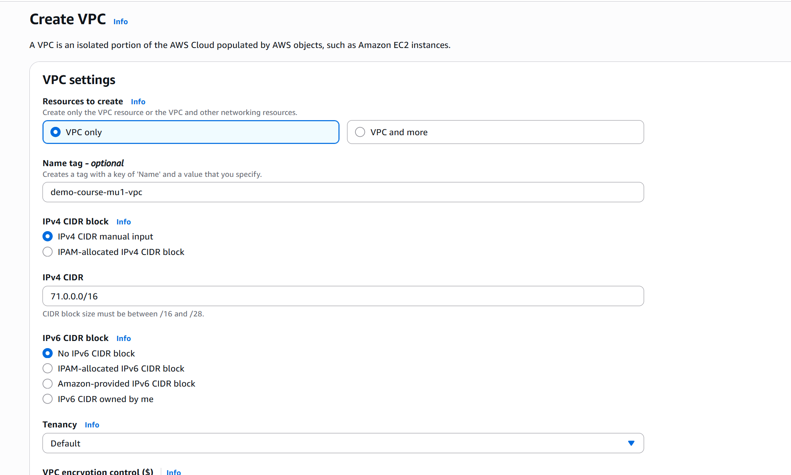

The VPC was created using the VPC-only option with the CIDR range `71.0.0.0/16`.

### VPC Created

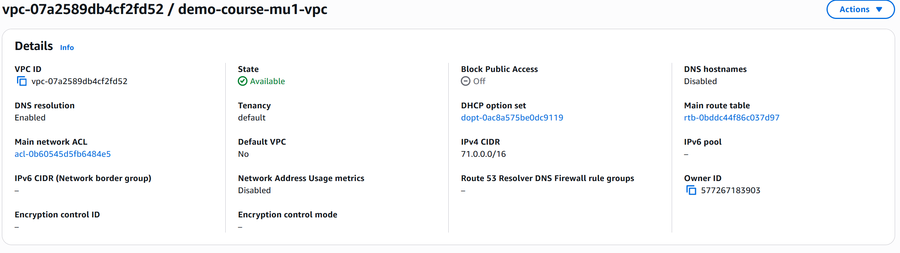

The VPC successfully entered the available state.

---

## VPC `10.0.0.0/16`

The second additional VPC was created with:

`10.0.0.0/16`

### VPC Configuration

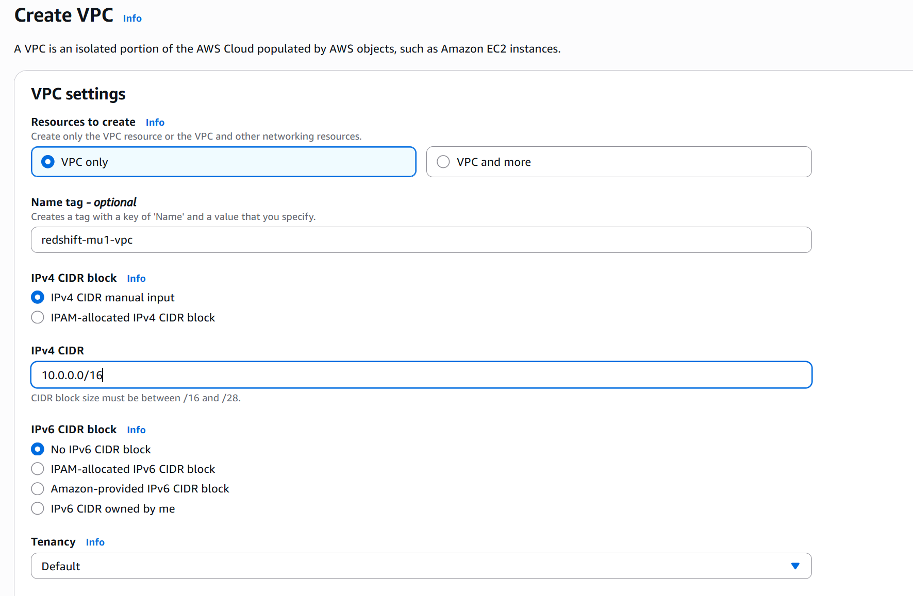

### VPC Created

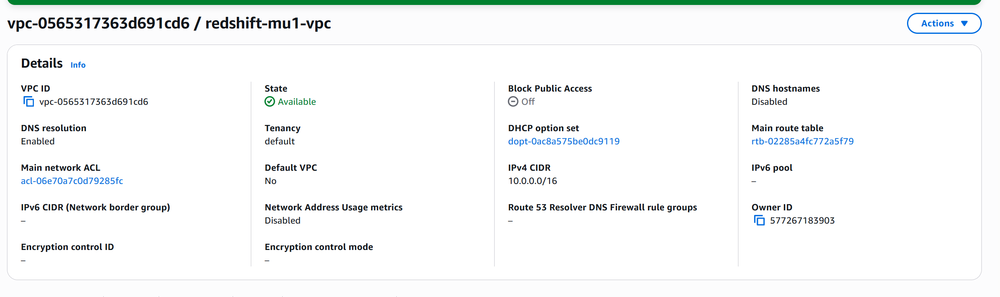

The VPC successfully entered the available state.

---

# 2. Creating Subnets for the `71.0.0.0/16` VPC

The `71.0.0.0/16` VPC was configured with separate public and private subnets.

The subnet ranges were:

- Public Subnet: `71.0.1.0/24`
- Private Subnet: `71.0.2.0/24`

## Public Subnet

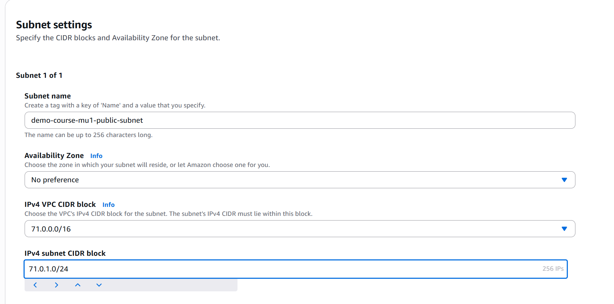

The public subnet was created using:

- VPC CIDR: `71.0.0.0/16`
- Subnet CIDR: `71.0.1.0/24`

### Public Subnet Created

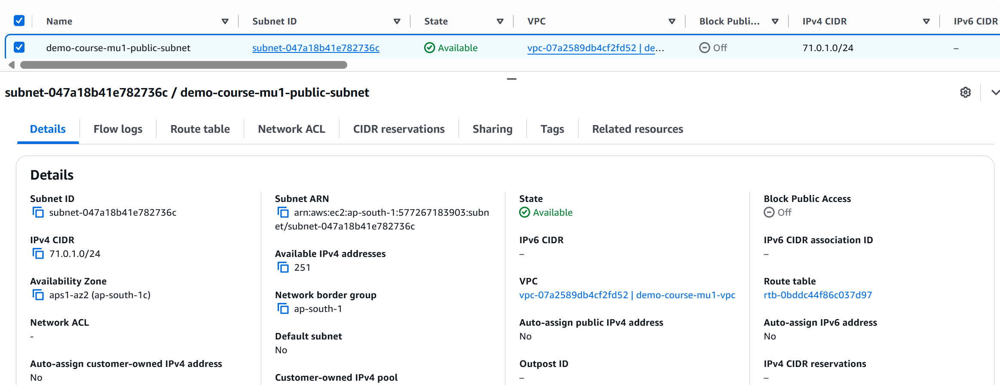

The public subnet was successfully created.

## Private Subnet

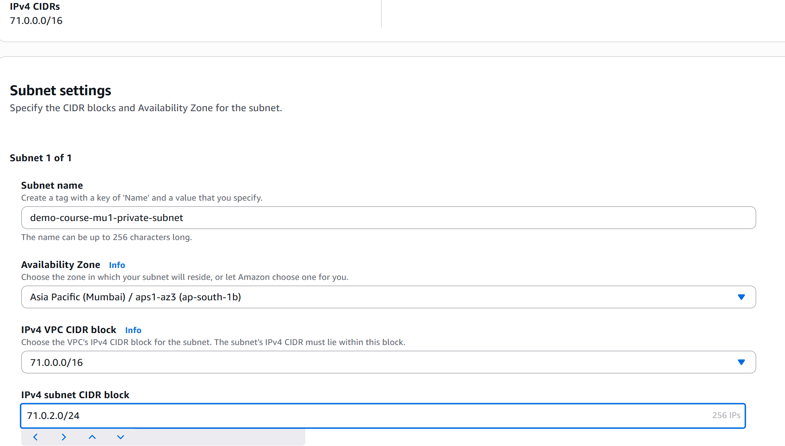

The private subnet was created using:

- VPC CIDR: `71.0.0.0/16`
- Subnet CIDR: `71.0.2.0/24`

### Private Subnet Created

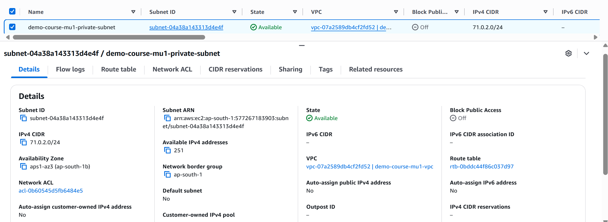

The private subnet was successfully created without automatic public IPv4 assignment.

---

# 3. Internet Gateway for the `71.0.0.0/16` VPC

An Internet Gateway was created for the new VPC.

### Internet Gateway Creation

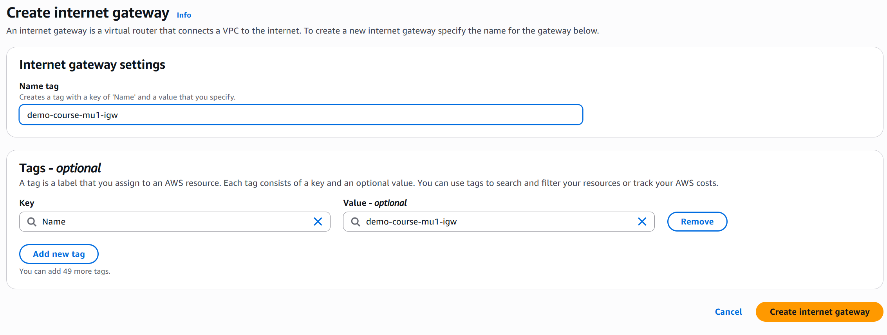

### Internet Gateway Attached

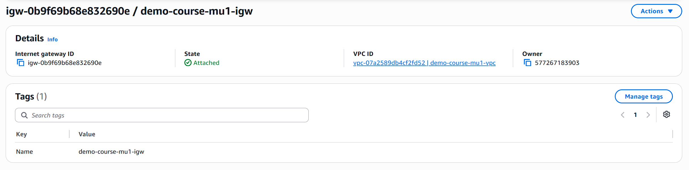

The Internet Gateway was attached to the `71.0.0.0/16` VPC.

---

# 4. Route Tables for the `71.0.0.0/16` VPC

Separate public and private route tables were created.

## Public Route Table

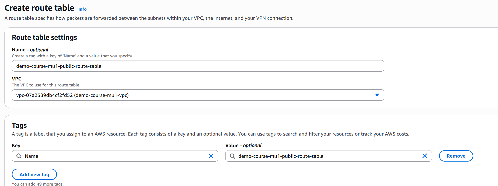

The public route table was configured with the Internet Gateway route:

`0.0.0.0/0 → Internet Gateway`

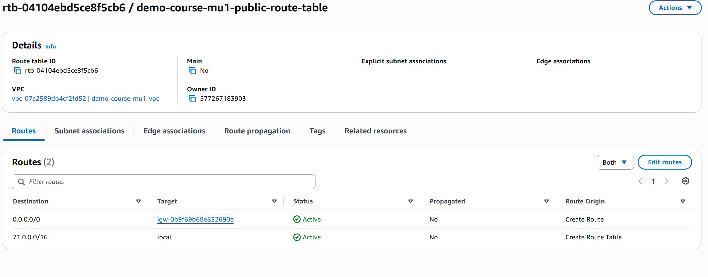

The public subnet was then associated with the public route table.

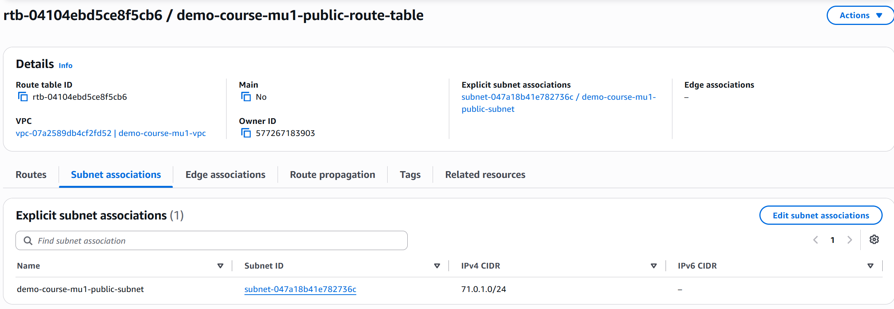

## Private Route Table

A separate private route table was created for the private subnet.

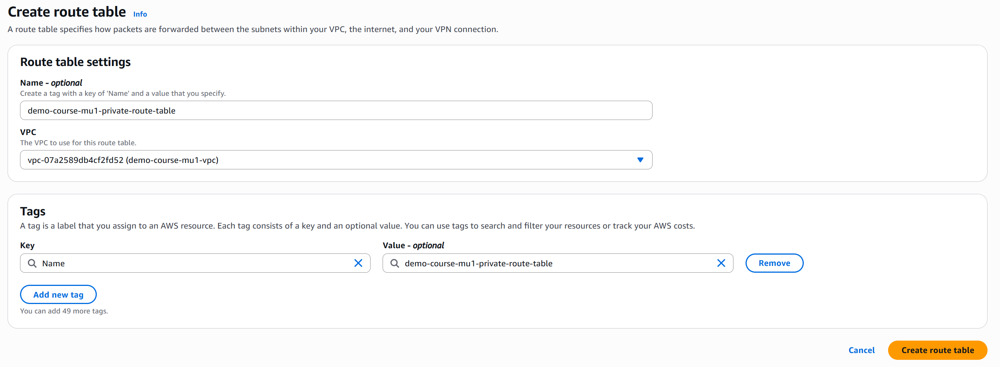

The private subnet was associated with the private route table.

The private route table did not receive an Internet Gateway route.

---

# 5. Creating Subnets for the `10.0.0.0/16` VPC

The second new VPC was configured with:

- Public Subnet: `10.0.1.0/24`
- Private Subnet: `10.0.2.0/24`

## Public Subnet

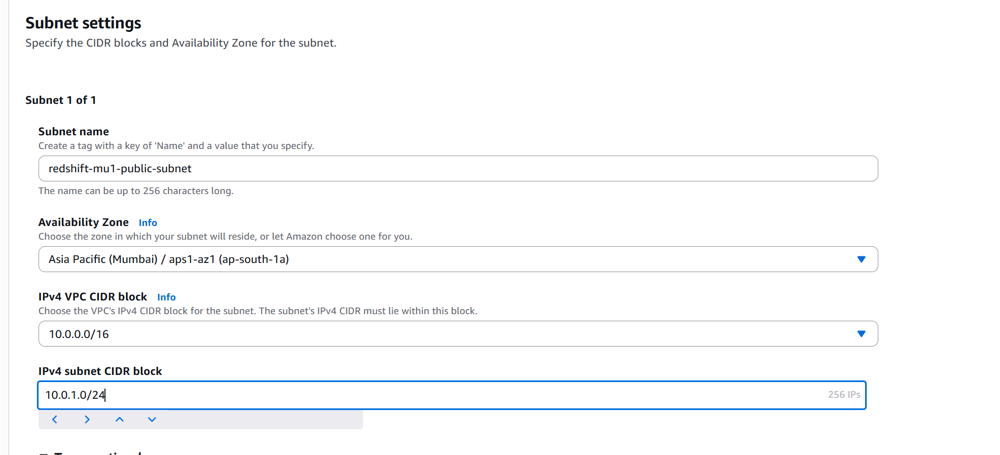

The public subnet was created inside the `10.0.0.0/16` VPC.

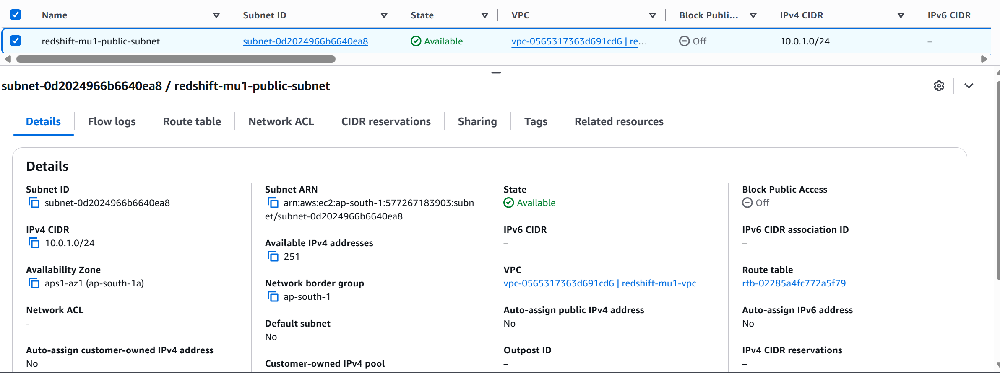

## Private Subnet

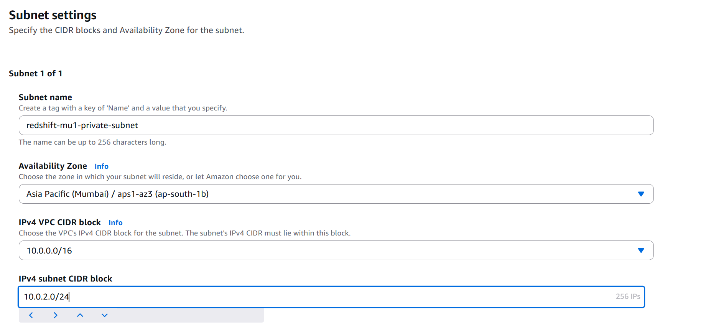

The private subnet was configured with:

`10.0.2.0/24`

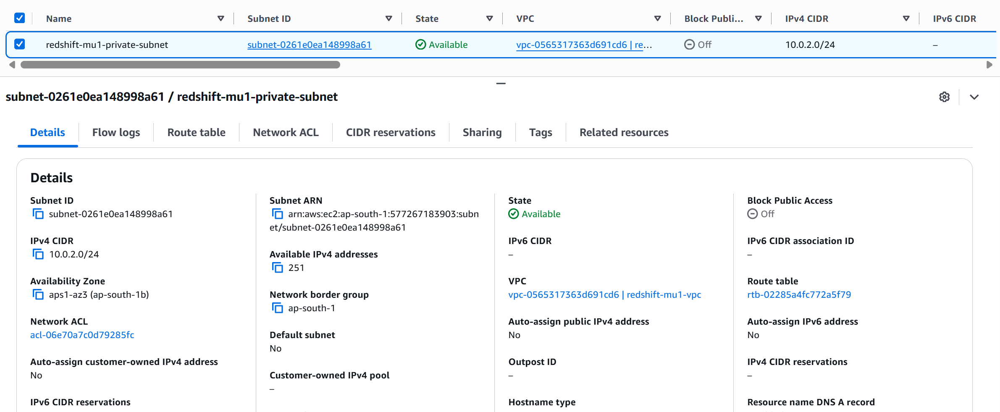

---

# 6. Internet Gateway for the `10.0.0.0/16` VPC

An Internet Gateway was created and attached to the VPC.

### Internet Gateway Creation

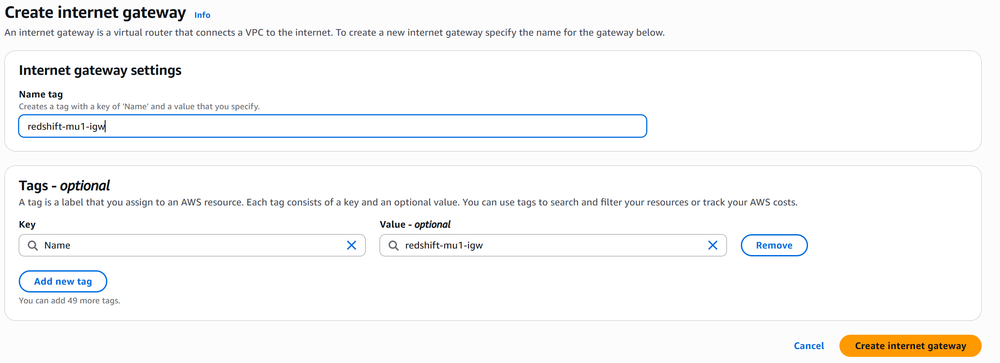

### Internet Gateway Attached

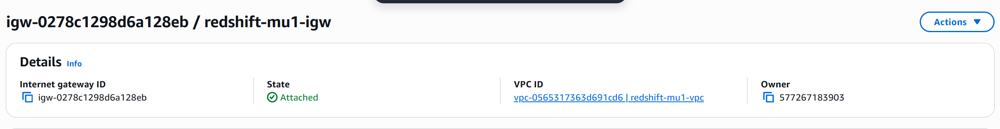

---

# 7. Route Tables for the `10.0.0.0/16` VPC

A public and private route table were created.

## Public Route Table

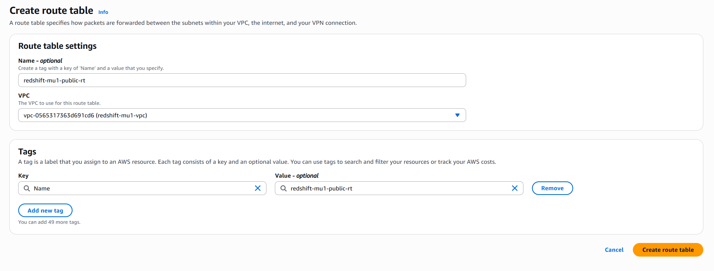

The public route table was configured with:

`0.0.0.0/0 → Internet Gateway`

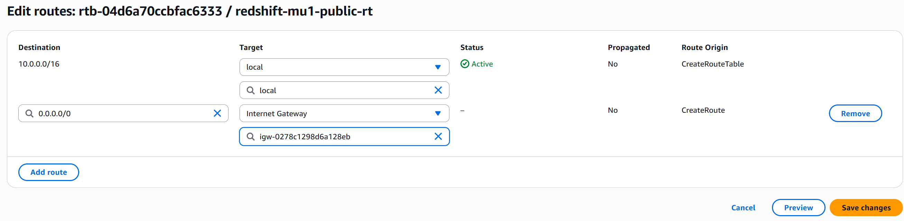

The public subnet was associated with the public route table.

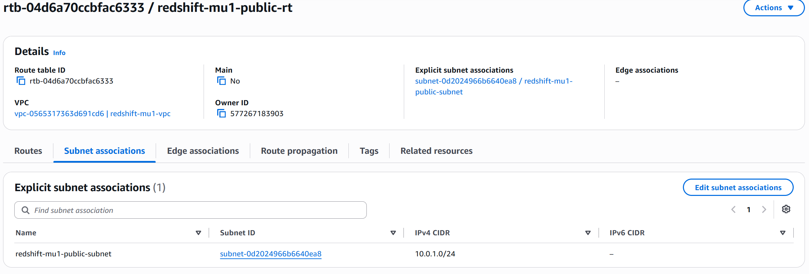

## Private Route Table

The private route table was created separately.

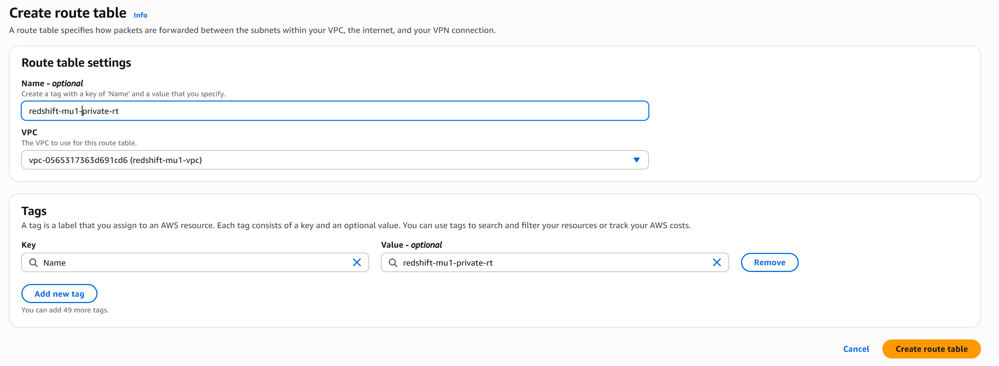

The private subnet was associated with the private route table.

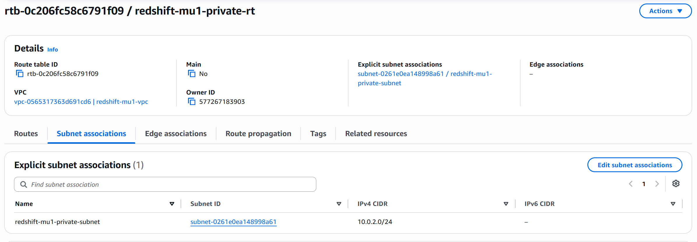

---

# 8. Three-VPC Infrastructure

At this stage, the project contained three VPCs:

- `31.0.0.0/16` — AWS Course VPC
- `71.0.0.0/16` — Demo Course VPC
- `10.0.0.0/16` — Redshift VPC

Each VPC had its own networking resources.

The three VPCs were now ready to be connected through a Transit Gateway.

---

# 9. Creating the Transit Gateway

AWS Transit Gateway was created to provide a centralized networking hub for the three VPCs.

The Transit Gateway acts as the central point through which the VPCs communicate.

### Transit Gateway Configuration

The Transit Gateway was configured within the AWS account.

No cross-account sharing was required for this lab.

### Transit Gateway Created

The Transit Gateway successfully became available.

---

# 10. Transit Gateway Attachments

Creating the Transit Gateway alone does not connect the VPCs.

Each VPC must be attached to the Transit Gateway.

Three Transit Gateway attachments were created:

- `31.0.0.0/16` → Transit Gateway
- `71.0.0.0/16` → Transit Gateway
- `10.0.0.0/16` → Transit Gateway

---

## AWS Course VPC Attachment

The existing `31.0.0.0/16` VPC was attached to the Transit Gateway.

After provisioning, the attachment became available.

---

## Demo Course VPC Attachment

The `71.0.0.0/16` VPC was attached to the same Transit Gateway.

The attachment successfully became available.

---

## Redshift VPC Attachment

The `10.0.0.0/16` VPC was also attached to the Transit Gateway.

The attachment successfully became available.

---

# 11. Final Transit Gateway Attachments

All three VPCs were now attached to the same Transit Gateway.

All three attachments were available.

The final attachment structure was:

- AWS Course VPC → Transit Gateway
- Demo Course VPC → Transit Gateway
- Redshift VPC → Transit Gateway

---

# 12. Updating VPC Route Tables

Although the VPCs were attached to the Transit Gateway, connectivity between the VPCs was not yet established.

The VPC route tables needed routes that directed traffic for the other VPC CIDR ranges toward the Transit Gateway.

The routing model was:

### AWS Course VPC

- `71.0.0.0/16 → Transit Gateway`
- `10.0.0.0/16 → Transit Gateway`

### Demo Course VPC

- `31.0.0.0/16 → Transit Gateway`
- `10.0.0.0/16 → Transit Gateway`

### Redshift VPC

- `31.0.0.0/16 → Transit Gateway`
- `71.0.0.0/16 → Transit Gateway`

Both public and private route tables were updated for the lab.

---

## AWS Course VPC Public Route Table

The public route table for the `31.0.0.0/16` VPC was updated with routes for the other VPCs.

Routes included:

- `71.0.0.0/16 → Transit Gateway`
- `10.0.0.0/16 → Transit Gateway`

## AWS Course VPC Private Route Table

The same destination VPC CIDRs were configured through the Transit Gateway.

---

## Demo Course VPC Public Route Table

The `71.0.0.0/16` VPC public route table was updated with:

- `31.0.0.0/16 → Transit Gateway`
- `10.0.0.0/16 → Transit Gateway`

## Demo Course VPC Private Route Table

The private route table was also updated with the routes toward the other two VPCs.

---

## Redshift VPC Public Route Table

The `10.0.0.0/16` VPC public route table was updated with:

- `31.0.0.0/16 → Transit Gateway`
- `71.0.0.0/16 → Transit Gateway`

## Redshift VPC Private Route Table

The private route table was also updated with routes toward the other VPCs.

---

# 13. Final Transit Gateway Routing Configuration

After updating all route tables, the routing configuration was verified.

The route tables now provided paths between all three VPC CIDR ranges through the Transit Gateway.

---

# 14. EC2 Instances for Connectivity Testing

To validate the Transit Gateway connectivity, one EC2 instance was launched inside each VPC.

The instances were placed in public subnets so they could be accessed using SSH.

However, the actual VPC-to-VPC connectivity test was performed using the private IPv4 addresses of the EC2 instances.

This ensures that the test demonstrates private communication between the VPCs through the Transit Gateway rather than communication through public IP addresses.

---

## EC2 in AWS Course VPC

The EC2 instance was launched inside the `31.0.0.0/16` VPC.

### EC2 Running

---

## EC2 in Demo Course VPC

The EC2 instance was launched inside the `71.0.0.0/16` VPC.

### EC2 Running

---

## EC2 in Redshift VPC

The EC2 instance was launched inside the `10.0.0.0/16` VPC.

### EC2 Running

---

# 15. EC2 Private IP Addresses

The three EC2 instances received private IPv4 addresses from their respective VPC CIDR ranges.

These private IP addresses were used for the connectivity tests.

The instances belonged to different VPC CIDR ranges:

- AWS Course EC2 → `31.0.0.0/16`
- Demo Course EC2 → `71.0.0.0/16`
- Redshift EC2 → `10.0.0.0/16`

---

# 16. Testing Transit Gateway Connectivity

With the Transit Gateway attachments and routes configured, connectivity between the EC2 instances was tested using their private IPv4 addresses.

The connectivity was tested between all three VPCs.

---

## AWS Course VPC → Demo Course VPC

The EC2 instance in the `31.0.0.0/16` VPC successfully pinged the private IP of the EC2 instance in the `71.0.0.0/16` VPC.

---

## AWS Course VPC → Redshift VPC

The EC2 instance in the `31.0.0.0/16` VPC successfully pinged the private IP of the EC2 instance in the `10.0.0.0/16` VPC.

---

## Demo Course VPC → AWS Course VPC

The EC2 instance in the `71.0.0.0/16` VPC successfully pinged the private IP of the EC2 instance in the `31.0.0.0/16` VPC.

---

## Demo Course VPC → Redshift VPC

The EC2 instance in the `71.0.0.0/16` VPC successfully pinged the private IP of the EC2 instance in the `10.0.0.0/16` VPC.

---

## Redshift VPC → AWS Course VPC

The EC2 instance in the `10.0.0.0/16` VPC successfully pinged the private IP of the EC2 instance in the `31.0.0.0/16` VPC.

---

## Redshift VPC → Demo Course VPC

The EC2 instance in the `10.0.0.0/16` VPC successfully pinged the private IP of the EC2 instance in the `71.0.0.0/16` VPC.

---

# 17. Negative Connectivity Test

To verify that the Transit Gateway routes were responsible for the connectivity, a negative test was performed.

A Transit Gateway route was temporarily removed from the route table.

After removing the required route, the corresponding private-IP connectivity test failed.

This demonstrates that creating a Transit Gateway attachment alone is not enough.

The VPC route tables must contain the correct destination CIDR routes pointing to the Transit Gateway.

---

# 18. Restoring Connectivity

After the required Transit Gateway route was restored, the private-IP connectivity test succeeded again.

This confirmed that the complete networking path was functioning correctly.

---

# 19. Complete Transit Gateway Traffic Flow

The final traffic flow can be summarized as:

**Source EC2**

↓

**VPC Route Table**

↓

**Destination VPC CIDR**

↓

**Transit Gateway**

↓

**Transit Gateway Attachment**

↓

**Destination VPC**

↓

**Destination EC2**

For example:

`31.0.0.0/16 → 71.0.0.0/16`

The route table sends traffic destined for `71.0.0.0/16` to the Transit Gateway, which forwards the traffic through the appropriate VPC attachment.

The same process applies between the other VPCs.

---

# VPC Peering vs Transit Gateway

The previous section demonstrated VPC Peering between two VPCs.

With VPC Peering, two VPCs require a dedicated peering connection:

**VPC A ↔ VPC B**

If another VPC is introduced, additional peering connections are required.

With Transit Gateway, multiple VPCs can connect to a single centralized Transit Gateway:

**VPC A → Transit Gateway**

**VPC B → Transit Gateway**

**VPC C → Transit Gateway**

This provides a centralized hub-and-spoke networking architecture.

Transit Gateway becomes particularly useful when the number of connected VPCs grows.

---

# Key Concepts Learned

Through this hands-on project, I gained practical experience with:

- AWS Transit Gateway
- Transit Gateway creation
- Transit Gateway attachments
- Connecting multiple VPCs through a centralized networking hub
- Creating public and private subnets
- Internet Gateway configuration
- Public and private route tables
- Adding Transit Gateway routes
- Routing traffic between multiple VPC CIDR ranges
- Launching EC2 instances in different VPCs
- Testing private IPv4 connectivity between VPCs
- Understanding Transit Gateway attachment behavior
- Validating connectivity using ICMP
- Performing a negative connectivity test
- Understanding the difference between VPC Peering and Transit Gateway

---

# Final Result

The Transit Gateway implementation successfully connected three VPCs:

- AWS Course VPC — `31.0.0.0/16`
- Demo Course VPC — `71.0.0.0/16`
- Redshift VPC — `10.0.0.0/16`

The final implementation consisted of:

1. Three VPCs
2. Public and private subnets
3. Internet Gateways
4. Public and private route tables
5. One Transit Gateway
6. Three Transit Gateway attachments
7. Transit Gateway routes in the VPC route tables
8. Three EC2 instances
9. Private IPv4 connectivity testing
10. Negative connectivity testing

The successful ping tests between all three VPCs confirmed that the Transit Gateway attachments and route-table configuration were working correctly.

The negative test further demonstrated that removing the required Transit Gateway route blocks communication between the VPCs.

---

## Next

The project will continue with additional AWS VPC networking concepts and progressively extend the architecture.

---

[← Previous: VPC Peering](10-vpc-peering.md) | [Back to Project README](../README.md)