# Transit Gateway & Cross-Region Peering

## 1. What is AWS Transit Gateway?

AWS Transit Gateway is a **network transit hub** that allows multiple VPCs and other networks to connect through a centralized networking service.

Instead of creating individual connections between every VPC, Transit Gateway provides a central point through which traffic can be routed.

For example:

```text
              AWS Transit Gateway
                /      |      \
               /       |       \
            VPC-1    VPC-2    VPC-3
```

This makes it easier to manage connectivity when an AWS environment contains multiple VPCs.

A Transit Gateway can also be used with **Transit Gateway Peering** to connect Transit Gateways located in different AWS regions.

---

## 2. Why Do We Need Transit Gateway?

When multiple VPCs need to communicate with each other, creating individual connections between every VPC can become difficult to manage.

For example, with three VPCs:

```text
VPC-1 ───────── VPC-2
  │               │
  │               │
  └──────────── VPC-3
```

As the number of VPCs increases, the number of connections and route configurations also increases.

Transit Gateway provides a centralized architecture:

```text
              Transit Gateway
             /       |       \
            /        |        \
         VPC-1      VPC-2     VPC-3
```

The Transit Gateway provides a central routing point for the attached VPCs.

In this practical, Transit Gateway is used to connect VPCs across **different AWS regions** by using Transit Gateway Peering.

---

## 3. What is Transit Gateway Peering?

Transit Gateway Peering allows two Transit Gateways located in different AWS regions to communicate with each other.

In this practical:

```text
Mumbai Region                         Virginia Region

Mumbai VPC                            Virginia VPC
31.0.0.0/16                           41.0.0.0/16
     │                                      │
     ▼                                      ▼
Mumbai Transit Gateway  ◄──────────►  Virginia Transit Gateway
                              Peering
```

The Transit Gateways are connected using a **Transit Gateway Peering Attachment**.

One side creates the peering request and the other side accepts it.

In this practical:

```text
Mumbai
Requester

        │
        │ Transit Gateway Peering
        ▼

Virginia
Accepter
```

After the peering connection becomes available, routes must be configured on both sides so that traffic can travel between the two VPCs.

---

## 4. Problem We Are Solving

The goal of this practical is to establish **private cross-region connectivity** between two VPCs.

The two VPCs are:

```text
Mumbai VPC
CIDR: 31.0.0.0/16

        │
        ▼
Mumbai Transit Gateway
        │
        │ Transit Gateway Peering
        │
        ▼
Virginia Transit Gateway
        │
        ▼
Virginia VPC
CIDR: 41.0.0.0/16
```

The Mumbai VPC and Virginia VPC are located in different AWS regions.

The required connectivity is:

```text
Mumbai EC2
31.0.0.0/16
     │
     ▼
Mumbai Transit Gateway
     │
     ▼
Transit Gateway Peering
     │
     ▼
Virginia Transit Gateway
     │
     ▼
Virginia EC2
41.0.0.0/16
```

The reverse path must also work:

```text
Virginia EC2
41.0.0.0/16
     │
     ▼
Virginia Transit Gateway
     │
     ▼
Transit Gateway Peering
     │
     ▼
Mumbai Transit Gateway
     │
     ▼
Mumbai EC2
31.0.0.0/16
```

The final objective is to verify that both EC2 instances can communicate using their **private IP addresses**, without relying on their public IP addresses.

---

## Overview

In this section, I implemented **AWS Transit Gateway Cross-Region Peering** to establish private network connectivity between two VPCs located in different AWS regions.

The practical implementation used:

- **Mumbai Region** as the requester side
- **US East (N. Virginia)** as the accepter side
- A Transit Gateway in each region
- Transit Gateway Peering between the two regional Transit Gateways
- VPC attachments in both regions
- Static routes for the remote VPC CIDR
- EC2 instances in public subnets for connectivity testing
- Private IP connectivity between the two EC2 instances

The final result was successful two-way communication between the Mumbai and Virginia EC2 instances using their **private IP addresses**.

---

## Architecture

The completed architecture is represented below:


The practical uses:

```text
Mumbai Region                         US East (N. Virginia)
31.0.0.0/16                           41.0.0.0/16

┌───────────────────┐                 ┌───────────────────┐
│    Mumbai VPC     │                 │   Virginia VPC    │
│   31.0.0.0/16     │                 │   41.0.0.0/16     │
│                   │                 │                   │
│   Public Subnet   │                 │   Public Subnet   │
│       EC2         │                 │       EC2         │
└─────────┬─────────┘                 └─────────┬─────────┘
          │                                     │
          │ VPC Attachment                      │ VPC Attachment
          ▼                                     ▼
┌───────────────────┐                 ┌───────────────────┐
│ Mumbai Transit    │◄───────────────►│ Virginia Transit  │
│ Gateway           │     Peering     │ Gateway           │
└───────────────────┘                 └───────────────────┘
```

---

## Regional Configuration

| Component | Mumbai | Virginia |
|---|---|---|
| AWS Region | Asia Pacific (Mumbai) | US East (N. Virginia) |
| VPC CIDR | `31.0.0.0/16` | `41.0.0.0/16` |
| Transit Gateway | Mumbai TGW | Virginia TGW |
| Peering Role | Requester | Accepter |
| EC2 | Mumbai EC2 | Virginia EC2 |

---

# 1. Virginia VPC Configuration

The Virginia VPC infrastructure was prepared first for the cross-region Transit Gateway practical.

The Virginia VPC uses the CIDR:

```text
41.0.0.0/16
```

### Virginia VPC Configuration

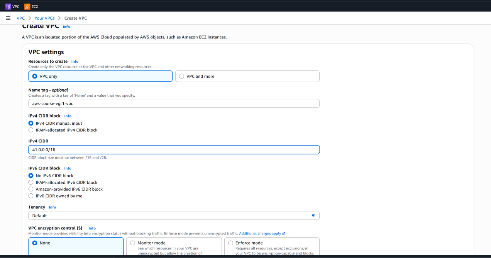

### Virginia VPC Created

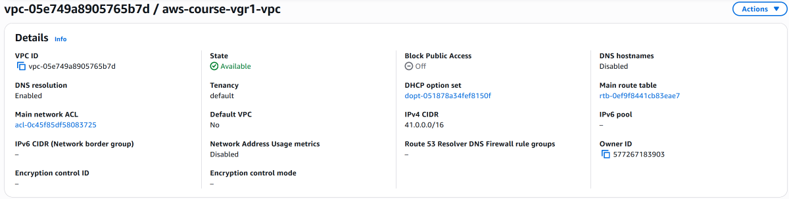

---

## Virginia Public Subnet

A public subnet was created inside the Virginia VPC.

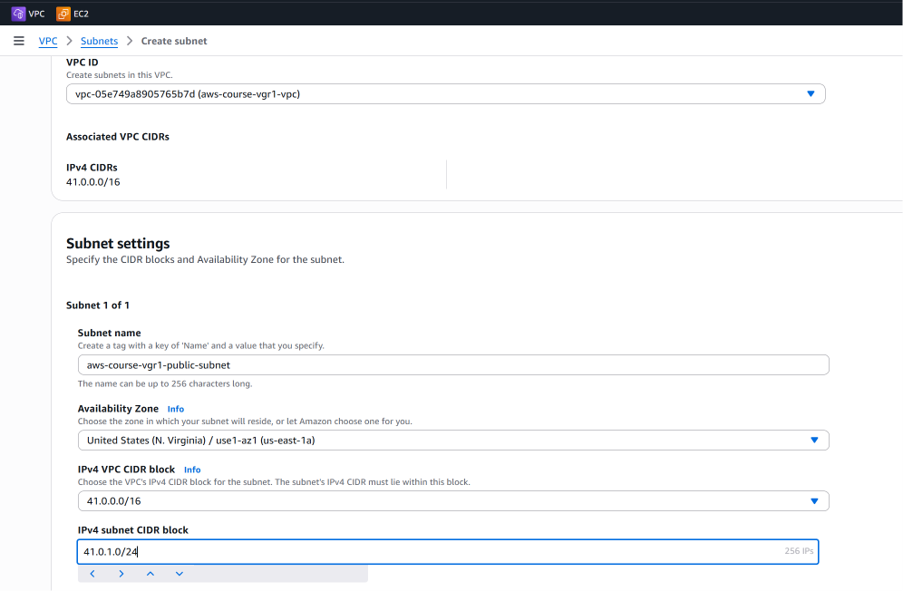

---

## Virginia Private Subnet

A private subnet was also created inside the Virginia VPC.

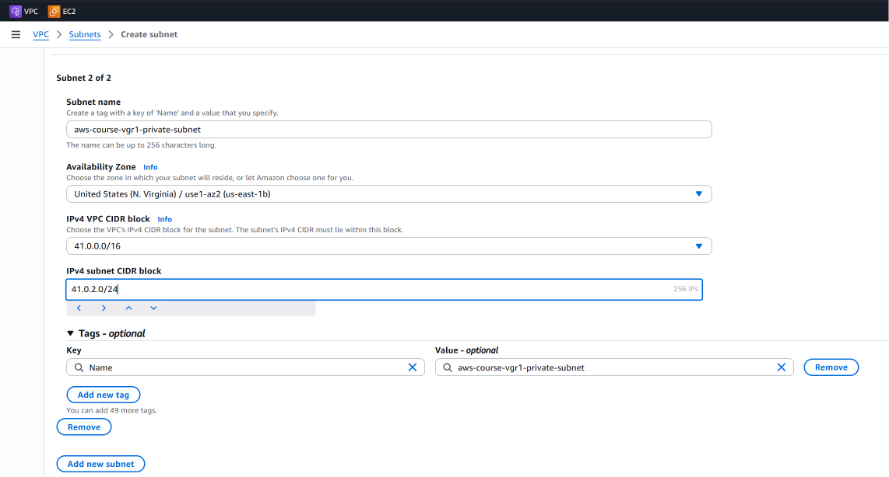

Both subnets were successfully created:

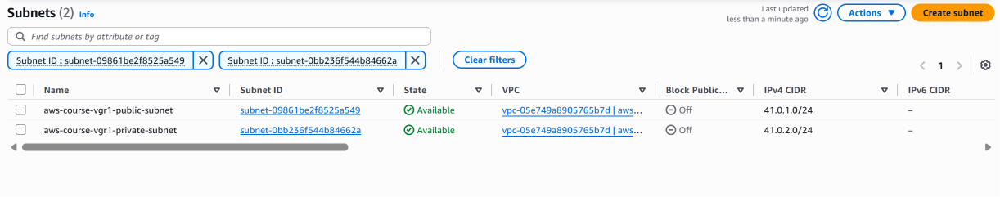

---

## Virginia Internet Gateway

An Internet Gateway was created for the Virginia VPC.

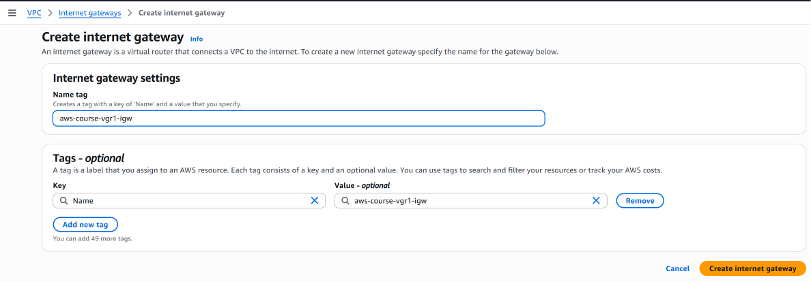

The Internet Gateway was then attached to the Virginia VPC.

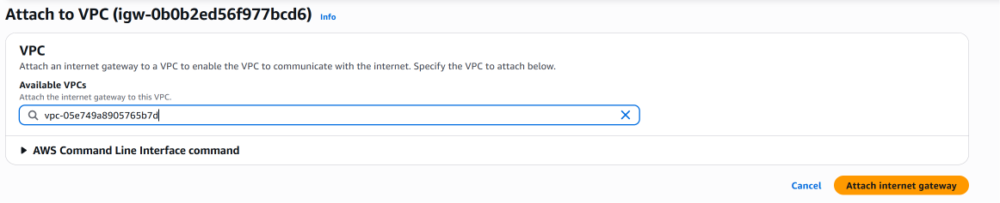

---

## Virginia Public Route Table

A public route table was created for the Virginia public subnet.

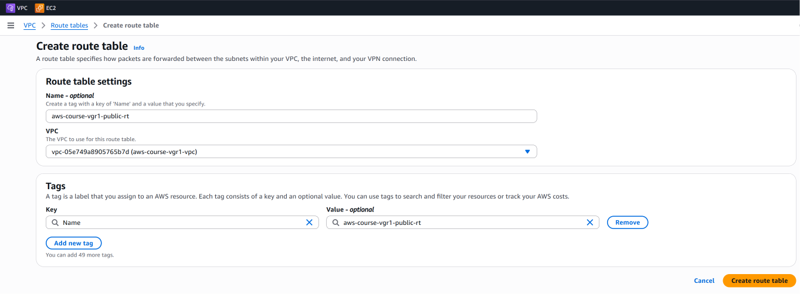

The default Internet route was configured:

```text
0.0.0.0/0 → Internet Gateway
```

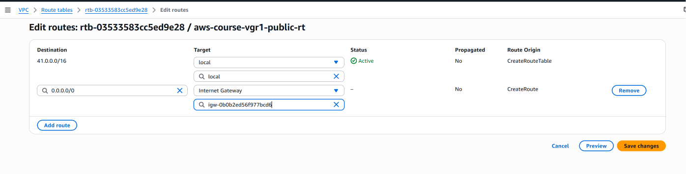

The public subnet was associated with the public route table.

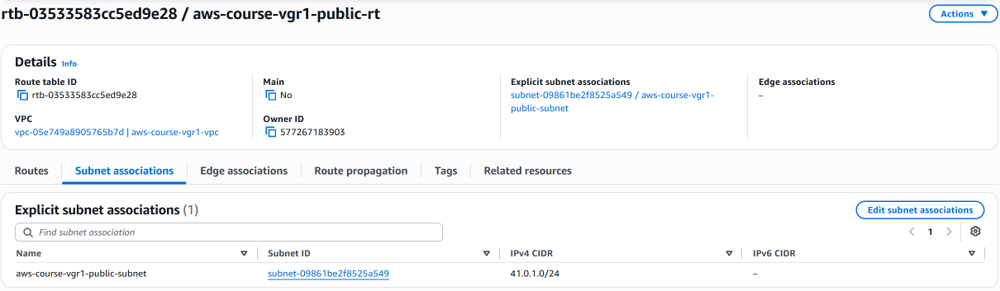

---

## Virginia Private Route Table

A separate route table was created for the Virginia private subnet.

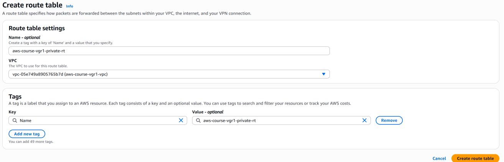

The private subnet was associated with the private route table.

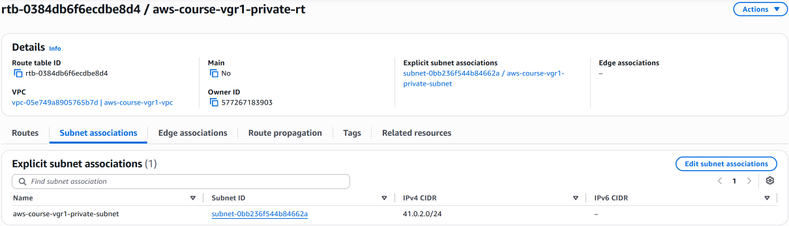

---

# 2. Create Transit Gateway in Virginia

A Transit Gateway was created in the **US East (N. Virginia)** region.

This Transit Gateway acts as the **accepter-side Transit Gateway** for the cross-region peering connection.

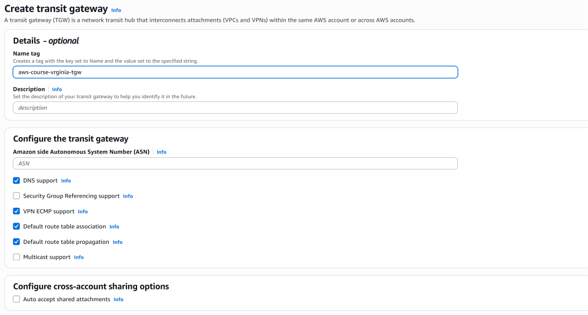

The Transit Gateway was successfully created and became available.

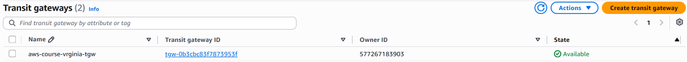

The Virginia Transit Gateway ID was required while creating the peering request from the Mumbai region.

---

# 3. Create Transit Gateway in Mumbai

The next step was to create a Transit Gateway in the **Asia Pacific (Mumbai)** region.

The Mumbai Transit Gateway acts as the **requester-side Transit Gateway**.

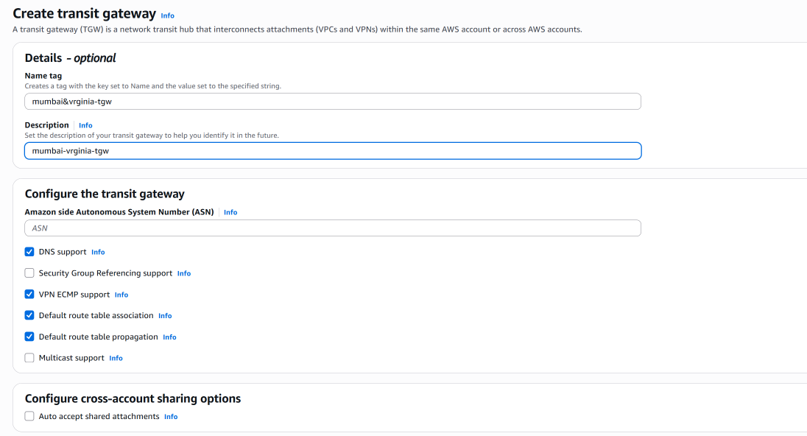

The Mumbai Transit Gateway was successfully created.

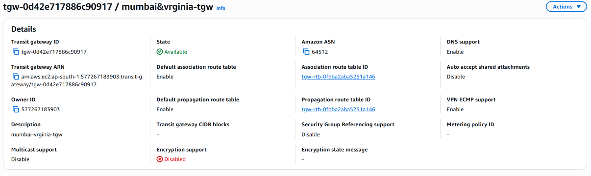

---

# 4. Create Transit Gateway Peering Attachment

The Transit Gateway peering connection was created from the **Mumbai region**.

The attachment type was selected as:

```text
Peering Connection
```

The destination region was selected as:

```text
US East (N. Virginia)
```

The Transit Gateway ID of the Virginia region was provided as the accepter Transit Gateway.

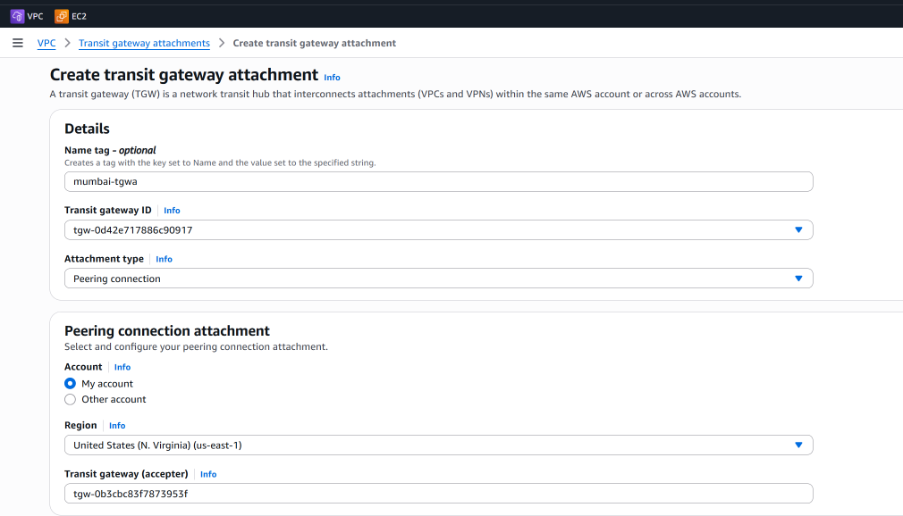

After creation, the peering attachment entered the:

```text
Pending Acceptance
```

state.

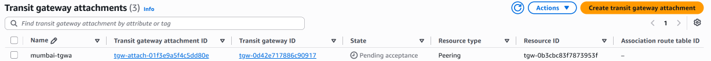

---

# 5. Accept Transit Gateway Peering Request in Virginia

The peering request was then opened in the **Virginia region**.

The pending Transit Gateway attachment was selected and the request was accepted from the Virginia side.

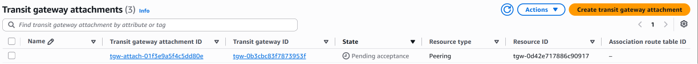

The Transit Gateway peering request was accepted.

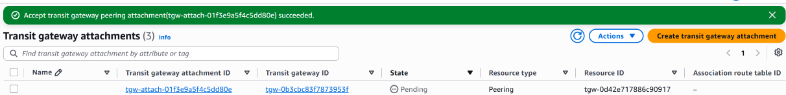

After AWS finished processing the request, the Transit Gateway peering attachment became available.

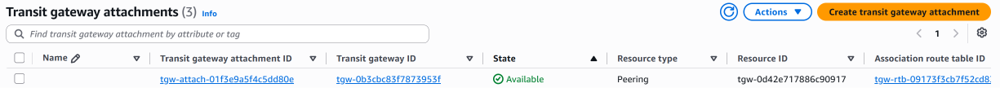

This confirmed that the Transit Gateways in Mumbai and Virginia were successfully peered.

---

# 6. Attach Mumbai VPC to Mumbai Transit Gateway

The next step was to attach the existing Mumbai VPC to the Mumbai Transit Gateway.

The Mumbai VPC used for this practical is:

```text
aws-course-mu1-vpc
```

with CIDR:

```text
31.0.0.0/16
```

The Transit Gateway VPC attachment was configured using the Mumbai Transit Gateway.

Both the public and private subnets were selected for the VPC attachment.

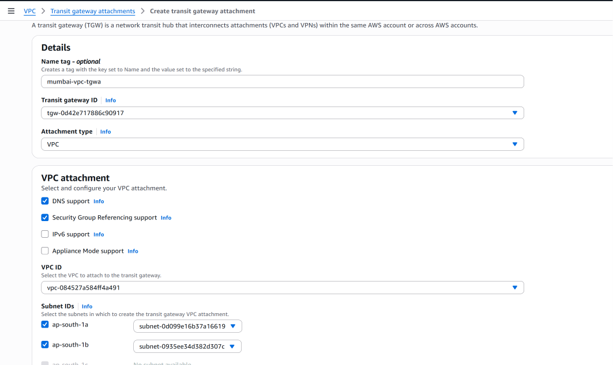

After AWS completed the provisioning process, the attachment became available.

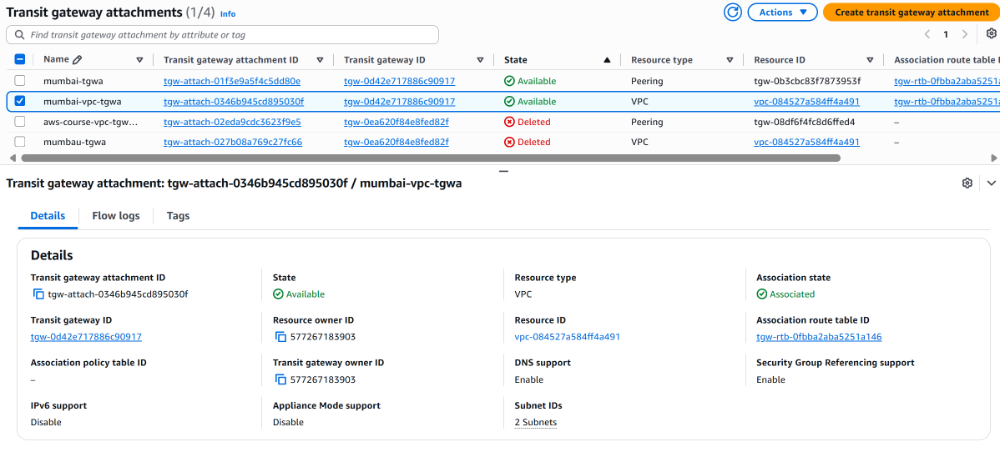

---

# 7. Attach Virginia VPC to Virginia Transit Gateway

The same process was performed in the Virginia region.

The Virginia VPC uses the CIDR:

```text
41.0.0.0/16
```

The Virginia VPC was attached to the Virginia Transit Gateway.

Both the public and private subnets were selected for the VPC attachment.

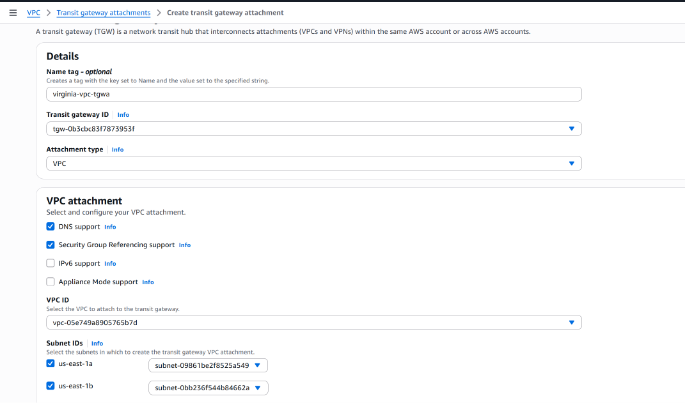

After AWS completed the provisioning process, the Virginia VPC attachment became available.

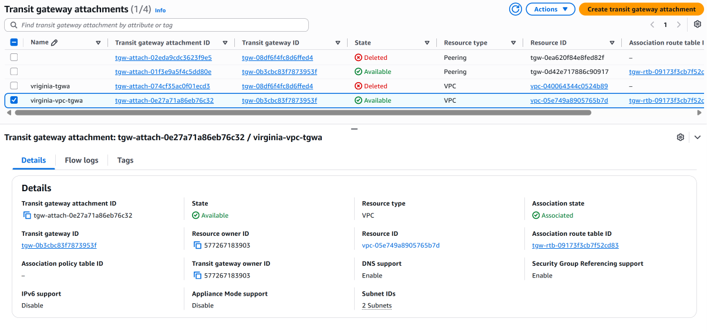

At this point, the architecture contained:

```text
Mumbai VPC
31.0.0.0/16
      │
      ▼
Mumbai Transit Gateway
      │
      │ Transit Gateway Peering
      │
      ▼
Virginia Transit Gateway
      │
      ▼
Virginia VPC
41.0.0.0/16
```

---

# 8. Configure Mumbai VPC Route Table

The Mumbai VPC route table needed a route pointing toward the Virginia VPC.

The Virginia VPC CIDR is:

```text
41.0.0.0/16
```

Therefore, the Mumbai public route table was configured with:

```text
Destination: 41.0.0.0/16
Target: Transit Gateway
```

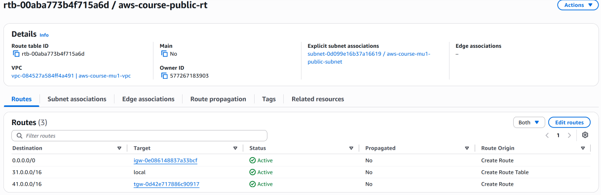

The existing Internet Gateway route remained available:

```text
0.0.0.0/0 → Internet Gateway
```

The private route table was also configured with a route toward the Virginia VPC:

```text
41.0.0.0/16 → Transit Gateway
```

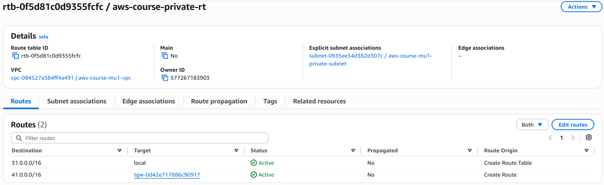

This tells the Mumbai VPC that traffic destined for the Virginia VPC should be sent to the Mumbai Transit Gateway.

---

# 9. Configure Virginia VPC Route Table

The reverse route was then configured in the Virginia VPC.

The Mumbai VPC CIDR is:

```text
31.0.0.0/16
```

Therefore, the Virginia public route table was configured with:

```text
Destination: 31.0.0.0/16
Target: Transit Gateway
```

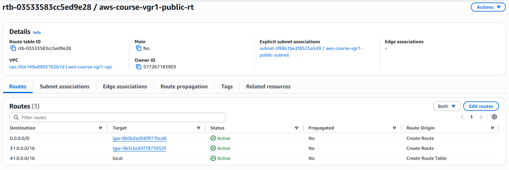

The private route table was also configured with the same remote VPC route:

```text
31.0.0.0/16 → Transit Gateway
```

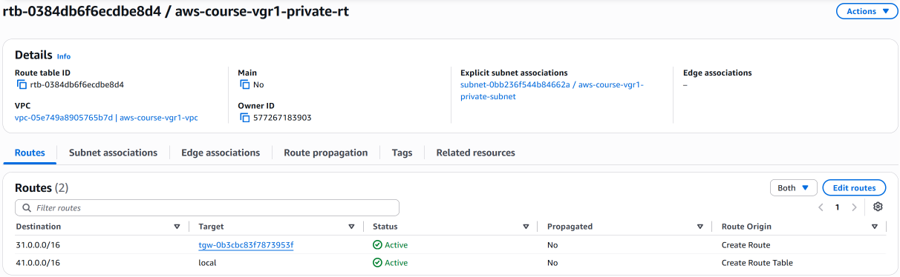

This tells the Virginia VPC that traffic destined for the Mumbai VPC should be sent to the Virginia Transit Gateway.

---

# 10. Configure Transit Gateway Route Tables

The VPC attachments provide the local VPC routes inside the regional Transit Gateway route tables.

The Mumbai Transit Gateway route table contains the Mumbai VPC route:

```text
31.0.0.0/16 → Mumbai VPC Attachment
```

The Virginia Transit Gateway route table contains the Virginia VPC route:

```text
41.0.0.0/16 → Virginia VPC Attachment
```

For cross-region communication, static routes were configured through the Transit Gateway peering attachment.

### Mumbai Transit Gateway

The Mumbai Transit Gateway needs a route toward the Virginia VPC:

```text
41.0.0.0/16 → Transit Gateway Peering Attachment
```

### Virginia Transit Gateway

The Virginia Transit Gateway needs a route toward the Mumbai VPC:

```text
31.0.0.0/16 → Transit Gateway Peering Attachment
```

The complete Transit Gateway routing therefore becomes:

```text
Mumbai Transit Gateway

31.0.0.0/16 → Mumbai VPC Attachment
41.0.0.0/16 → Peering Attachment
```

and:

```text
Virginia Transit Gateway

41.0.0.0/16 → Virginia VPC Attachment
31.0.0.0/16 → Peering Attachment
```

---

# 11. Final Routing Path

After configuring the VPC route tables, Transit Gateway route tables, and peering attachment, the complete routing path became:

## Mumbai → Virginia

```text
Mumbai EC2
31.0.0.0/16
     │
     ▼
Mumbai VPC
     │
     ▼
Mumbai VPC Route Table
41.0.0.0/16 → Transit Gateway
     │
     ▼
Mumbai Transit Gateway
     │
     ▼
Transit Gateway Peering
     │
     ▼
Virginia Transit Gateway
     │
     ▼
Virginia VPC Attachment
     │
     ▼
Virginia VPC
41.0.0.0/16
     │
     ▼
Virginia EC2
```

## Virginia → Mumbai

```text
Virginia EC2
41.0.0.0/16
     │
     ▼
Virginia VPC
     │
     ▼
Virginia VPC Route Table
31.0.0.0/16 → Transit Gateway
     │
     ▼
Virginia Transit Gateway
     │
     ▼
Transit Gateway Peering
     │
     ▼
Mumbai Transit Gateway
     │
     ▼
Mumbai VPC Attachment
     │
     ▼
Mumbai VPC
31.0.0.0/16
     │
     ▼
Mumbai EC2
```

---

# 12. Launch Mumbai EC2 Instance

An EC2 instance was launched in the Mumbai VPC.

The instance was placed inside the public subnet so that it could be accessed through SSH from the local machine.

The security group allowed:

- SSH traffic
- ICMP traffic for ping testing

The Mumbai EC2 instance was successfully launched and became available.

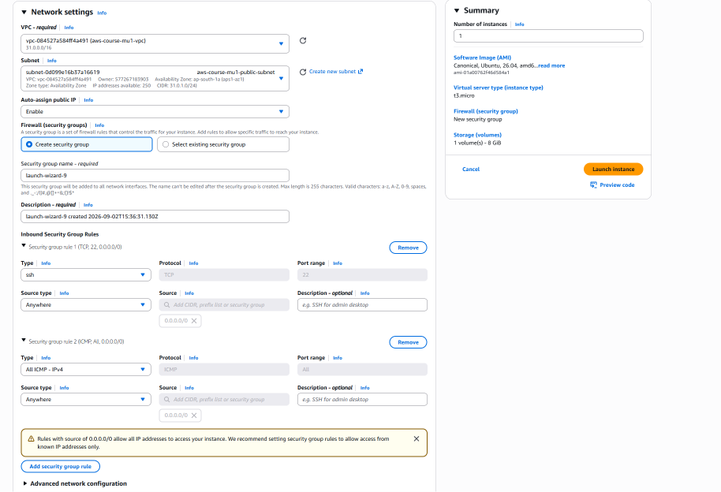


The private IP address of this instance was used for the cross-region connectivity test.

---

# 13. Launch Virginia EC2 Instance

Another EC2 instance was launched in the Virginia VPC.

The instance was placed inside the public subnet.

The security group allowed:

- SSH traffic
- ICMP traffic for ping testing

The Virginia EC2 instance became available.

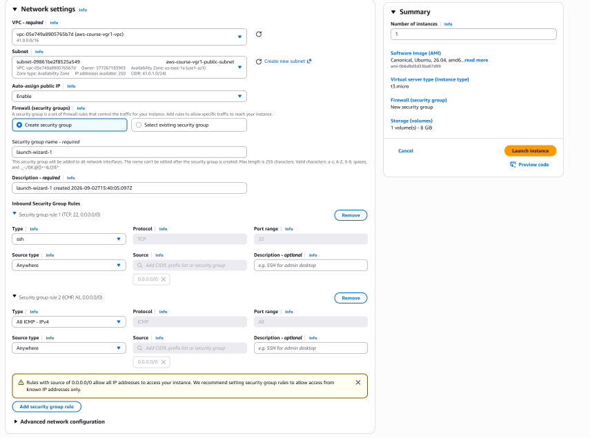


The private IP address of this instance was used for the cross-region connectivity test.

---

# 14. Test Mumbai to Virginia Connectivity

After connecting to the Mumbai EC2 instance through SSH, the private IP address of the Virginia EC2 instance was used as the ping destination.

The test was performed using:

```bash
ping <VIRGINIA-PRIVATE-IP>
```

The ping was successful.

This verified that traffic could travel from the Mumbai VPC:

```text
31.0.0.0/16
```

to the Virginia VPC:

```text
41.0.0.0/16
```

through the Transit Gateway peering connection.


---

# 15. Test Virginia to Mumbai Connectivity

The reverse connectivity test was then performed from the Virginia EC2 instance.

The private IP address of the Mumbai EC2 instance was used as the destination:

```bash
ping <MUMBAI-PRIVATE-IP>
```

The ping was successful.

This confirmed that communication was also working from Virginia back to Mumbai.


---

# 16. Connectivity Validation

The final test successfully demonstrated bidirectional private connectivity.

### Mumbai → Virginia

```text
Mumbai EC2
31.0.0.0/16
     │
     ▼
Mumbai Transit Gateway
     │
     ▼
Transit Gateway Peering
     │
     ▼
Virginia Transit Gateway
     │
     ▼
Virginia EC2
41.0.0.0/16
```

### Virginia → Mumbai

```text
Virginia EC2
41.0.0.0/16
     │
     ▼
Virginia Transit Gateway
     │
     ▼
Transit Gateway Peering
     │
     ▼
Mumbai Transit Gateway
     │
     ▼
Mumbai EC2
31.0.0.0/16
```

Both directions were successfully tested using the **private IP addresses** of the EC2 instances.

---

# 17. What I Learned

Through this hands-on, I learned how to:

- Create Transit Gateways in different AWS regions.
- Understand the purpose of AWS Transit Gateway.
- Understand why Transit Gateway is useful for centralized VPC connectivity.
- Establish Transit Gateway Peering between regions.
- Understand the requester and accepter sides of a peering connection.
- Accept a Transit Gateway peering request.
- Attach VPCs to regional Transit Gateways.
- Configure VPC route tables for remote VPC CIDRs.
- Configure Transit Gateway route tables.
- Configure static routes through a Transit Gateway peering attachment.
- Understand the difference between a VPC attachment and a peering attachment.
- Understand the routing path between two regional Transit Gateways.
- Test private connectivity between EC2 instances located in different AWS regions.
- Validate bidirectional cross-region connectivity.
- Understand that Transit Gateway attachments alone do not automatically create the required VPC routes.

---

# 18. Final Result

The Transit Gateway Cross-Region Peering configuration was successfully completed.

The final environment consisted of:

```text
Mumbai
VPC CIDR: 31.0.0.0/16
        │
        ▼
Mumbai Transit Gateway
        │
        │ Transit Gateway Peering
        │
        ▼
Virginia Transit Gateway
        │
        ▼
Virginia
VPC CIDR: 41.0.0.0/16
```

The connectivity tests were successful in both directions:

```text
Mumbai EC2 → Virginia EC2
SUCCESS ✅

Virginia EC2 → Mumbai EC2
SUCCESS ✅
```

The tests were performed using the **private IP addresses**, confirming that the two VPCs could communicate across AWS regions through **Transit Gateway Cross-Region Peering**.

---

## Key Takeaway

Transit Gateway Peering allows Transit Gateways in different AWS regions to exchange traffic between their attached VPCs.

For successful cross-region communication, the complete routing path must be configured:

```text
Source VPC Route Table
        ↓
Regional Transit Gateway
        ↓
Transit Gateway Peering
        ↓
Remote Regional Transit Gateway
        ↓
Remote VPC Attachment
        ↓
Destination VPC
```

In this practical:

```text
31.0.0.0/16 ↔ 41.0.0.0/16
```

was successfully established and tested using private IP connectivity.