# Section 13 — VPC Endpoint

## Table of Contents

- [1. What is a VPC Endpoint?](#1-what-is-a-vpc-endpoint)
- [2. Why Do We Need a VPC Endpoint?](#2-why-do-we-need-a-vpc-endpoint)
- [3. What Problem Does a VPC Endpoint Solve?](#3-what-problem-does-a-vpc-endpoint-solve)
- [4. How Does a VPC Endpoint Work?](#4-how-does-a-vpc-endpoint-work)
- [5. Gateway vs Interface VPC Endpoints](#5-gateway-vs-interface-vpc-endpoints)
- [6. Lab Architecture](#6-lab-architecture)
- [7. Lab Environment](#7-lab-environment)
- [8. Hands-On Implementation](#8-hands-on-implementation)
  - [8.1 Create the S3 Gateway VPC Endpoint](#81-create-the-s3-gateway-vpc-endpoint)
  - [8.2 Verify S3 Endpoint Routes](#82-verify-s3-endpoint-routes)
  - [8.3 Create the IAM Policy](#83-create-the-iam-policy)
  - [8.4 Create the EC2 IAM Role](#84-create-the-ec2-iam-role)
  - [8.5 Add Systems Manager Permissions](#85-add-systems-manager-permissions)
  - [8.6 Create the Public EC2 Instance](#86-create-the-public-ec2-instance)
  - [8.7 Create the Private EC2 Instance](#87-create-the-private-ec2-instance)
  - [8.8 Create the SSM Interface Endpoint](#88-create-the-ssm-interface-endpoint)
  - [8.9 Create the SSMMessages Interface Endpoint](#89-create-the-ssmmessages-interface-endpoint)
  - [8.10 Verify the Private EC2 in Systems Manager](#810-verify-the-private-ec2-in-systems-manager)
  - [8.11 Connect to the Private EC2 Using Session Manager](#811-connect-to-the-private-ec2-using-session-manager)
  - [8.12 Verify the IAM Role](#812-verify-the-iam-role)
  - [8.13 Troubleshooting STS Connectivity](#813-troubleshooting-sts-connectivity)
  - [8.14 Create the STS Interface Endpoint](#814-create-the-sts-interface-endpoint)
  - [8.15 Test S3 Access from the Private EC2](#815-test-s3-access-from-the-private-ec2)
  - [8.16 Verify Credential Source](#816-verify-credential-source)
  - [8.17 Negative Test — Internet Access](#817-negative-test--internet-access)
  - [8.18 Final Endpoint Verification](#818-final-endpoint-verification)
  - [8.19 Compare Public EC2 S3 Access](#819-compare-public-ec2-s3-access)
- [9. Traffic Flow](#9-traffic-flow)
- [10. Testing and Validation](#10-testing-and-validation)
- [11. Important Practical Lessons](#11-important-practical-lessons)
- [12. Common Confusions](#12-common-confusions)
- [13. Interview Questions](#13-interview-questions)
- [14. How to Explain This in an Interview](#14-how-to-explain-this-in-an-interview)
- [15. Quick Revision Cheat Sheet](#15-quick-revision-cheat-sheet)
- [16. Final Architecture](#16-final-architecture)
- [17. Final Result](#17-final-result)
- [18. Cleanup](#18-cleanup)
- [19. Navigation](#19-navigation)


---

# 1. What is a VPC Endpoint?

A **VPC Endpoint** provides private connectivity between resources inside a VPC and supported AWS services without requiring the traffic to travel through the public internet.

For example, a private EC2 instance can access Amazon S3 through an S3 Gateway VPC Endpoint without requiring:

- An Internet Gateway
- A NAT Gateway
- Public IP connectivity

In this lab, we specifically implemented an **S3 Gateway VPC Endpoint**.

We also created Interface VPC Endpoints for:

- AWS Systems Manager
- Systems Manager Messages
- AWS STS

These additional endpoints allowed our private EC2 instance to be managed and authenticated without requiring general internet connectivity.


---

# 2. Why Do We Need a VPC Endpoint?

A private subnet normally does not have direct internet connectivity.

For example:

```text
Private EC2
     |
     ▼
Private Route Table
     |
     └── No Internet Gateway
```

If the private EC2 needs to communicate with an AWS service, a VPC Endpoint can provide private connectivity to that service.

In our lab:

```text
Private EC2
     |
     ▼
S3 Gateway VPC Endpoint
     |
     ▼
Amazon S3
```

The traffic stays within the AWS networking environment instead of requiring a public internet path.


---

# 3. What Problem Does a VPC Endpoint Solve?

Without an appropriate endpoint, a private EC2 instance may need a NAT Gateway to reach AWS services through a network path outside the VPC.

For example:

```text
Private EC2
     |
     ▼
NAT Gateway
     |
     ▼
Internet
     |
     ▼
AWS Service
```

With an S3 Gateway Endpoint:

```text
Private EC2
     |
     ▼
Private Route Table
     |
     ▼
S3 Gateway Endpoint
     |
     ▼
Amazon S3
```

This provides a private service-specific path.

In this lab, we demonstrated that:

```text
Private EC2 → S3        ✅
Private EC2 → Internet  ❌
```

This clearly shows that S3 connectivity does not require general internet connectivity when the appropriate VPC Endpoint is configured.


---

# 4. How Does a VPC Endpoint Work?

The exact behavior depends on the endpoint type.

For our S3 Gateway Endpoint, the endpoint is associated with route tables.

The route table receives an S3-specific route using an AWS-managed prefix list.

Conceptually:

```text
Private EC2
     |
     ▼
Private Route Table
     |
     ▼
S3 Prefix List
     |
     ▼
VPC Endpoint
     |
     ▼
S3
```

The endpoint therefore provides a private path from the subnet to the supported AWS service.


---

# 5. Gateway vs Interface VPC Endpoints

AWS provides different endpoint types.

## Gateway Endpoint

Gateway endpoints are used for supported AWS services such as:

- Amazon S3
- Amazon DynamoDB

In this lab, we used:

```text
S3
└── Gateway VPC Endpoint
```

Gateway endpoints are associated with route tables.


---

## Interface Endpoint

Interface endpoints use elastic network interfaces inside the VPC.

They provide private connectivity to supported AWS services through private IP addresses.

In this lab, we used Interface Endpoints for:

```text
AWS Systems Manager
Systems Manager Messages
AWS STS
```

Our final endpoint setup was:

```text
S3
└── Gateway Endpoint

SSM
└── Interface Endpoint

SSMMessages
└── Interface Endpoint

STS
└── Interface Endpoint
```

This lab therefore demonstrates both major endpoint concepts.


---

# 6. Lab Architecture

The base VPC was already available before starting this section.

```text
                         AWS Cloud
                              |
                     VPC: 31.0.0.0/16
                              |
              ┌────────────────┴────────────────┐
              |                                 |
       Public Subnet                      Private Subnet
              |                                 |
         Public EC2                       Private EC2
              |                                 |
           IAM Role                         IAM Role
              |                                 |
              |                         ┌───────┴────────┐
              |                         |                |
              |                        STS              S3
              |                         |                |
              |                  Interface Endpoint   Gateway
              |                         |             Endpoint
              |                         |                |
              |                         └──────┬─────────┘
              |                                |
              |                         AWS Services
              |
         Internet Gateway
              |
           Internet
```

The private EC2 was intentionally configured without a public IP.

It also had no NAT Gateway route.

The S3 Gateway Endpoint provided the private path to S3.

### Architecture Diagram

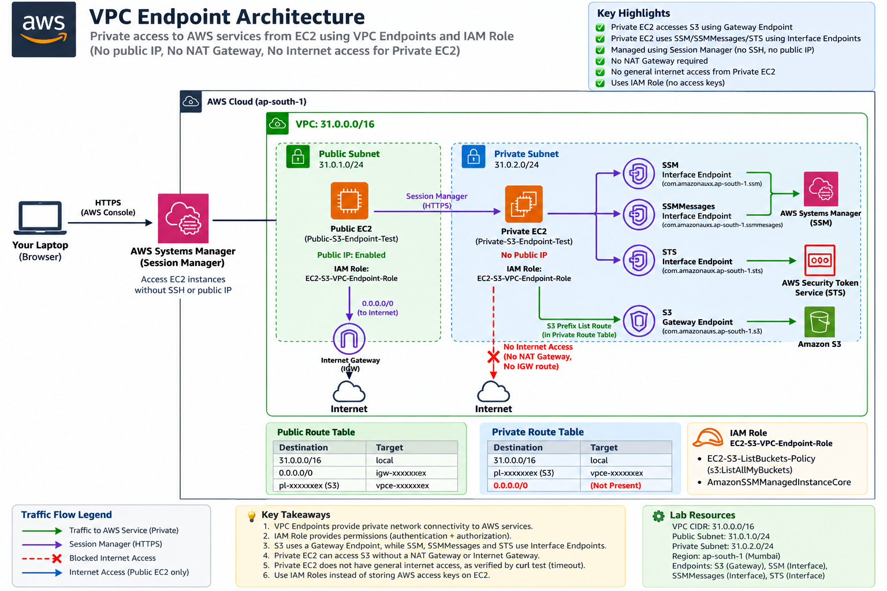


---

# 7. Lab Environment

## VPC

```text
VPC CIDR: 31.0.0.0/16
```

## Subnets

```text
Public Subnet
Private Subnet
```

## Route Tables

```text
Public Route Table
└── Internet Gateway route

Private Route Table
└── S3 Endpoint route
```

## EC2 Instances

```text
Public EC2
Private EC2
```

Both EC2 instances used:

```text
EC2-S3-VPC-Endpoint-Role
```

## IAM Policies

The role contained:

```text
EC2-S3-ListBuckets-Policy
AmazonSSMManagedInstanceCore
```

## VPC Endpoints

```text
S3 Gateway Endpoint
SSM Interface Endpoint
SSMMessages Interface Endpoint
STS Interface Endpoint
```


---

# 8. Hands-On Implementation

## 8.1 Create the S3 Gateway VPC Endpoint

Navigate to:

```text
AWS Console
→ VPC
→ Endpoints
→ Create endpoint
```

Configure:

```text
Service category:
AWS services

Service:
S3

Endpoint type:
Gateway

VPC:
31.0.0.0/16
```

Associate both route tables:

```text
Public Route Table
Private Route Table
```

Create the endpoint.

### Screenshot

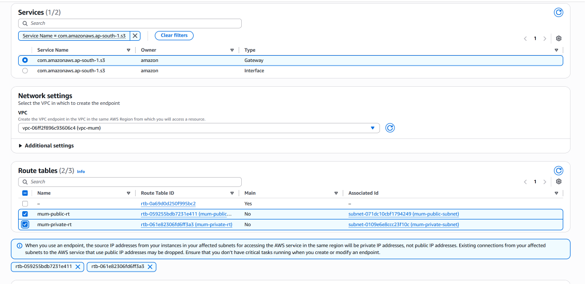

The configuration shows the S3 Gateway Endpoint, VPC, and selected route tables.

### Screenshot

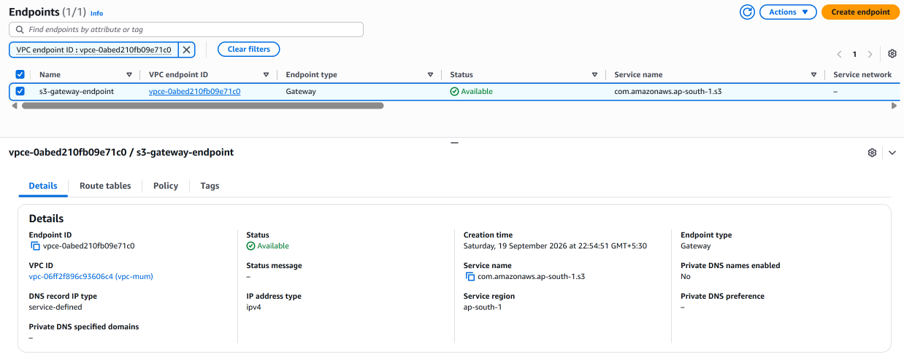

The endpoint is successfully created and available.


---

## 8.2 Verify S3 Endpoint Routes

The Gateway Endpoint automatically adds the S3 route to the selected route tables.

### Public Route Table

Navigate to:

```text
VPC
→ Route Tables
→ Public Route Table
→ Routes
```

The route table contains the normal Internet Gateway route and an S3 endpoint route.

### Screenshot

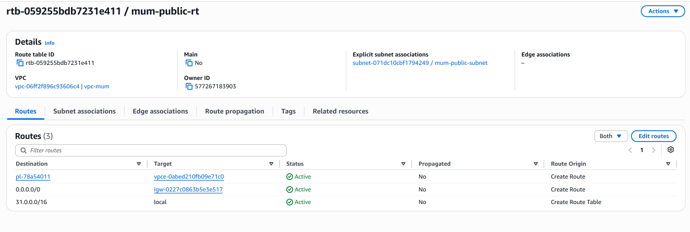

### Private Route Table

Navigate to:

```text
VPC
→ Route Tables
→ Private Route Table
→ Routes
```

The private route table contains the S3 endpoint route.

It does not contain a default Internet Gateway route.

### Screenshot

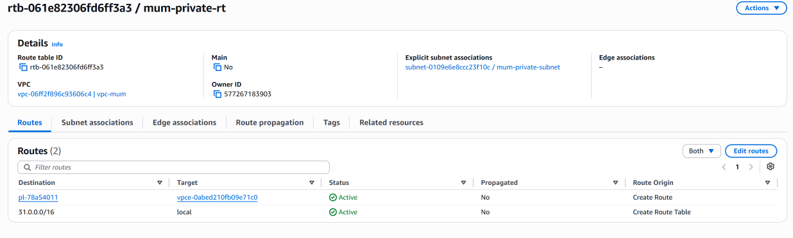


---

## 8.3 Create the IAM Policy

Instead of storing AWS access keys on the EC2 instance, we used an IAM Role.

First, create an IAM policy with the minimum permission required for our S3 test.

Policy:

```json
{
  "Version": "2012-10-17",
  "Statement": [
    {
      "Effect": "Allow",
      "Action": "s3:ListAllMyBuckets",
      "Resource": "*"
    }
  ]
}
```

Policy name:

```text
EC2-S3-ListBuckets-Policy
```

This policy allows the EC2 instance to run:

```bash
aws s3 ls
```

It does not provide permissions to create, delete, upload, or modify S3 resources.

### Screenshot

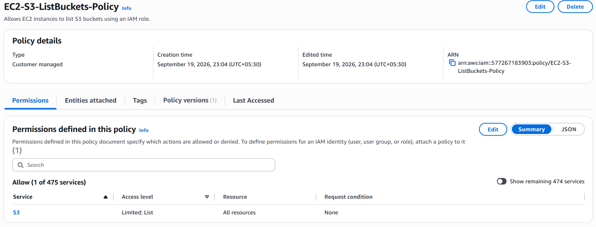


---

## 8.4 Create the EC2 IAM Role

Navigate to:

```text
IAM
→ Roles
→ Create role
```

Select:

```text
Trusted entity:
AWS service

Use case:
EC2
```

Attach:

```text
EC2-S3-ListBuckets-Policy
```

Role name:

```text
EC2-S3-VPC-Endpoint-Role
```

### Screenshot

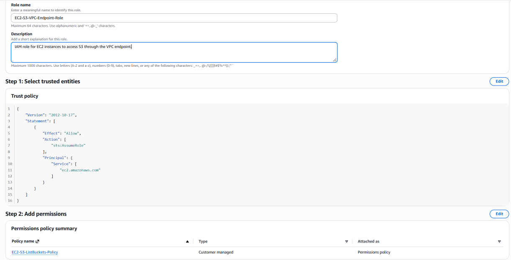

After creating the role, verify its configuration.

### Screenshot

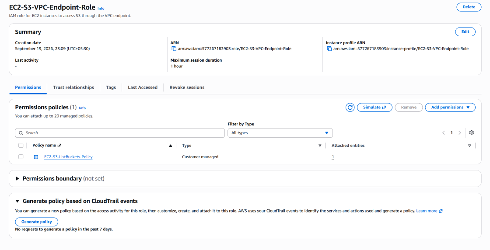


---

## 8.5 Add Systems Manager Permissions

The private EC2 will be accessed using Systems Manager Session Manager.

Add the AWS-managed policy:

```text
AmazonSSMManagedInstanceCore
```

to:

```text
EC2-S3-VPC-Endpoint-Role
```

The final role permissions are:

```text
EC2-S3-VPC-Endpoint-Role
│
├── EC2-S3-ListBuckets-Policy
└── AmazonSSMManagedInstanceCore
```

### Screenshot

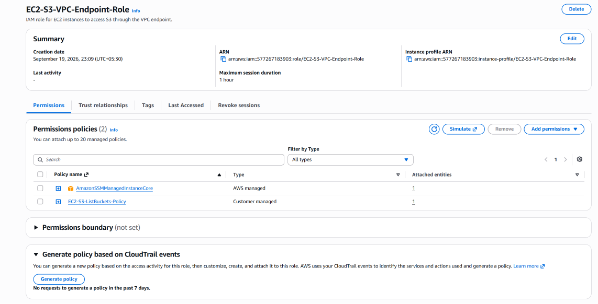


---

## 8.6 Create the Public EC2 Instance

Create an EC2 instance in the public subnet.

Configuration:

```text
Name:
Public-S3-Endpoint-Test

VPC:
31.0.0.0/16

Subnet:
Public Subnet

Public IP:
Enabled

IAM Instance Profile:
EC2-S3-VPC-Endpoint-Role
```

A security group was created for the public EC2.

### Screenshot

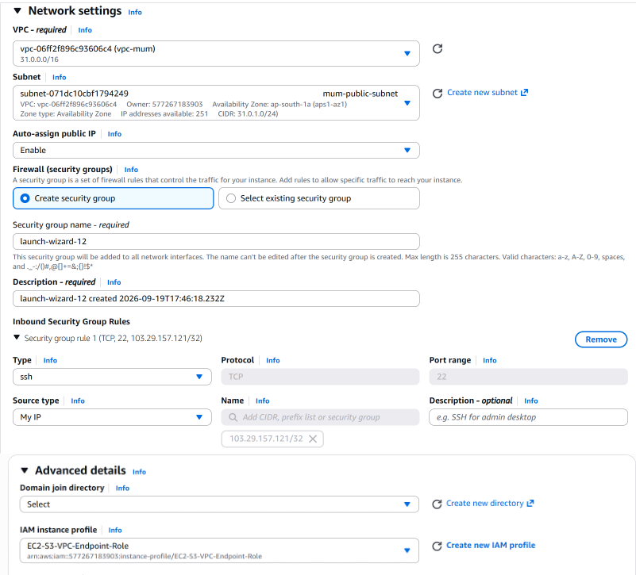

After launching the instance:

### Screenshot

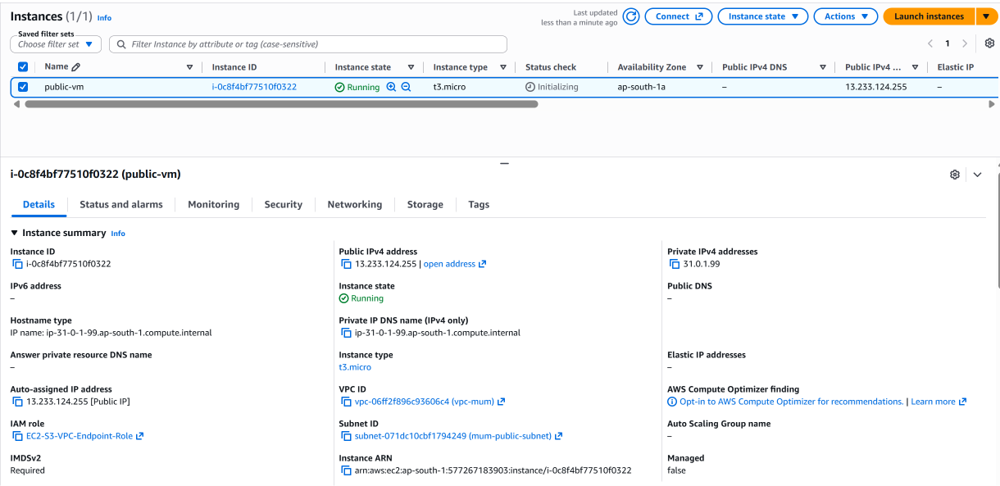


---

## 8.7 Create the Private EC2 Instance

Create another EC2 instance in the private subnet.

Configuration:

```text
Name:
Private-S3-Endpoint-Test

VPC:
31.0.0.0/16

Subnet:
Private Subnet

Public IP:
Disabled

IAM Instance Profile:
EC2-S3-VPC-Endpoint-Role
```

The private instance does not have a public IPv4 address.

### Screenshot

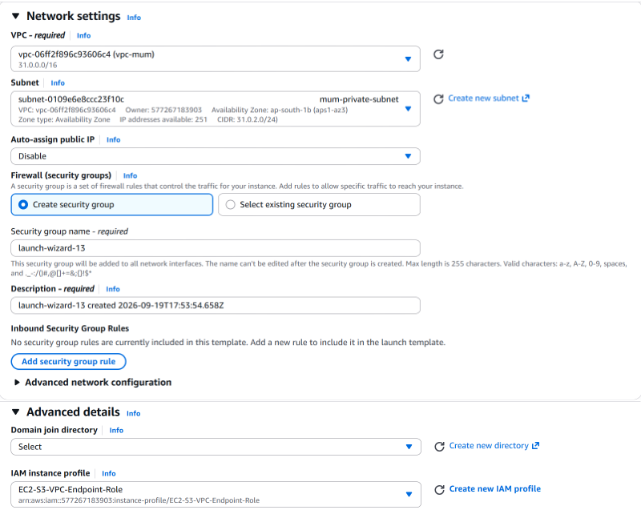

After launching:

### Screenshot

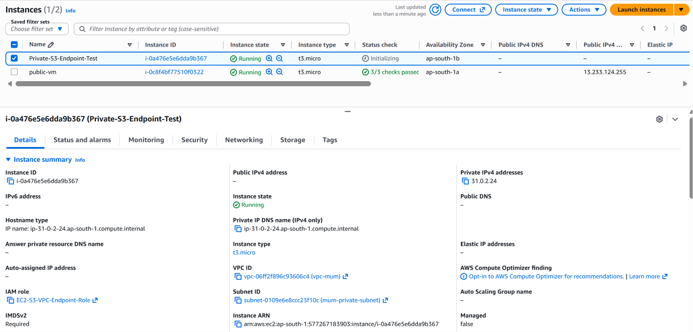

The private EC2 now has:

```text
No public IP
No Internet Gateway route
IAM role
S3 endpoint route
```


---

## 8.8 Create the SSM Interface Endpoint

The private EC2 needs private connectivity to Systems Manager.

Create an Interface VPC Endpoint for:

```text
com.amazonaws.ap-south-1.ssm
```

Configuration:

```text
Endpoint type:
Interface

VPC:
31.0.0.0/16

Subnet:
Private Subnet
```

The endpoint security group allows HTTPS traffic on TCP port 443 from the private EC2 security group.

### Screenshot

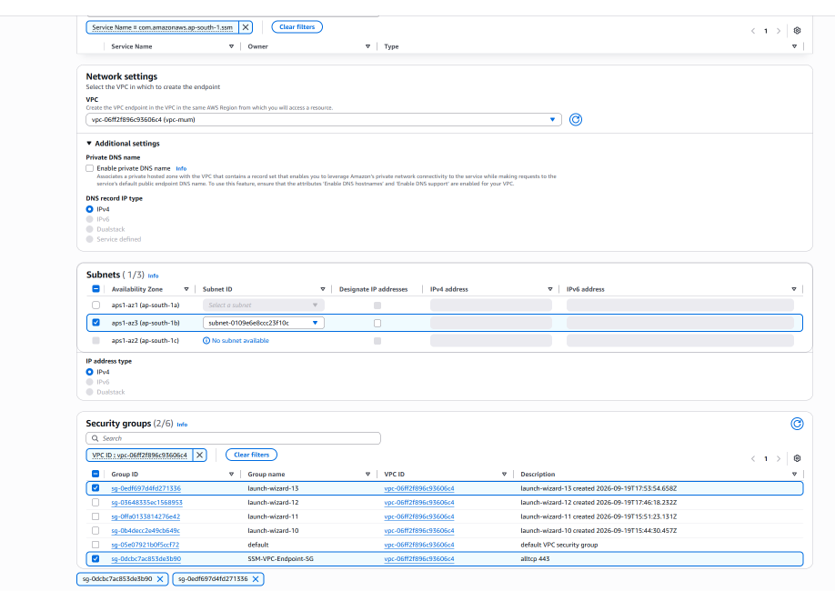

After creation:

### Screenshot

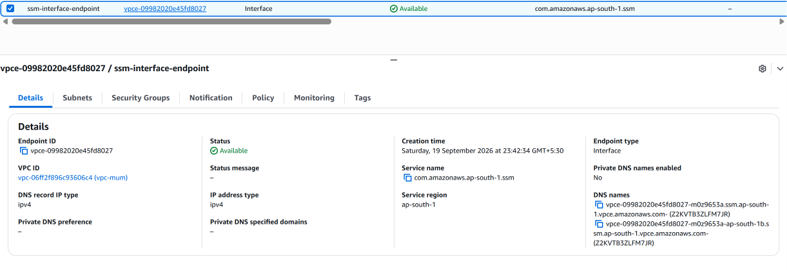


---

## 8.9 Create the SSMMessages Interface Endpoint

Create another Interface Endpoint for:

```text
com.amazonaws.ap-south-1.ssmmessages
```

Use:

```text
VPC:
31.0.0.0/16

Subnet:
Private Subnet

Security Group:
SSM-VPC-Endpoint-SG
```

### Screenshot

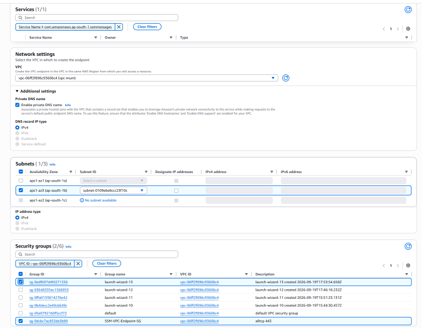

After creation:

### Screenshot

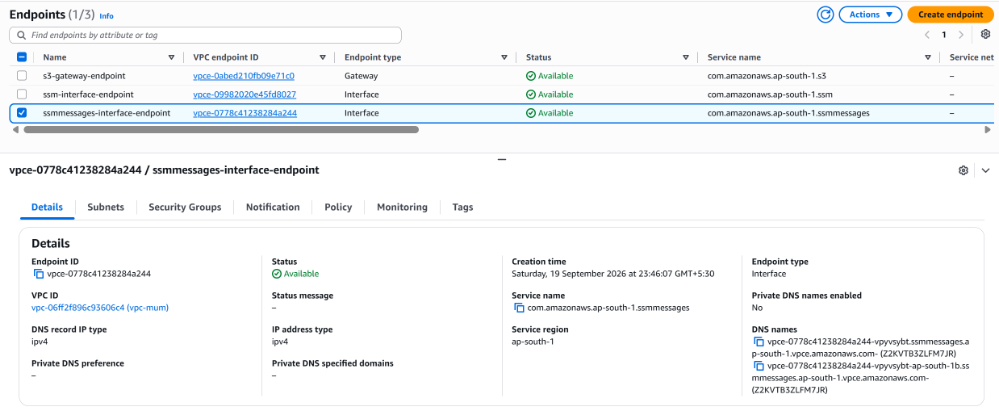


---

## 8.10 Verify the Private EC2 in Systems Manager

Navigate to:

```text
AWS Systems Manager
→ Managed nodes
```

The private EC2 should appear as a managed node.

The expected status is:

```text
Ping status:
Online
```

### Screenshot

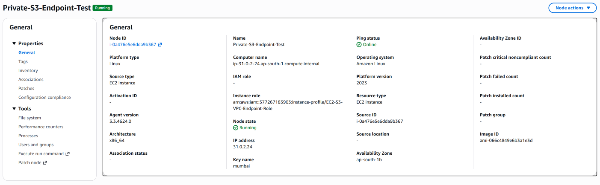

This confirms that the private EC2 can communicate with Systems Manager using the configured IAM role and private endpoint connectivity.


---

## 8.11 Connect to the Private EC2 Using Session Manager

Navigate to:

```text
Systems Manager
→ Session Manager
→ Start session
```

Select:

```text
Private-S3-Endpoint-Test
```

Start the session.

The private EC2 can now be accessed without:

- A public IP
- Direct SSH from the internet
- A bastion host

### Screenshot

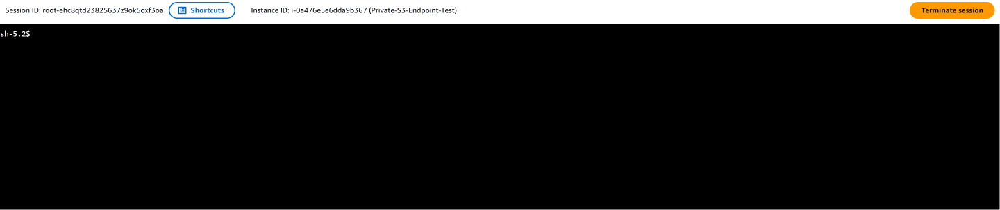


---

## 8.12 Verify the IAM Role

Inside the private EC2 Session Manager shell, verify the AWS identity:

```bash
aws sts get-caller-identity
```

Initially, this command did not return because the private subnet did not yet have a private path to STS.

After creating the STS Interface Endpoint, the command returned:

```json
{
    "UserId": "AROAYMZ6OGEPQL3SOWYC3:i-0a476e5e6dda9b367",
    "Account": "577267183903",
    "Arn": "arn:aws:sts::577267183903:assumed-role/EC2-S3-VPC-Endpoint-Role/i-0a476e5e6dda9b367"
}
```

The important part is:

```text
assumed-role/EC2-S3-VPC-Endpoint-Role/
```

This proves that the EC2 is using the IAM role rather than manually configured permanent AWS credentials.

### Screenshot


---

## 8.13 Troubleshooting STS Connectivity

Before creating the STS endpoint, the following command was executed from the private EC2:

```bash
aws sts get-caller-identity
```

The command did not return and remained at a blinking cursor.

The reason was that the private EC2 had no general internet connectivity and no private endpoint for STS.

At that point, the architecture had:

```text
S3
└── Gateway Endpoint

SSM
└── Interface Endpoint

SSMMessages
└── Interface Endpoint
```

But it did not yet have:

```text
STS
└── Interface Endpoint
```

This was an important troubleshooting lesson:

> IAM permissions and network connectivity are separate requirements.

The IAM role allowed the EC2 to use STS, but the EC2 still required a network path to the STS service.


---

## 8.14 Create the STS Interface Endpoint

Create an Interface Endpoint for:

```text
com.amazonaws.ap-south-1.sts
```

Configuration:

```text
Endpoint type:
Interface

VPC:
31.0.0.0/16

Subnet:
Private Subnet

Private DNS:
Enabled
```

Use the existing endpoint security group that permits HTTPS traffic from the private EC2.

### Screenshot

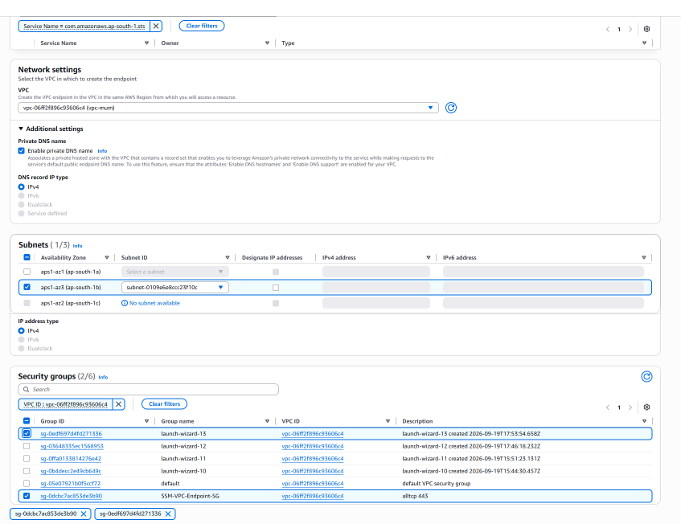

After creation:

### Screenshot


After the endpoint became available, run:

```bash
aws sts get-caller-identity
```

The command successfully returned the assumed IAM role.

### Screenshot

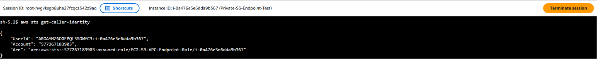


---

## 8.15 Test S3 Access from the Private EC2

Now test the main purpose of the lab:

```bash
aws s3 ls
```

The command successfully listed the available S3 buckets.

The traffic path is:

```text
Private EC2
     |
     ▼
Private Route Table
     |
     ▼
S3 Gateway VPC Endpoint
     |
     ▼
Amazon S3
```

No Internet Gateway or NAT Gateway is required for this S3 path.

### Screenshot

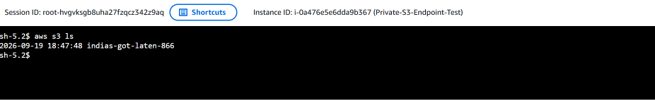

This is the main success test for the VPC Endpoint lab.


---

## 8.16 Verify Credential Source

To verify that the AWS CLI is using the EC2 IAM role rather than manually configured credentials, run:

```bash
aws configure list
```

The output shows the credential source associated with the IAM role.

### Screenshot

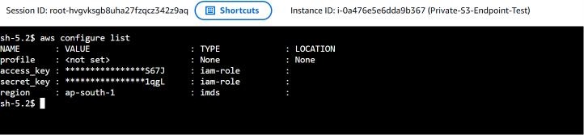

This confirms that permanent AWS access keys were not required on the EC2 instance.


---

## 8.17 Negative Test — Internet Access

The private EC2 was intentionally configured without a general internet route.

Run:

```bash
curl -I --connect-timeout 5 --max-time 10 https://google.com
```

The command returned:

```text
curl: (28) Connection timed out after 5002 milliseconds
```

This is the expected result.

The private EC2 can reach S3 through the VPC Endpoint, but it does not have general internet connectivity.

### Screenshot

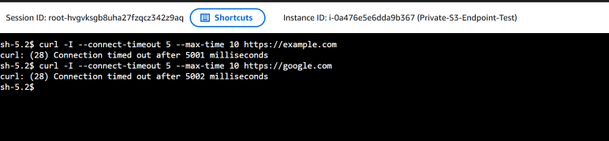

This negative test is important because it demonstrates that successful S3 access did not come from internet connectivity.


---

## 8.18 Final Endpoint Verification

The final VPC endpoint configuration contains:

```text
S3
└── Gateway Endpoint

SSM
└── Interface Endpoint

SSMMessages
└── Interface Endpoint

STS
└── Interface Endpoint
```

### Screenshot

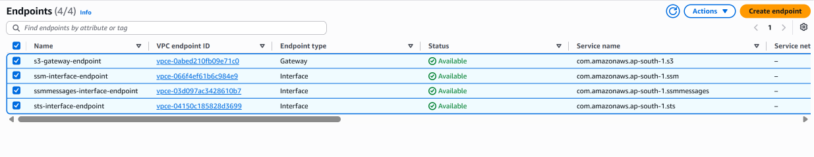


---

## 8.19 Compare Public EC2 S3 Access

The public EC2 was also configured with the same IAM role.

From the public EC2:

```bash
aws s3 ls
```

successfully listed the S3 buckets.

### Screenshot

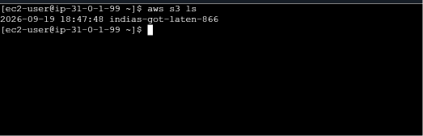

The comparison demonstrates that both instances can access S3 using the IAM role, while the private instance does so without general internet access.


---

# 9. Traffic Flow

## Private EC2 → S3

The primary traffic flow is:

```text
Private EC2
     |
     ▼
Private Route Table
     |
     ▼
S3 Prefix List
     |
     ▼
S3 Gateway VPC Endpoint
     |
     ▼
Amazon S3
```

---

## Private EC2 → STS

For STS:

```text
Private EC2
     |
     ▼
STS Interface Endpoint
     |
     ▼
AWS STS
```

The Interface Endpoint provides private connectivity to the STS service.


---

## Private EC2 → Systems Manager

For Session Manager:

```text
Private EC2
     |
     ├── SSM Interface Endpoint
     |
     └── SSMMessages Interface Endpoint
                    |
                    ▼
              AWS Systems Manager
```

---

## Private EC2 → Internet

There is no default internet route:

```text
Private EC2
     |
     ▼
Private Route Table
     |
     X
Internet
```

The negative test confirmed this behavior.


---

# 10. Testing and Validation

The following tests were completed.

| Test | Result |
|---|---|
| S3 Gateway Endpoint created | ✅ |
| S3 route added to Public Route Table | ✅ |
| S3 route added to Private Route Table | ✅ |
| IAM S3 policy created | ✅ |
| EC2 IAM role created | ✅ |
| SSM permissions attached | ✅ |
| Public EC2 created | ✅ |
| Private EC2 created | ✅ |
| SSM Interface Endpoint created | ✅ |
| SSMMessages Interface Endpoint created | ✅ |
| Private EC2 registered in Systems Manager | ✅ |
| Session Manager connection | ✅ |
| STS Interface Endpoint created | ✅ |
| `aws sts get-caller-identity` | ✅ |
| `aws s3 ls` from Private EC2 | ✅ |
| `aws configure list` IAM role verification | ✅ |
| Internet connectivity from Private EC2 | ❌ Expected |
| `aws s3 ls` from Public EC2 | ✅ |


---

# 11. Important Practical Lessons

## 1. VPC Endpoint and IAM Role solve different problems

A VPC Endpoint provides:

```text
Network connectivity
```

An IAM Role provides:

```text
Authentication + authorization
```

Both may be required.


---

## 2. Private EC2 does not automatically mean it can access every AWS service

A private subnet may have no internet connectivity.

Individual AWS services can still be reached privately when the required VPC Endpoint is configured.


---

## 3. S3 Gateway Endpoint uses route tables

The S3 Gateway Endpoint is associated with route tables.

The route table receives an S3-specific route using an AWS-managed prefix list.


---

## 4. Interface endpoints use network interfaces

SSM and STS were implemented using Interface Endpoints.

These endpoints provide private IP-based connectivity from the VPC to the corresponding AWS services.


---

## 5. IAM permissions do not provide network connectivity

Our STS troubleshooting demonstrated this clearly.

The EC2 already had an IAM role with permissions, but:

```bash
aws sts get-caller-identity
```

could not complete until a private network path to STS was provided.


---

## 6. Avoid permanent AWS credentials on EC2

Instead of running:

```bash
aws configure
```

with permanent access keys, use an EC2 IAM Role.

The EC2 can then obtain temporary credentials through the instance profile.


---

## 7. Negative testing is important

The S3 command succeeding by itself does not prove that traffic is private.

The additional test:

```bash
curl -I --connect-timeout 5 --max-time 10 https://google.com
```

timed out.

Together, the tests demonstrate:

```text
S3 access      → Working
General Internet → Not available
```

This provides stronger evidence of the intended architecture.


---

# 12. Common Confusions

## VPC Endpoint vs Internet Gateway

An Internet Gateway provides connectivity between a VPC and the internet.

A VPC Endpoint provides private connectivity from a VPC to supported AWS services.


---

## VPC Endpoint vs NAT Gateway

A NAT Gateway allows private subnet resources to initiate connections to external destinations through a public path.

A VPC Endpoint provides a private path to supported AWS services.

For this lab:

```text
S3 → VPC Endpoint
```

was used instead of:

```text
Private EC2 → NAT Gateway → Internet → S3
```


---

## Gateway Endpoint vs Interface Endpoint

### Gateway

Used in this lab for:

```text
S3
```

It is associated with route tables.

### Interface

Used in this lab for:

```text
SSM
SSMMessages
STS
```

It uses network interfaces inside the VPC.


---

## IAM Role vs VPC Endpoint

These are not alternatives.

They solve different problems:

```text
IAM Role
└── "Is this EC2 allowed to perform the action?"

VPC Endpoint
└── "How does the EC2 privately reach the AWS service?"
```


---

# 13. Interview Questions

## Q1. What is a VPC Endpoint?

**Answer:**

A VPC Endpoint provides private connectivity between resources in a VPC and supported AWS services without requiring traffic to use the public internet.


---

## Q2. What are the main types of VPC Endpoints?

**Answer:**

The two commonly used types are Gateway Endpoints and Interface Endpoints.

Gateway Endpoints are used for services such as S3 and DynamoDB and are associated with route tables. Interface Endpoints use network interfaces and private IP addresses inside the VPC.


---

## Q3. Why did we use a Gateway Endpoint for S3?

**Answer:**

S3 supports Gateway Endpoints, which allow resources in the VPC to access S3 without requiring an Internet Gateway or NAT Gateway.


---

## Q4. Why did we create an Interface Endpoint for STS?

**Answer:**

Our private EC2 had no internet or NAT connectivity. The AWS CLI needed to communicate with STS to obtain and use temporary credentials through the EC2 IAM role. The STS Interface Endpoint provided a private network path to STS.


---

## Q5. Why didn't we use `aws configure` on the EC2?

**Answer:**

We avoided storing permanent AWS access keys on the EC2. Instead, we attached an IAM Role to the EC2 instance, allowing it to obtain temporary credentials automatically.


---

## Q6. What was the role of the IAM policy?

**Answer:**

The IAM policy granted the EC2 permission to list S3 buckets using `s3:ListAllMyBuckets`.


---

## Q7. How did we access the private EC2 without SSH from the internet?

**Answer:**

We used AWS Systems Manager Session Manager. The private EC2 had the required IAM permissions and private connectivity to Systems Manager through Interface VPC Endpoints.


---

## Q8. How did we prove the private EC2 did not have internet connectivity?

**Answer:**

We ran:

```bash
curl -I --connect-timeout 5 --max-time 10 https://google.com
```

The request timed out, while `aws s3 ls` successfully accessed S3 through the Gateway Endpoint.


---

# 14. How to Explain This in an Interview

> "I created a VPC Endpoint lab using a VPC with public and private subnets. I created an S3 Gateway Endpoint and associated it with the route tables so that the private EC2 could access S3 without using a NAT Gateway or Internet Gateway. Instead of storing AWS credentials on the EC2, I created an IAM Role with S3 permissions and Systems Manager permissions. I then created SSM and SSMMessages Interface Endpoints so I could manage the private EC2 using Session Manager. During testing, I found that STS connectivity was also required for the AWS CLI to use the IAM role, so I created an STS Interface Endpoint. After that, `aws sts get-caller-identity` and `aws s3 ls` worked successfully. Finally, I tested internet connectivity with curl and it timed out, proving that the private EC2 could access S3 without having general internet access."


---

# 15. Quick Revision Cheat Sheet

```text
VPC Endpoint
│
├── Provides private connectivity to supported AWS services
│
├── Gateway Endpoint
│   └── S3
│
└── Interface Endpoint
    ├── SSM
    ├── SSMMessages
    └── STS
```

### IAM

```text
EC2
 ↓
IAM Role
 ↓
Temporary credentials
```

### S3

```text
Private EC2
 ↓
Private Route Table
 ↓
S3 Prefix List
 ↓
S3 Gateway Endpoint
 ↓
S3
```

### Session Manager

```text
Private EC2
 ↓
SSM / SSMMessages Interface Endpoints
 ↓
Systems Manager
```

### Negative Test

```text
Private EC2
 ↓
Internet
 ↓
❌ Timeout
```

### Main Commands

```bash
aws sts get-caller-identity
```

```bash
aws s3 ls
```

```bash
aws configure list
```

```bash
curl -I --connect-timeout 5 --max-time 10 https://google.com
```


---

# 16. Final Architecture

```text
                              AWS Cloud
                                   |
                     ┌──────────────┴──────────────┐
                     |       VPC 31.0.0.0/16       |
                     |                             |
           ┌─────────┴──────────┐       ┌──────────┴─────────┐
           |    Public Subnet   |       |   Private Subnet   |
           |                    |       |                    |
           |     Public EC2     |       |    Private EC2     |
           |                    |       |                    |
           |     IAM Role       |       |     IAM Role       |
           └─────────┬──────────┘       └──────────┬─────────┘
                     |                             |
                Internet                         SSM
                Gateway                           |
                     |                    ┌────────┴─────────┐
                     |                    |                  |
                 Internet              SSM Endpoint    SSMMessages
                                          |              Endpoint
                                          |                  |
                                          └────────┬─────────┘
                                                   |
                                             Systems Manager

                     Private EC2
                          |
                    ┌──────────┴──────────┐
                    |                     |
                    ▼                     ▼
              STS Interface         S3 Gateway
                 Endpoint             Endpoint
                    |                     |
                    ▼                     ▼
                   STS                    S3
```

The key private-subnet flow is:

```text
Private EC2
    |
    ├── Session Manager
    │      ↓
    │   SSM Interface Endpoints
    │
    ├── IAM authentication
    │      ↓
    │   STS Interface Endpoint
    │
    └── S3 access
           ↓
        S3 Gateway Endpoint
           ↓
           S3
```

### Architecture Diagram


---

# 17. Final Result

The VPC Endpoint lab successfully demonstrated private access to AWS services from a private EC2 instance.

The final results were:

```text
S3 Gateway Endpoint
        ↓
Private EC2 → S3
        ↓
       SUCCESS
```

```text
STS Interface Endpoint
        ↓
Private EC2 → STS
        ↓
       SUCCESS
```

```text
SSM Interface Endpoints
        ↓
Private EC2 → Session Manager
        ↓
       SUCCESS
```

And:

```text
Private EC2 → Internet
        ↓
      TIMEOUT
```

The lab therefore demonstrated how **VPC Endpoints, IAM Roles, and Systems Manager can work together to provide secure private access and management without placing permanent AWS credentials or public internet connectivity on a private EC2 instance.**


---

# 18. Cleanup

After completing the lab, clean up the resources to avoid unnecessary AWS charges.

Delete:

```text
EC2 instances
```

Delete the Interface Endpoints:

```text
SSM
SSMMessages
STS
```

Delete the S3 Gateway Endpoint.

Delete the associated security groups if they are no longer required.

The IAM policy and role can also be removed if they were created specifically for this lab and are no longer needed.

> The screenshots and documentation remain available in this repository as evidence of the completed hands-on lab.


---

# 19. Navigation

[← Previous: Transit Gateway Cross-Region Peering](./12-transit-gateway-cross-region-peering.md)

[↑ Back to README](../README.md)