# VPC Flow Logs

VPC Flow Logs is an AWS networking feature that captures information about network traffic going to and from network interfaces in a VPC.

In this lab, VPC Flow Logs were configured to send traffic-flow records to **Amazon CloudWatch Logs**. An EC2 instance was then used to generate network traffic, and the resulting Flow Log records were inspected through CloudWatch.

---

## Table of Contents

- [1. What are VPC Flow Logs?](#1-what-are-vpc-flow-logs)
- [2. Why do we need VPC Flow Logs?](#2-why-do-we-need-vpc-flow-logs)
- [3. What information does VPC Flow Logs capture?](#3-what-information-does-vpc-flow-logs-capture)
- [4. VPC Flow Logs Architecture](#4-vpc-flow-logs-architecture)
- [5. Lab Environment](#5-lab-environment)
- [6. IAM Policy](#6-iam-policy)
- [7. IAM Role](#7-iam-role)
- [8. CloudWatch Log Group](#8-cloudwatch-log-group)
- [9. Configure VPC Flow Logs](#9-configure-vpc-flow-logs)
- [10. Launch EC2 for Traffic Testing](#10-launch-ec2-for-traffic-testing)
- [11. Identify the EC2 ENI](#11-identify-the-ec2-eni)
- [12. Generate Network Traffic](#12-generate-network-traffic)
- [13. Verify VPC Flow Logs in CloudWatch](#13-verify-vpc-flow-logs-in-cloudwatch)
- [14. Understand the Flow Log Record](#14-understand-the-flow-log-record)
- [15. ENI Correlation](#15-eni-correlation)
- [16. Key Concepts Learned](#16-key-concepts-learned)
- [17. Important Practical Lessons](#17-important-practical-lessons)
- [18. Interview Questions](#18-interview-questions)
- [19. How to Explain VPC Flow Logs in an Interview](#19-how-to-explain-vpc-flow-logs-in-an-interview)
- [20. Final Architecture](#20-final-architecture)
- [21. Final Result](#21-final-result)


---

# 1. What are VPC Flow Logs?

**VPC Flow Logs** capture information about network traffic going to and from network interfaces in a VPC.

The captured flow information can be sent to destinations such as **CloudWatch Logs**, where it can be inspected for network troubleshooting and traffic analysis.

In this lab, the traffic flow was sent to a CloudWatch Log Group:

```text
VPC
  |
  | VPC Flow Logs
  v
CloudWatch Logs
  |
  v
/vpc/flow-logs
```

VPC Flow Logs provide network-flow metadata rather than the actual application payload.

---

# 2. Why do we need VPC Flow Logs?

When troubleshooting AWS networking, it is often necessary to understand what traffic is being observed at the network interface level.

For example:

```text
EC2
 |
 +-- Is traffic reaching the instance?
 |
 +-- Is traffic leaving the instance?
 |
 +-- Which source IP is communicating?
 |
 +-- Which destination IP is being contacted?
 |
 +-- Which protocol and ports are being used?
 |
 +-- Was the recorded traffic accepted or rejected?
```

VPC Flow Logs provide information that can help investigate these types of networking questions.

They are particularly useful for:

- Network troubleshooting
- Traffic analysis
- Investigating accepted and rejected traffic
- Understanding communication between resources
- Correlating traffic with network interfaces

---

# 3. What information does VPC Flow Logs capture?

The default flow-log format used in this lab provides fields containing information such as:

```text
Version
Account ID
Interface ID
Source Address
Destination Address
Source Port
Destination Port
Protocol
Packets
Bytes
Start Time
End Time
Action
Log Status
```

For example, an actual record observed during this lab was:

```text
2 577267183903 eni-0e16fa6936bb97b97 212.73.148.29 12.0.1.18 45819 43073 6 1 52 1790621790 1790621816 REJECT OK
```

This record shows network-flow metadata associated with the ENI.

Important distinction:

```text
VPC Flow Logs
    |
    +-- Capture network-flow information
    |
    +-- Do NOT represent application payload contents
```

---

# 4. VPC Flow Logs Architecture

The lab architecture consists of:

```text
                         Internet
                            |
                            v
                    +---------------+
                    | Internet      |
                    | Gateway       |
                    +-------+-------+
                            |
                            v
                +-----------------------+
                |         VPC           |
                |     12.0.0.0/16       |
                |                       |
                |  +-----------------+  |
                |  | Public Subnet   |  |
                |  | 12.0.1.0/24     |  |
                |  |                 |  |
                |  |      EC2         |  |
                |  |       |          |  |
                |  |      ENI         |  |
                |  +-------+---------+  |
                |          |            |
                +----------+------------+
                           |
                    VPC Flow Logs
                           |
                           v
                +-----------------------+
                |    CloudWatch Logs    |
                |                       |
                |    /vpc/flow-logs     |
                |          |            |
                |     Log Stream         |
                |          |            |
                |   Flow Log Records    |
                +-----------------------+
```

The main traffic path demonstrated in this lab was:

```text
EC2
  |
  v
ENI
  |
  v
VPC Flow Logs
  |
  v
CloudWatch Log Group
  |
  v
Log Stream
  |
  v
Flow Log Records
```

---

# 5. Lab Environment

The VPC networking foundation used for this lab was:

| Resource | Configuration |
|---|---|
| VPC | `Demo VPC Flow Logs` |
| VPC CIDR | `12.0.0.0/16` |
| Public Subnet | `12.0.1.0/24` |
| Private Subnet | `12.0.2.0/24` |
| Internet Gateway | `IGW VPC Flow Logs` |
| CloudWatch Log Group | `/vpc/flow-logs` |
| IAM Role | `VPCFlowLogs-CloudWatch-Role` |
| IAM Policy | `VPCFlowLogs-CloudWatch-Policy` |
| VPC Flow Log | `VPCFlowLogs-to-CloudWatch` |

The VPC, subnets, Internet Gateway, and route tables were created as the networking foundation for this lab.

---

# 6. IAM Policy

VPC Flow Logs needs permissions to interact with CloudWatch Logs.

A custom IAM policy was created for this purpose.

## Policy Name

```text
VPCFlowLogs-CloudWatch-Policy
```

The policy grants the CloudWatch Logs permissions required by the Flow Logs service.

### Policy JSON

```json
{
  "Version": "2012-10-17",
  "Statement": [
    {
      "Effect": "Allow",
      "Action": [
        "logs:CreateLogGroup",
        "logs:CreateLogStream",
        "logs:PutLogEvents",
        "logs:DescribeLogGroups",
        "logs:DescribeLogStreams"
      ],
      "Resource": "*"
    }
  ]
}
```

### IAM Policy Creation

The policy was created through:

```text
AWS Console
    |
    v
IAM
    |
    v
Policies
    |
    v
Create policy
    |
    v
JSON
```

### Screenshot — Policy JSON

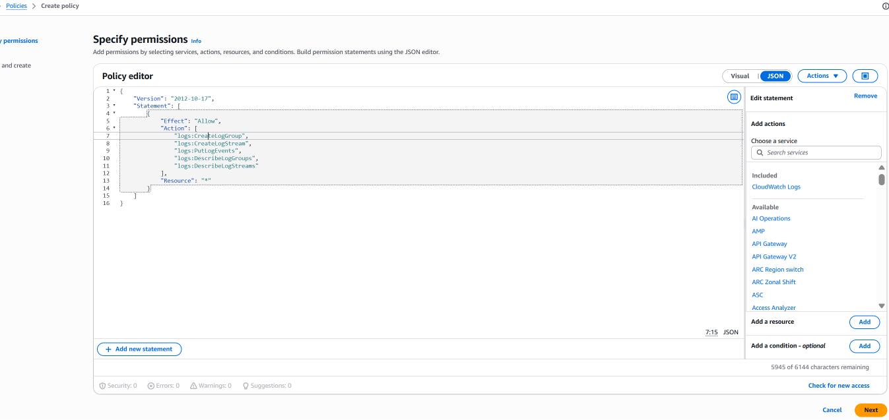

### Screenshot — Policy Created

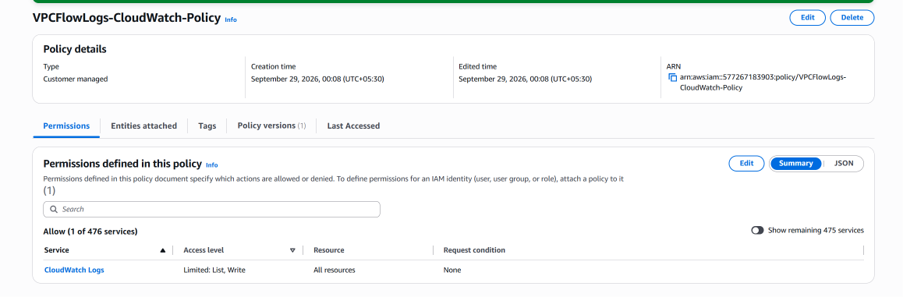

---

# 7. IAM Role

After creating the permission policy, an IAM role was created for the VPC Flow Logs service.

## Role Name

```text
VPCFlowLogs-CloudWatch-Role
```

The role contains a trust relationship that allows the VPC Flow Logs service to assume the role.

The relationship is:

```text
VPC Flow Logs Service
        |
        | AssumeRole
        v
VPCFlowLogs-CloudWatch-Role
        |
        | attached policy
        v
VPCFlowLogs-CloudWatch-Policy
        |
        v
CloudWatch Logs
```

## Trust Policy

The role was created using a custom trust policy for the VPC Flow Logs service.

### Screenshot — IAM Role Trust Policy

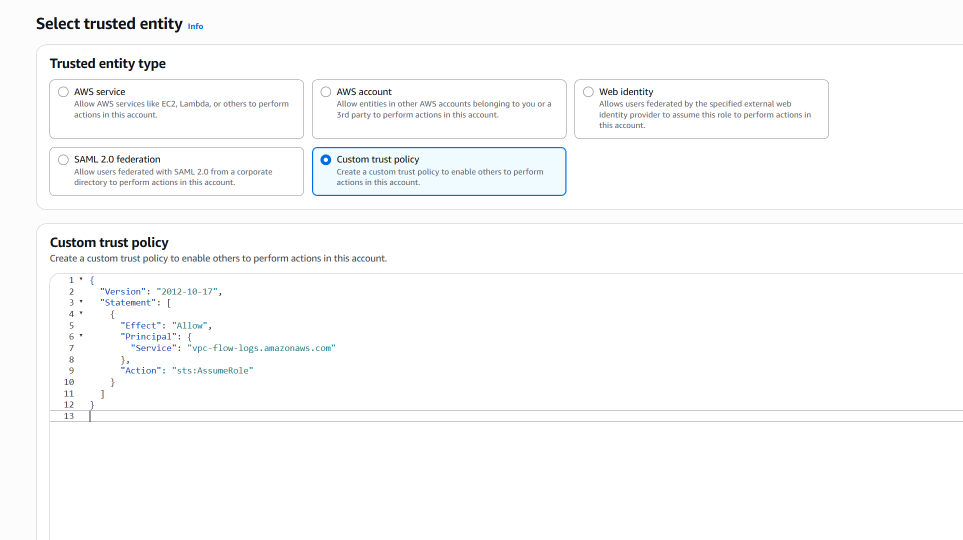

### Screenshot — IAM Role Created

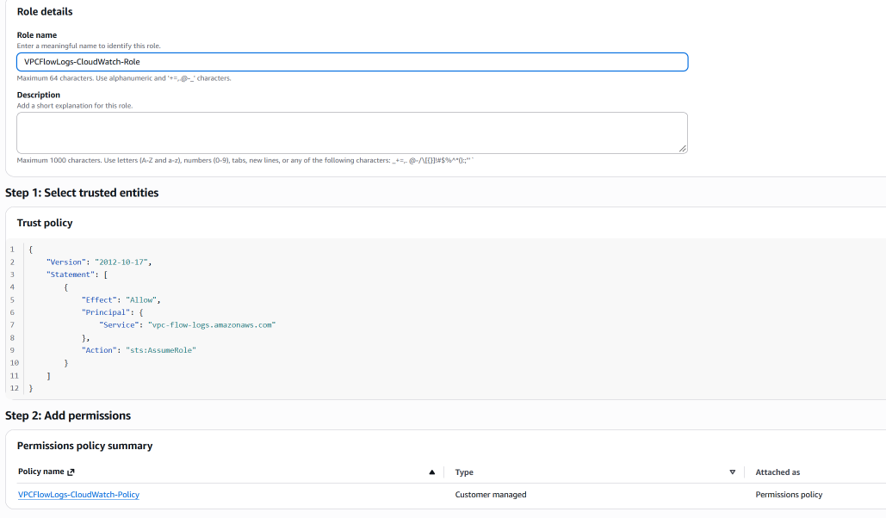

### Screenshot — IAM Role Permissions

The custom CloudWatch Logs policy was attached to the role.

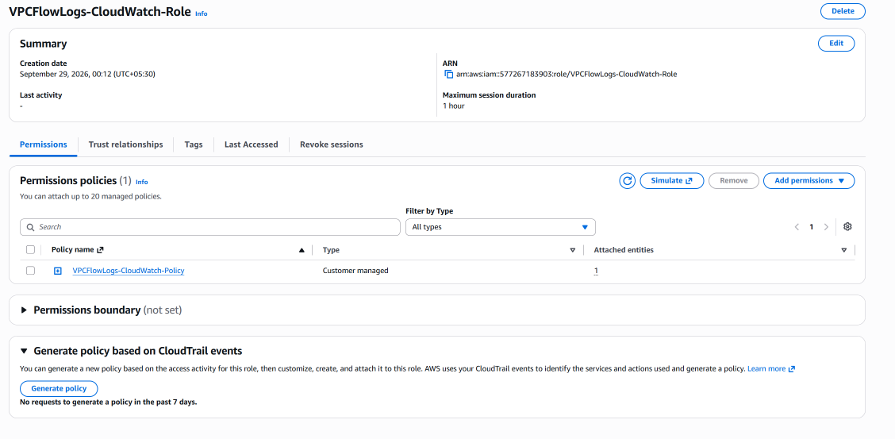

---

# 8. CloudWatch Log Group

The CloudWatch Log Group was created as the destination for the VPC Flow Logs.

## Log Group

```text
/vpc/flow-logs
```

For this training lab, the log group was configured without a KMS key and with the retention setting used during the demonstration.

The destination flow is:

```text
VPC Flow Logs
      |
      v
CloudWatch Logs
      |
      v
/vpc/flow-logs
```

### Screenshot — Log Group Configuration

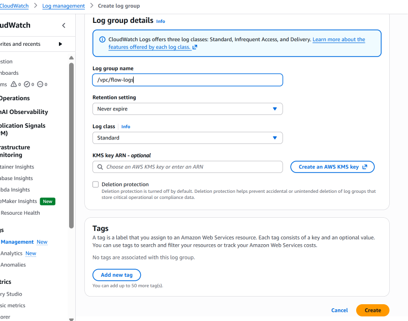

### Screenshot — Log Group Created

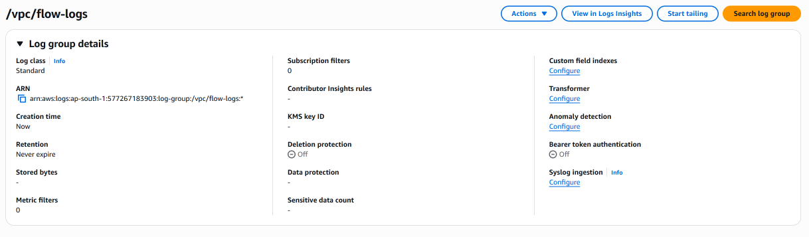

---

# 9. Configure VPC Flow Logs

The VPC Flow Log was configured to send traffic information to the CloudWatch Log Group.

## Flow Log Configuration

```text
Name:
VPCFlowLogs-to-CloudWatch

Filter:
All

Maximum aggregation interval:
1 minute

Destination:
CloudWatch Logs

Log Group:
/vpc/flow-logs

IAM Role:
VPCFlowLogs-CloudWatch-Role

Log Format:
AWS default format
```

Using the `All` filter allows the lab to observe both accepted and rejected traffic.

### Screenshot — VPC Flow Log Configuration

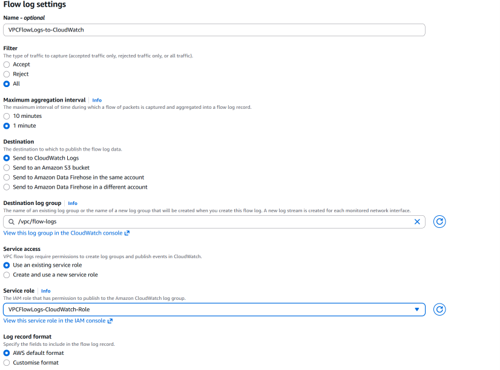

### Screenshot — VPC Flow Log Created

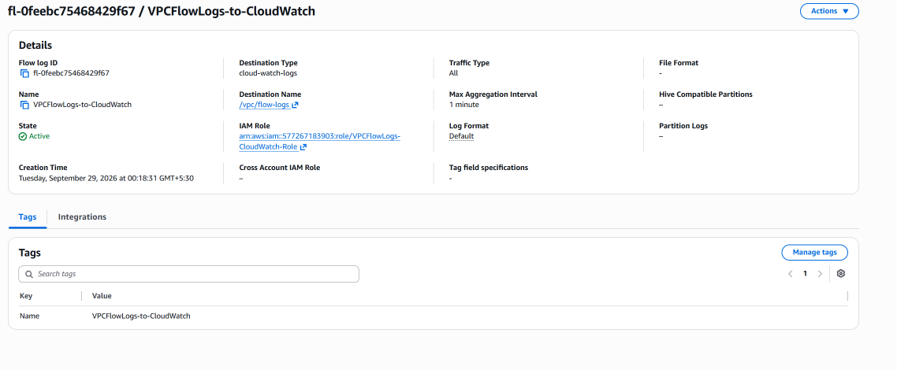

---

# 10. Launch EC2 for Traffic Testing

An EC2 instance was launched in the public subnet so that real network traffic could be generated and captured by VPC Flow Logs.

The EC2 instance was placed in:

```text
VPC:
Demo VPC Flow Logs

Subnet:
Demo VPC Flow Log Public Subnet

CIDR:
12.0.1.0/24
```

A public IP was enabled so the instance could be used for the traffic-generation test.

### Screenshot — EC2 Configuration

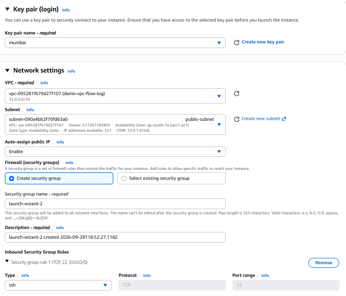

### Screenshot — EC2 Running

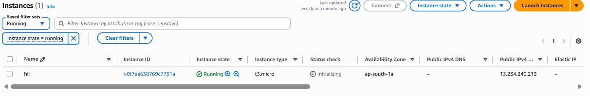

---

# 11. Identify the EC2 ENI

The EC2 instance has an **Elastic Network Interface (ENI)**.

The ENI is important because VPC Flow Logs capture traffic associated with network interfaces.

The ENI identified during this lab was:

```text
eni-0e16fa6936bb97b97
```

The relationship is:

```text
EC2
 |
 v
Elastic Network Interface
 |
 v
VPC Flow Logs
```

### Screenshot — EC2 ENI

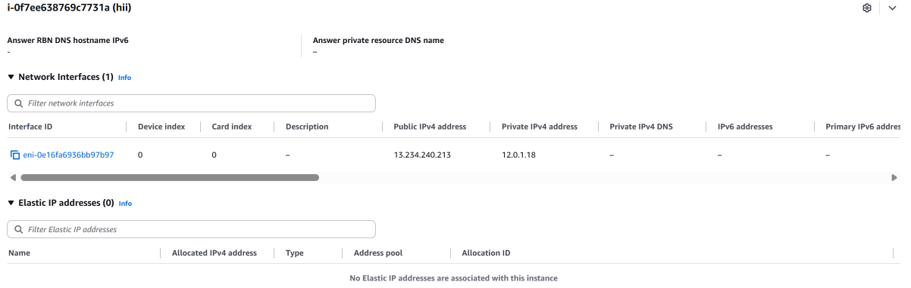

---

# 12. Generate Network Traffic

After the EC2 instance was running, network traffic was generated from the instance.

The purpose was to create traffic that could later be observed in CloudWatch through VPC Flow Logs.

Example traffic-generation command:

```bash
ping -c 4 google.com
```

The traffic flow was:

```text
EC2
 |
 | ping / network traffic
 v
ENI
 |
 v
VPC Flow Logs
 |
 v
CloudWatch
```

### Screenshot — Traffic Generation

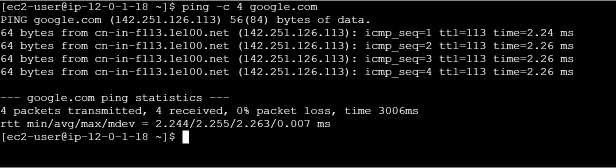

---

# 13. Verify VPC Flow Logs in CloudWatch

After traffic was generated, the CloudWatch Log Group was opened:

```text
CloudWatch
    |
    v
Log Groups
    |
    v
/vpc/flow-logs
```

The Flow Log created a log stream containing traffic records.

### Screenshot — CloudWatch Log Stream

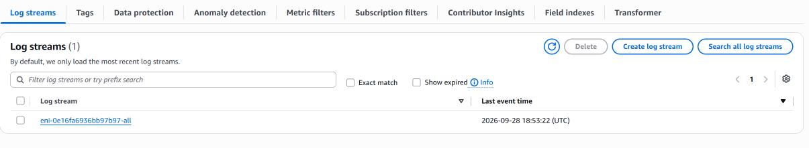

The log stream contains the actual flow-log records generated from network traffic.

### Screenshot — Flow Log Records

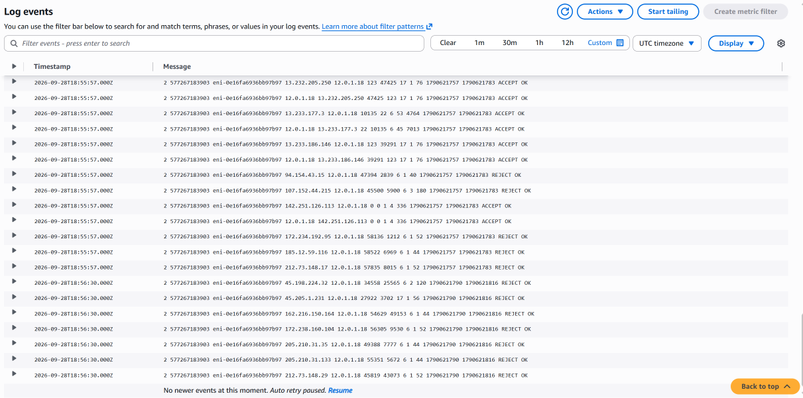

---

# 14. Understand the Flow Log Record

An actual Flow Log record observed during the lab was:

```text
2 577267183903 eni-0e16fa6936bb97b97 212.73.148.29 12.0.1.18 45819 43073 6 1 52 1790621790 1790621816 REJECT OK
```

Using the AWS default flow-log field order, the record can be interpreted as:

| Field | Value | Meaning |
|---|---|---|
| Version | `2` | Flow Logs version |
| Account ID | `577267183903` | AWS account ID |
| Interface ID | `eni-0e16fa6936bb97b97` | Network interface associated with the traffic |
| Source Address | `212.73.148.29` | Source IP |
| Destination Address | `12.0.1.18` | Destination IP |
| Source Port | `45819` | Source port |
| Destination Port | `43073` | Destination port |
| Protocol | `6` | TCP |
| Packets | `1` | Number of packets recorded |
| Bytes | `52` | Number of bytes recorded |
| Start Time | `1790621790` | Flow start timestamp |
| End Time | `1790621816` | Flow end timestamp |
| Action | `REJECT` | Recorded traffic action |
| Log Status | `OK` | Flow-log record status |

### Important observation

The record contained:

```text
Protocol:
6
```

Protocol number `6` represents TCP.

The record also contained:

```text
Action:
REJECT
```

Therefore, this particular record represents a TCP flow that was recorded with the action `REJECT`.

The record itself does not establish exactly which networking control caused the rejection.

The important point demonstrated by the lab is that VPC Flow Logs can record rejected traffic when the Flow Log filter is configured to capture all traffic.

---

# 15. ENI Correlation

One of the most useful parts of this lab was correlating the EC2 instance with its Flow Log record.

The EC2 instance's ENI was:

```text
eni-0e16fa6936bb97b97
```

The Flow Log record contained the same ENI:

```text
eni-0e16fa6936bb97b97
```

Therefore:

```text
EC2
 |
 v
eni-0e16fa6936bb97b97
 |
 | network traffic
 v
VPC Flow Logs
 |
 v
CloudWatch
 |
 v
Flow Log Record
 |
 +-- eni-0e16fa6936bb97b97
```

This demonstrates the practical relationship between an EC2 instance, its network interface, and the VPC Flow Log records stored in CloudWatch.

---

# 16. Key Concepts Learned

## VPC Flow Logs

Captures information about network traffic associated with network interfaces.

## ENI

An Elastic Network Interface provides network connectivity for resources such as EC2 instances.

## CloudWatch Log Group

Provides the destination where VPC Flow Log records are stored when CloudWatch Logs is configured as the destination.

## Log Stream

Contains the individual log records within the CloudWatch Log Group.

## IAM Role

Allows the VPC Flow Logs service to assume an identity with the required permissions.

## IAM Trust Policy

Defines which service is trusted to assume the IAM role.

## IAM Permission Policy

Defines what actions the role can perform.

## ACCEPT and REJECT

Flow Log records can indicate whether the recorded traffic was accepted or rejected.

---

# 17. Important Practical Lessons

### 1. Attaching an Internet Gateway does not automatically make a subnet public

A subnet needs a route to the Internet Gateway.

For example:

```text
0.0.0.0/0
    |
    v
Internet Gateway
```

The route table determines how traffic is routed.

---

### 2. Flow Logs and Security Groups are different

```text
Security Group
    |
    +-- Controls traffic

VPC Flow Logs
    |
    +-- Records network-flow information
```

A Flow Log is not a replacement for a Security Group.

---

### 3. Flow Logs are associated with network interfaces

For EC2:

```text
EC2
 |
 v
ENI
 |
 v
Flow Logs
```

This is why identifying the ENI is useful when investigating Flow Log records.

---

### 4. Flow Logs provide metadata, not application payloads

Flow Logs provide information about network flows such as:

```text
Source
Destination
Ports
Protocol
Packets
Bytes
Action
```

They are not application-level packet-content logs.

---

### 5. IAM has two separate concepts

```text
Trust Policy
    |
    +-- WHO can assume the role?

Permission Policy
    |
    +-- WHAT can the role do?
```

Understanding this distinction is important when working with AWS services that assume IAM roles.

---

### 6. Generate real traffic when testing Flow Logs

Simply creating the Flow Log does not make the lab demonstration meaningful.

A practical validation flow is:

```text
Create Flow Log
      |
      v
Launch resource
      |
      v
Identify ENI
      |
      v
Generate traffic
      |
      v
Wait for Flow Log aggregation
      |
      v
Open CloudWatch
      |
      v
Inspect records
```

---

# 18. Interview Questions

## Q1. What are VPC Flow Logs?

**Answer:**

VPC Flow Logs capture information about network traffic going to and from network interfaces in a VPC. The records can be sent to destinations such as CloudWatch Logs for network troubleshooting and traffic analysis.

---

## Q2. What information does VPC Flow Logs capture?

**Answer:**

It can capture information such as source and destination addresses, source and destination ports, protocol, packets, bytes, timestamps, action, and log status.

---

## Q3. Where can VPC Flow Logs be sent?

**Answer:**

VPC Flow Logs can be configured with supported destinations such as CloudWatch Logs, depending on the AWS configuration and use case.

---

## Q4. What is an ENI?

**Answer:**

ENI stands for Elastic Network Interface. It is a virtual network interface that provides network connectivity to resources such as EC2 instances.

---

## Q5. Why is the ENI important when analyzing VPC Flow Logs?

**Answer:**

Flow Log records contain the network interface ID associated with the traffic. This allows traffic records to be correlated with the corresponding network interface and the AWS resource using it.

---

## Q6. What is the difference between a Security Group and VPC Flow Logs?

**Answer:**

A Security Group is a traffic control mechanism that determines whether traffic is allowed to an AWS resource. VPC Flow Logs record information about network traffic.

---

## Q7. What is the difference between an IAM trust policy and permission policy?

**Answer:**

A trust policy determines who or which AWS service can assume an IAM role. A permission policy determines what actions the role is allowed to perform.

---

## Q8. What does `REJECT` mean in a Flow Log record?

**Answer:**

It indicates that the recorded flow was rejected. The Flow Log record itself does not necessarily identify the exact networking component responsible for the rejection.

---

## Q9. What does protocol number `6` represent?

**Answer:**

Protocol number `6` represents TCP.

---

# 19. How to Explain VPC Flow Logs in an Interview

A concise explanation:

> **VPC Flow Logs are used to capture information about network traffic associated with network interfaces in a VPC. In my hands-on lab, I configured a VPC Flow Log to send records to a CloudWatch Log Group. I created an IAM role and policy that allowed the Flow Logs service to write to CloudWatch Logs, launched an EC2 instance, identified its ENI, generated network traffic, and then verified the resulting Flow Log records in CloudWatch.**

If asked about troubleshooting:

> **I would first identify the relevant network interface, inspect the Flow Log records for source, destination, protocol, ports, packets, bytes, and ACCEPT or REJECT status, and then correlate that information with the VPC routing and security configuration.**

---

# 20. Final Architecture

The completed lab architecture:

```text
                              Internet
                                 |
                                 v
                       +-------------------+
                       | Internet Gateway  |
                       +---------+---------+
                                 |
                                 v
                +--------------------------------+
                |             VPC                |
                |          12.0.0.0/16           |
                |                                |
                |   +------------------------+   |
                |   |     Public Subnet      |   |
                |   |      12.0.1.0/24       |   |
                |   |                        |   |
                |   |        EC2             |   |
                |   |         |              |   |
                |   |         v              |   |
                |   |        ENI             |   |
                |   +---------+--------------+   |
                |             |                  |
                |             | Flow Logs        |
                +-------------+------------------+
                              |
                              v
                    +----------------------+
                    |    CloudWatch Logs   |
                    |                      |
                    |    /vpc/flow-logs   |
                    |          |           |
                    |          v           |
                    |     Log Stream       |
                    |          |           |
                    |          v           |
                    |   Flow Log Records   |
                    +----------------------+

IAM:

VPC Flow Logs Service
          |
          | AssumeRole
          v
VPCFlowLogs-CloudWatch-Role
          |
          | attached policy
          v
VPCFlowLogs-CloudWatch-Policy
          |
          v
CloudWatch Logs
```

---

# 21. Final Result

The VPC Flow Logs lab was successfully implemented and validated.

The completed setup includes:

```text
VPC
12.0.0.0/16
```

```text
Public Subnet
12.0.1.0/24
```

```text
Private Subnet
12.0.2.0/24
```

```text
IAM Role
VPCFlowLogs-CloudWatch-Role
```

```text
IAM Policy
VPCFlowLogs-CloudWatch-Policy
```

```text
CloudWatch Log Group
/vpc/flow-logs
```

```text
VPC Flow Log
VPCFlowLogs-to-CloudWatch
```

The lab was validated by:

```text
1. Launching an EC2 instance
2. Identifying its ENI
3. Generating network traffic
4. Sending VPC Flow Logs to CloudWatch
5. Opening the CloudWatch Log Stream
6. Inspecting actual Flow Log records
7. Correlating the ENI ID with the Flow Log record
8. Observing a real TCP REJECT record
```

The practical traffic-observation chain is:

```text
EC2
  |
  v
ENI
  |
  v
Network Traffic
  |
  v
VPC Flow Logs
  |
  v
CloudWatch Log Group
  |
  v
Log Stream
  |
  v
Flow Log Record
```

---

---

[← Previous: VPC Endpoint](./13-vpc-endpoint.md)

[↑ Back to Project README](../README.md)
